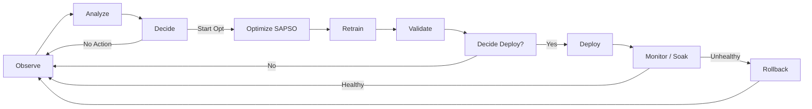
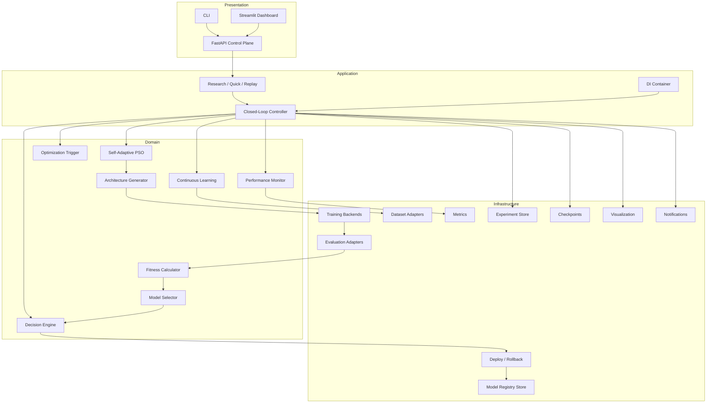
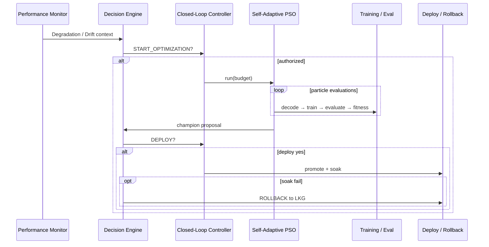
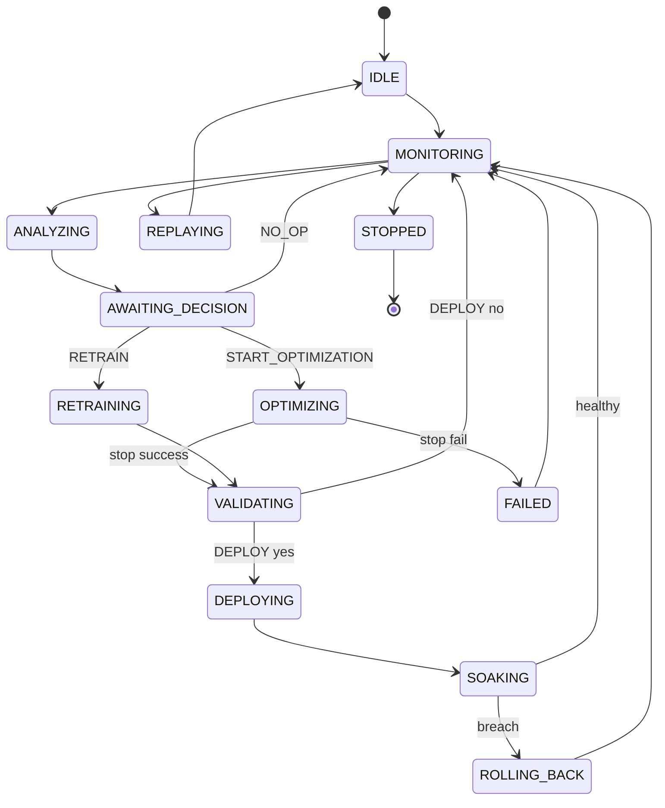
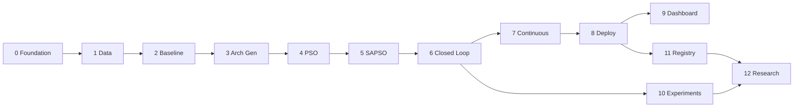
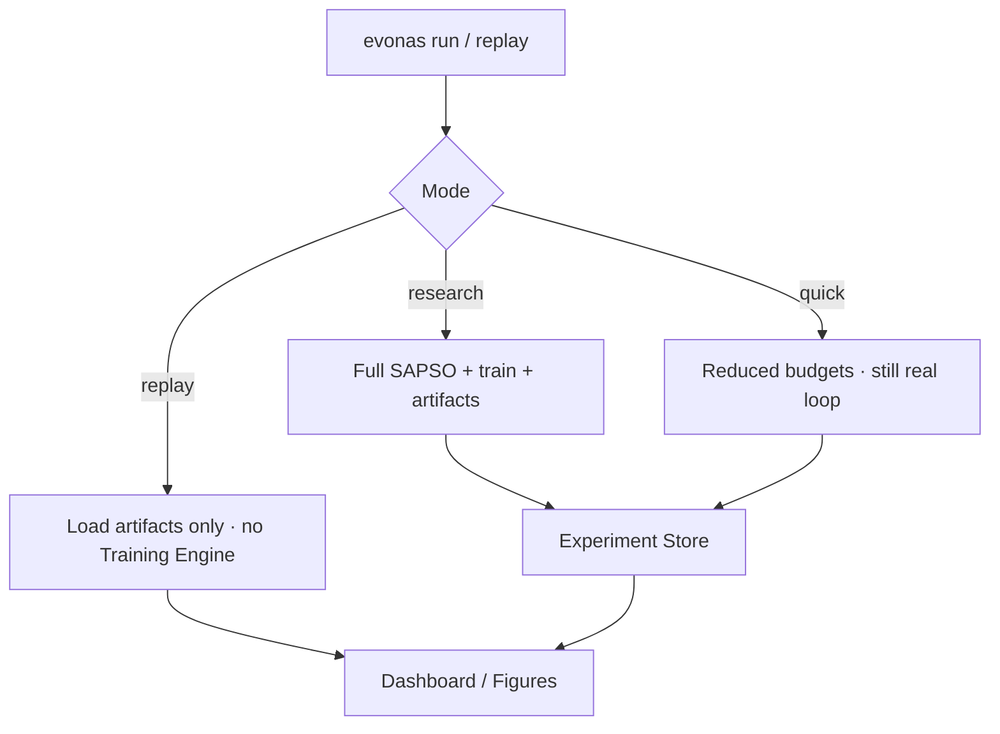

# EvoNAS

### An Autonomous Closed-Loop AutoML Platform for Continuous Neural Architecture Optimization using Self-Adaptive Particle Swarm Optimization (SAPSO)

**An AI System that Continuously Improves Another AI.**

EvoNAS is an **autonomous AI lifecycle management platform** that continuously monitors deployed models, decides when optimization is warranted, redesigns neural architectures via **Self-Adaptive Particle Swarm Optimization (SAPSO)**, retrains and validates candidates, deploys improvements under policy gates, rolls back failures, and repeats forever — without requiring a human in the optimization loop.

> **Important:** EvoNAS is **not** merely a Neural Architecture Search algorithm.  
> NAS is **one capability** inside a broader closed-loop AutoML operating system.  
> The product thesis is **autonomous lifecycle management**; SAPSO is the appointed production search engine.

[](LICENSE)
[](https://www.python.org/)
[](idea.md)
[](idea.md)
[](idea.md)
[](idea.md)
[](idea.md)
[](idea.md)
[](https://github.com/CoderAnush/EvoNAS)

---

## Table of Contents

1. [Vision](#vision)
2. [Problem Statement](#problem-statement)
3. [Solution Overview](#solution-overview)
4. [Core Features](#core-features)
5. [Why EvoNAS?](#why-evonas)
6. [Architecture Overview](#architecture-overview)
7. [Closed-Loop Workflow](#closed-loop-workflow)
8. [Repository Structure](#repository-structure)
9. [Technology Stack](#technology-stack)
10. [Project Roadmap](#project-roadmap)
11. [Execution Modes](#execution-modes)
12. [Installation](#installation)
13. [Quick Start](#quick-start)
14. [Documentation](#documentation)
15. [Future Scope](#future-scope)
16. [Research Direction](#research-direction)
17. [Contributing](#contributing)
18. [License](#license)
19. [Acknowledgements](#acknowledgements)

---

## Vision

Modern AI systems are usually trained once, deployed once, and improved only when a human notices degradation. That model of operation cannot keep pace with distribution drift, concept drift, architecture obsolescence, or the operational cost of manual remediation.

**EvoNAS** treats model evolution as a continuous, policy-governed control problem.

The long-term vision is an AutoML operating layer — conceptually closer to platforms such as Vertex AI, SageMaker, Azure AutoML, Kubeflow, and MLflow in *operational spirit* — specialized for **continuous neural architecture evolution** under SAPSO, with:

- first-class jobs and experiments  
- versioned models and lineage  
- auditable decisions  
- gated deployment and automatic rollback  
- reproducible research artifacts  
- interchangeable training backends (PyTorch / TensorFlow)  
- plugin-ready model families without redesigning the controller  

Humans remain responsible for **governance** (policies, budgets, freezes, ethics).  
EvoNAS removes humans from the **optimization decision loop**.

Canonical authority: [`idea.md`](idea.md) (Master Engineering Specification v1.1.0).

---

## Problem Statement

Traditional machine learning follows an open loop:

```text
Train → Deploy → Stop
```

Even classical Neural Architecture Search typically follows:

```text
Search → Derive Architecture → Train → Evaluate → Deploy → Finished
```

Both approaches share critical limitations:

| Failure Mode | Consequence |
|---|---|
| Distribution / concept drift | Silent accuracy and reliability decay |
| Architecture obsolescence | Fixed topologies stop matching data complexity |
| Human latency | Weeks or months between detection and fix |
| Ad-hoc remediation | Non-reproducible tribal knowledge |
| One-shot NAS | No automatic re-evolution after deployment |
| Missing deploy/rollback policy | Research ends at leaderboard tables |

AI systems that operate in changing environments should be able to **observe themselves, decide when to act, redesign when needed, validate under gates, deploy safely, and continue monitoring** — indefinitely.

---

## Solution Overview

EvoNAS implements a perpetual closed loop:

```text
Observe → Analyze → Decide → Optimize → Retrain → Validate → Deploy → Monitor → Repeat
```



| Stage | Role |
|---|---|
| **Observe** | Collect offline/online metrics, predictions, resource signals |
| **Analyze** | Detect degradation, drift, stagnation, budget pressure |
| **Decide** | Authorize start/stop optimization, retrain, deploy, rollback |
| **Optimize** | Search architectures with **Self-Adaptive PSO only** |
| **Retrain** | Materialize decoded architectures and train weights |
| **Validate** | Compute fitness, compare against champion, enforce gates |
| **Deploy** | Promote validated champions to serving / registry stages |
| **Monitor** | Soak and continue observation; feed the next cycle |
| **Repeat** | Persist state and continue under policy — forever |

Autonomy means the platform decides *whether*, *when*, and *how* to act from observed state and versioned policy — not that it blindly retrains on a schedule.

---

## Core Features

| Capability | Description |
|---|---|
| **Closed-Loop AutoML** | Continuous Observe→…→Monitor state machine, not one-shot search |
| **Self-Adaptive PSO (SAPSO)** | Sole production optimizer; adapts inertia and acceleration from diversity and progress |
| **Continuous Learning Engine** | Windowed data, drift signals, retrain-vs-optimize recommendations |
| **Automatic Architecture Search** | Genotype ↔ architecture decoding under constraints |
| **Performance Monitoring** | Degradation and health reports for triggers and gates |
| **Decision Engine** | Auditable authority for optimize / retrain / deploy / rollback / continue / stop |
| **Dynamic Network Generation** | Framework-agnostic Architecture IR → PyTorch / TensorFlow builders |
| **Model Registry** | Versioning, stages, lineage, last-known-good (LKG) |
| **Automatic Deployment** | Stage → promote under policy; localhost and Docker targets |
| **Automatic Rollback** | Restore LKG on soak / health policy breach |
| **Replay Mode** | Visualize completed runs from artifacts **without retraining** |
| **Experiment Tracking** | Manifests, config hashes, decision logs, swarm histories |
| **Dashboard** | Streamlit operational UI over FastAPI control plane |
| **Future Plugin System** | Search spaces, backends, drift detectors, fitness objectives, serving adapters |

> **Hard constraint (`REQ-OPT-001`):** Production search engine = **SAPSO only**.  
> Grid / Random / Standard PSO may appear in an isolated `benchmarks/` package for research.  
> GA, NSGA-II, Bayesian Optimization, DE, ACO, WOA, GWO are **not** production engines.

---

## Why EvoNAS?

| Dimension | Traditional ML | Traditional NAS | Typical AutoML | **EvoNAS** |
|---|---|---|---|---|
| Lifecycle | Train → deploy → stop | Search → deploy → stop | Often HPO / model select | **Continuous closed loop** |
| Post-deploy evolution | Manual | Rare | Limited | **Policy-triggered architecture re-evolution** |
| Decision authority | Human | Human / script | Partial automation | **Decision Engine + audited records** |
| Optimizer | N/A / manual | Various | Various | **SAPSO exclusive (production)** |
| Deploy gates | Ad hoc | Often omitted | Varies | **Improvement + resource + soak gates** |
| Rollback | Manual | Usually absent | Varies | **Automatic LKG rollback** |
| Reproducibility | Notebook-dependent | Paper-table focused | Tracking tools | **Manifests + Replay Mode** |
| Backend flexibility | Single stack common | Often locked | Varies | **PyTorch ↔ TensorFlow via ports** |
| Product thesis | Model training | Architecture discovery | Broader AutoML | **Autonomous AI lifecycle platform** |

---

## Architecture Overview

EvoNAS follows **Clean Architecture**, **SOLID**, and **Dependency Injection**. Domain logic has zero dependency on TensorFlow, PyTorch, Streamlit, or FastAPI.

```text
┌──────────────────────────────────────────────────────────────┐
│ Presentation: CLI · FastAPI · Streamlit Dashboard            │
├──────────────────────────────────────────────────────────────┤
│ Application: Closed-Loop Controller · Modes · DI Container   │
├──────────────────────────────────────────────────────────────┤
│ Domain: Decision · SAPSO · Architecture · Fitness · Policies │
├──────────────────────────────────────────────────────────────┤
│ Infrastructure: TF/PT · Storage · Deploy · Metrics · Notify  │
└──────────────────────────────────────────────────────────────┘
```



<details>
<summary><strong>Module responsibilities (summary)</strong></summary>

| Module | Responsibility |
|---|---|
| Dataset Manager | Versioned datasets, splits, windows, drift statistics |
| Configuration Manager | Typed configs, validation, hashes, mode overlays |
| Experiment Manager | Experiment IDs, artifacts, status, comparison |
| Performance Monitor | Metrics snapshots, degradation reports |
| Optimization Trigger | “Should we *consider* optimization?” |
| Decision Engine | Sole authority for lifecycle verbs |
| SAPSO | Adaptive swarm search over architecture genotypes |
| Architecture Generator | Decode / encode / validate / repair / complexity |
| Training / Evaluation Engines | Backend-agnostic train & metric production |
| Fitness Calculator | Pure aggregation of metrics + penalties |
| Model Selector | Propose champion (does not deploy) |
| Deployment / Rollback Managers | Stage, promote, LKG, rollback |
| Model Registry | Versions, stages, lineage |
| Checkpoint / Metrics / Visualization / Notification | Continuity, observability, figures, alerts |
| Plugin Registry (future) | Extension points without controller rewrite |

</details>

Full contracts, equations, and state machines: [`idea.md`](idea.md).

---

## Closed-Loop Workflow

Outputs of each cycle become inputs to the next:

1. **Monitor** produces metrics and drift features.  
2. **Trigger + Decision Engine** authorize action or hold.  
3. **SAPSO** proposes genotypes; **Architecture Generator** materializes networks.  
4. **Train / Eval / Fitness** score candidates (with evaluation cache).  
5. **Selector + Decision gates** accept or reject deployment.  
6. **Deploy / Soak / Rollback** update registry pointers and LKG.  
7. **Artifacts + DecisionRecords** enable Replay, audit, and research tables.  
8. Loop returns to monitoring with updated production baseline.





---

## Repository Structure

Target end-state layout defined by the engineering specification (implementation in progress):

```text
EvoNAS/
├── idea.md                          # Master Engineering Specification (canonical)
├── README.md                        # Public project overview (this file)
├── LICENSE
├── pyproject.toml
├── Dockerfile
├── docker-compose.yml
├── configs/                         # Modes, datasets, spaces, policies, optimization
├── src/evonas/
│   ├── ports/                       # Interfaces / Protocols (dependency inversion)
│   ├── domain/                      # Pure business logic (no TF/PT/UI frameworks)
│   ├── application/                 # Closed-loop controller, modes, DI composition root
│   ├── infrastructure/              # Adapters: data, train, deploy, registry, metrics
│   ├── presentation/                # CLI, FastAPI, Streamlit
│   └── benchmarks/                  # Research baselines only (not production engine)
├── tests/                           # Unit, integration, contract tests
├── scripts/                         # Demo, benchmark, export utilities
├── docs/                            # Derived docs (never override idea.md)
└── artifacts/                       # Runtime outputs (gitignored)
```

| Path | Why it exists |
|---|---|
| `idea.md` | Binding engineering bible for all implementation decisions |
| `configs/` | Policy and experiment configuration as code |
| `src/evonas/ports` | Explicit contracts for DI and testing |
| `src/evonas/domain` | Framework-agnostic brain (decision, SAPSO, architecture) |
| `src/evonas/application` | Orchestration and state machine |
| `src/evonas/infrastructure` | Replaceable adapters |
| `src/evonas/presentation` | Human/machine interfaces |
| `src/evonas/benchmarks` | Quarantine for non-SAPSO research baselines |
| `tests/` | Phase gates and contract enforcement (default engine = SAPSO) |
| `artifacts/` | Reproducible run outputs for Replay and papers |

---

## Technology Stack

| Layer | Technology |
|---|---|
| **Programming** | Python 3.11+, typed APIs, Ruff / Black / mypy, pytest |
| **AI / DL** | PyTorch and TensorFlow behind interchangeable ports |
| **Optimization** | Particle Swarm Optimization → **Self-Adaptive PSO (production)** |
| **Backend / Control Plane** | FastAPI |
| **Frontend / Ops UI** | Streamlit (React/Next reserved as future option) |
| **Deployment** | Localhost inference, Docker Compose, future cloud adapters |
| **Experiment Tracking** | First-party experiment manifests + artifact store (MLflow adapter future) |
| **Visualization** | Matplotlib / Plotly via Visualization Engine |
| **Packaging** | `pyproject.toml`, optional extras (`pytorch`, `tensorflow`, `api`, `dashboard`, `dev`, `research`) |

---

## Project Roadmap

Implementation status tracks the Master Specification phases. Checklist items are **not started** unless checked.

### Phase 0 — Repository Foundation
- [ ] Installable `evonas` package and CLI stub
- [ ] Ports skeleton, config loader, logging, DI stub
- [ ] Docker / CI scaffolding
- [x] Master Engineering Specification (`idea.md`)

### Phase 1 — Dataset Management
- [ ] `IDatasetManager` + manifests + checksums
- [ ] Splits, windows, drift utilities
- [ ] Quick Mode toy dataset configs

### Phase 2 — Baseline Model
- [ ] Fixed baseline ArchitectureSpec
- [ ] Training / Evaluation vertical slice (PyTorch first)
- [ ] Baseline metrics artifacts

### Phase 3 — Dynamic Neural Network Generator
- [ ] Search space schema + genotype decode/encode
- [ ] Constraint repair + complexity estimates
- [ ] Framework-agnostic Architecture IR

### Phase 4 — Standard PSO Engine
- [ ] Classical PSO implementing `ISearchAlgorithm`
- [ ] Synthetic-function unit tests + Quick NN path
- [ ] Swarm history + checkpoints

### Phase 5 — Self-Adaptive PSO
- [ ] Adaptive \(w, c_1, c_2\) from diversity / progress
- [ ] Ablation configs (fixed vs adaptive)
- [ ] Adaptive coefficient visualizations

### Phase 6 — Closed-Loop Controller
- [ ] Explicit state machine
- [ ] Decision Engine + policy YAML
- [ ] End-to-end Quick Mode loop with decision logs

### Phase 7 — Continuous Learning Engine
- [ ] Data windows + retention
- [ ] Drift-triggered recommendations
- [ ] Multi-cycle unsupervised operation

### Phase 8 — Deployment Manager
- [ ] Localhost staging / promote / LKG
- [ ] Automatic rollback path
- [ ] Docker deployment target

### Phase 9 — Dashboard
- [ ] Streamlit run / replay / registry / metrics / policies
- [ ] Live state and swarm charts
- [ ] Offline Replay without GPU training

### Phase 10 — Experiment Tracking
- [ ] Experiment index, compare, export
- [ ] Paper table export scripts
- [ ] Replay fidelity guarantees

### Phase 11 — Model Registry
- [ ] Versioning, stages, lineage
- [ ] Production singleton invariant
- [ ] Dashboard / API integration

### Phase 12 — Research Extensions
- [ ] Isolated Grid / Random / Standard PSO baselines
- [ ] Statistical comparison suite
- [ ] IEEE protocol assets (`docs/research/`)



---

## Execution Modes

EvoNAS defines three first-class modes:

| Mode | Purpose | Training | Typical Use |
|---|---|---|---|
| **Research Mode** | Full-budget scientific runs | Full | Papers, ablations, overnight jobs |
| **Quick Mode** | End-to-end smoke / demo / CI | Reduced | Minutes-scale validation on toy configs |
| **Replay Mode** | Reconstruct prior runs | **None** | Figures, audits, demos from artifacts |



Quick Mode is required to exercise the **real** controller, Decision Engine, and SAPSO class — not a fake substitute — with smaller swarm / iteration / epoch budgets (target: complete the reference toy loop within ~10 minutes on CPU).

---

## Installation

> **Status:** The repository is in the **specification-complete / implementation-ongoing** stage.  
> The public API surface below matches [`idea.md`](idea.md). Runnable package install will land with **Phase 0**.

### Prerequisites (planned)

- Python **3.11+**
- Git
- Optional: Docker / Docker Compose
- Optional: CUDA-capable GPU for Research Mode

### Planned install (after Phase 0)

```bash
git clone https://github.com/CoderAnush/EvoNAS.git
cd EvoNAS

python -m venv .venv
# Windows: .venv\Scripts\activate
# Unix:    source .venv/bin/activate

pip install -e ".[dev]"
# Later extras (as implemented):
# pip install -e ".[pytorch,api,dashboard,dev]"
```

### Verify (planned)

```bash
evonas version
evonas doctor
```

Until Phase 0 lands, the canonical project artifact is:

```bash
# Read the engineering bible
# idea.md
```

---

## Quick Start

> Commands below are **specified** in the engineering bible and will become available as phases complete.  
> They are documented here for contributors and early adopters — **do not assume they work until the corresponding phase is marked done**.

### Planned Quick Mode

```bash
evonas run --mode quick --config configs/modes/quick.yaml
```

### Planned Research Mode

```bash
evonas run --mode research --config configs/modes/research.yaml
```

### Planned Replay Mode

```bash
evonas replay --experiment-id exp_YYYYMMDD_HHMMSS_id
```

### Planned Dashboard / API

```bash
evonas dashboard
evonas api
```

### What exists today

| Artifact | Availability |
|---|---|
| Master Engineering Specification | ✅ [`idea.md`](idea.md) |
| Public overview | ✅ [`README.md`](README.md) |
| Installable CLI / training loop | ⏳ Phase 0+ |
| Closed-loop Quick demo | ⏳ Phase 6+ |
| Dashboard Replay | ⏳ Phase 9+ |

---

## Documentation

| Document | Status | Description |
|---|---|---|
| [`idea.md`](idea.md) | **Available** | Master Engineering Specification — sole source of truth |
| `ROADMAP.md` | Coming Soon | Phase tracking derived from `idea.md` |
| `ARCHITECTURE.md` | Coming Soon | Architecture digest for contributors |
| `CONTRIBUTING.md` | Coming Soon | Contribution process and review standards |
| `RESEARCH.md` | Coming Soon | Experimental protocol and publication notes |
| `API.md` | Coming Soon | FastAPI surface reference |

> If any derived document conflicts with `idea.md`, **`idea.md` wins**.

---

## Future Scope

Designed for extension **without redesigning** the closed-loop controller (plugin doctrine):

| Direction | Intent |
|---|---|
| **CNN / MLP** | Default early search spaces |
| **Vision Transformers** | Patch / depth / head genotype spaces |
| **Object Detection / Segmentation** | Task metrics (mAP / mIoU) via evaluator plugins |
| **Time Series / Tabular** | Alternate spaces and fitness definitions |
| **Medical AI** | Strict gates, audit, dataset license controls |
| **Edge AI** | Latency / memory hard constraints |
| **Federated Learning** | Trainer / aggregation adapters |
| **LLMs** | Adapter / LoRA configuration search (not full pretrain-from-scratch initially) |
| **Explainable AI** | Post-hoc explain adapters and fidelity penalties |
| **Cloud Deployment** | Job / artifact / endpoint adapters |
| **Multi-Agent / Agentic AI** | Future genotype spaces for routing / planner depth |

---

## Research Direction

### Gap

Most NAS systems are **open-loop**. Most AutoML stacks under-specify **post-deploy architecture re-evolution**, **audited optimize/deploy/rollback policy**, and **replayable continuous experiment manifests**. Adaptive PSO is often studied in isolation from production lifecycle concerns.

### Contribution thesis

The novelty of EvoNAS is **not** Particle Swarm Optimization itself.  
The novelty is the **complete autonomous framework**: continuous monitoring, decision-gated SAPSO search, validation, deployment, rollback, experiment tracking, and reproducibility — as one platform.

### Publication directions (planned)

1. Systems paper — autonomous closed-loop AutoML platform  
2. Algorithm paper — SAPSO under drift-triggered continuous optimization  
3. Decision-policy paper — gated deploy / rollback controllers  
4. Empirical paper — Baseline / Grid / Random / PSO / SAPSO under identical spaces  
5. Reproducibility paper — Replay Mode and continuous-run manifests  

### Benchmark policy

Compare under identical search spaces and training budgets:

**Baseline · Grid Search · Random Search · Standard PSO · SAPSO**

Metrics include accuracy, search time, train time, parameter count, architecture complexity, and inference latency. Other metaheuristics may appear **only** as research baselines.

---

## Contributing

EvoNAS welcomes careful, specification-aligned contributions.

1. Read [`idea.md`](idea.md) before proposing architecture changes.  
2. Map work to a **Phase ID** and module boundary.  
3. Prefer ports + DI; do not bypass the Decision Engine.  
4. Do not introduce non-SAPSO engines into the production closed loop.  
5. Add tests (unit / integration / contract as appropriate).  
6. If the change is architectural, update `idea.md` in the same PR.  

Detailed `CONTRIBUTING.md` — **Coming Soon**.

Suggested branch naming (from specification): `feature/<phase>-<short-desc>`.

---

## License

This project is intended to be released under the **MIT License**.

`LICENSE` file — placeholder until Phase 0 packaging lands.  
See the repository license file once added: [LICENSE](LICENSE).

---

## Acknowledgements

EvoNAS builds on decades of ideas from:

- **AutoML** and managed ML platforms  
- **Neural Architecture Search** research  
- **Particle Swarm Optimization** and adaptive swarm methods  
- **Evolutionary and population-based computing**  
- **MLOps** practices around registries, gates, and rollback  

This project is an independent open-source effort.  
**No affiliation** with OpenAI, Google DeepMind, Microsoft, NVIDIA, Meta, or any commercial AutoML vendor is implied.

---

<p align="center">
  <strong>EvoNAS</strong><br/>
  An AI System that Continuously Improves Another AI.<br/><br/>
  <a href="https://github.com/CoderAnush/EvoNAS">github.com/CoderAnush/EvoNAS</a><br/>
  Engineering authority: <a href="idea.md">idea.md</a>
</p>
