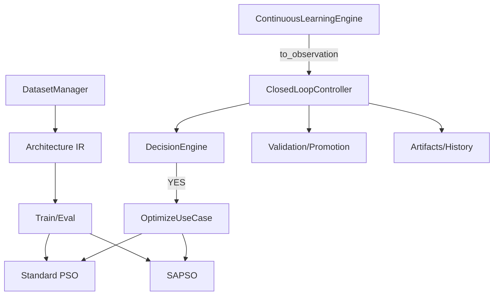

# SYSTEM_WORKFLOW.md

## Target Lifecycle (idea.md)

```text
Observe → Detect/Version Data (CL) → Decision Engine
  → Optimize (PSO|SAPSO) → Train → Evaluate → Validate
  → Promote|Reject (local) → Observe
```

## Implemented Through v0.7.0



## What Is Explicitly Out of Scope Now

Cloud deploy, FastAPI, dashboard UI, model registry, notifications.
