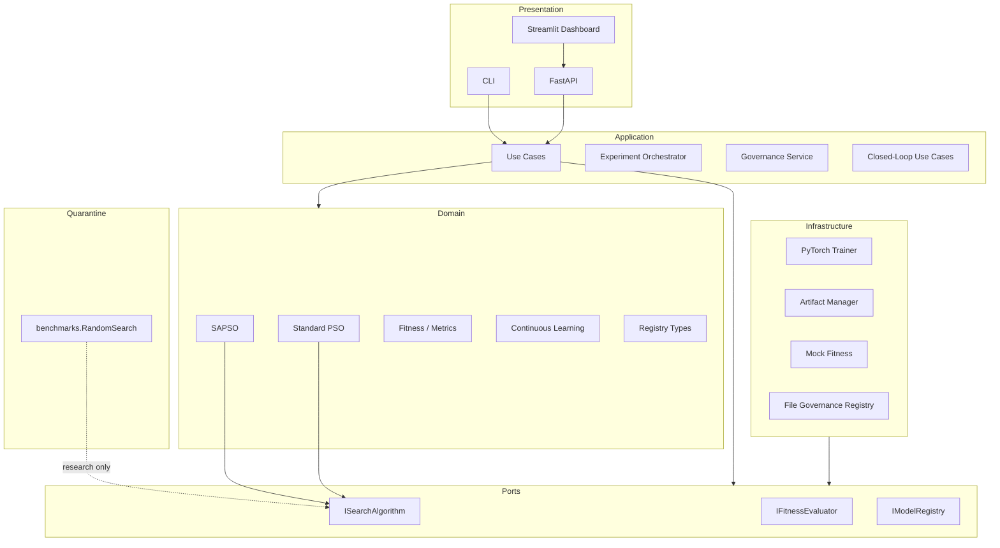
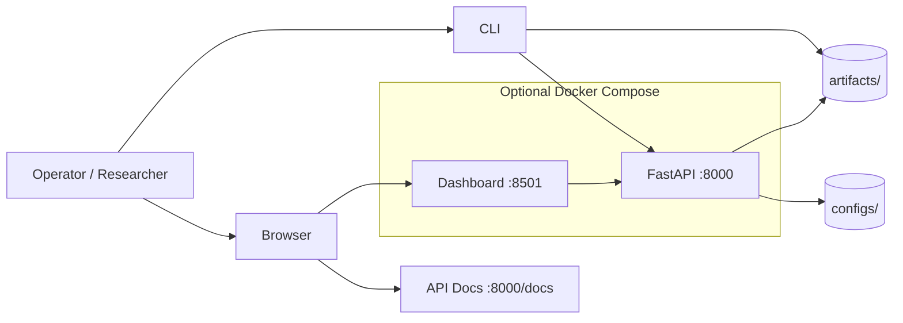
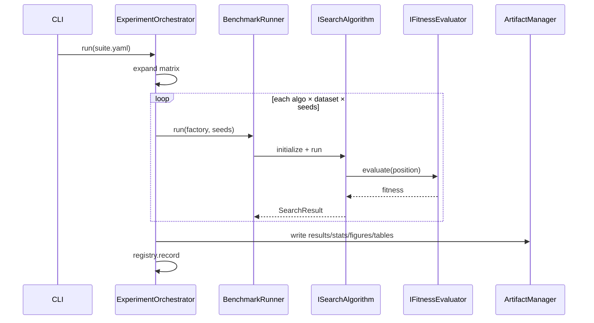
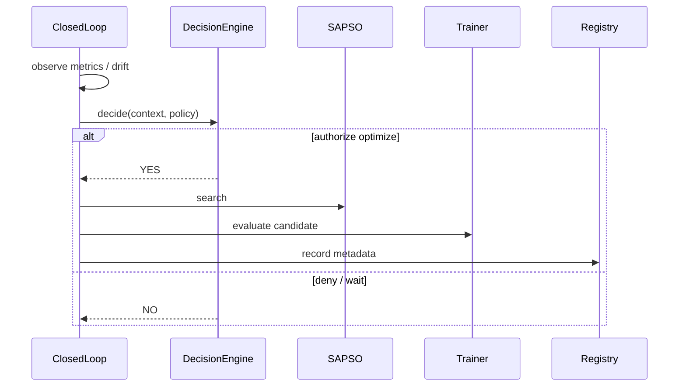
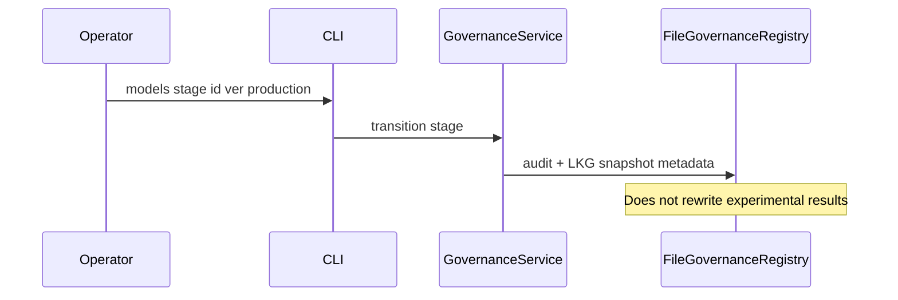

# EvoNAS Architecture Book — v1.0.0

**Audience:** Contributors, reviewers, thesis examiners, open-source users  
**Authority:** `idea.md` · Clean Architecture under `src/evonas/`  
**Release:** v1.0.0 (Phase 12C)  
**Scope:** Documentation only — no core engine changes in Phase 12C

---

## 1. Product thesis

EvoNAS is an **autonomous closed-loop AutoML platform**. Neural Architecture Search is a subsystem. Self-Adaptive PSO (SAPSO) is the **production** search engine. Standard PSO and Random Search exist for research comparison only and are not the default closed-loop engine.

## 2. Layered architecture

### Dependency rule

Presentation → Application → Domain ← Infrastructure (via ports).  
Domain must not import infrastructure or presentation.

## 3. Component catalog

| Component | Package | Role |
|-----------|---------|------|
| Dataset plane | `domain/data`, `infrastructure/data` | Load, validate, drift signals |
| Dynamic builder | `domain/architecture`, `infrastructure/training` | Spec → network |
| Trainer / evaluator | `infrastructure/training` | PyTorch train/eval |
| Standard PSO | `domain/optimization/pso.py` | Fixed-coefficient baseline |
| SAPSO | `domain/optimization/sapso.py` | Adaptive production engine |
| Closed loop | `domain` + application loop use cases | Observe → decide → act |
| Continuous learning | `domain/continuous` | Recommendations only |
| Research suite | `application/research` | Fair multi-seed benchmarks |
| Registry | `domain/registry`, `infrastructure/registry` | Metadata lifecycle |
| Dashboard / API | `presentation/*` | Ops surfaces |

## 4. Deployment diagram

Local default: `evonas serve` (API + dashboard). Docker: see `docs/ops/DEPLOYMENT.md` and `Dockerfile`.

## 5. Sequence — research benchmark cell

## 6. Sequence — closed-loop cycle (conceptual)

## 7. Sequence — governance promote (metadata)

## 8. Invariants (v1.0)

1. Production closed-loop engine = SAPSO (unless explicit research profile).
2. Registry never mutates scientific result files.
3. Benchmark baselines stay in `evonas.benchmarks`.
4. Phase 12A/12B evidence and docs do not alter engines.
5. Config hashes + artifact checksums support reproducibility.

## 9. Related docs

- Quick start / install: `README.md`
- CLI: `CLI.md` · `docs/guides/CLI_GUIDE.md`
- API: `docs/ops/API_REFERENCE.md` · `docs/guides/API_GUIDE.md`
- Config: `CONFIGURATION.md` · `docs/guides/CONFIGURATION_GUIDE.md`
- Architecture diagrams (exportable): `docs/architecture/`
- Research protocol: `docs/research/experimental_protocol.md`
- Publication package: `paper/`
