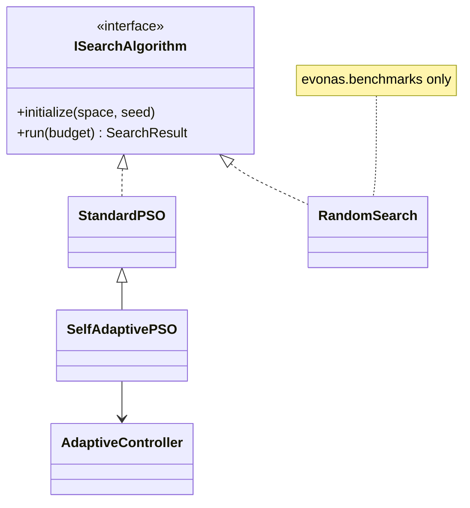
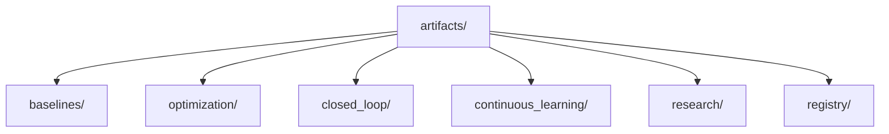

# Component Diagrams — EvoNAS v1.0.0

## Domain optimization components

```mermaid
classDiagram
  class ISearchAlgorithm {
    <<interface>>
    +initialize(space, seed)
    +run(budget) SearchResult
  }
  class StandardPSO
  class SelfAdaptivePSO
  class RandomSearch
  class AdaptiveController
  ISearchAlgorithm <|.. StandardPSO
  StandardPSO <|-- SelfAdaptivePSO
  ISearchAlgorithm <|.. RandomSearch
  SelfAdaptivePSO --> AdaptiveController
  note for RandomSearch "evonas.benchmarks only"
```

## Presentation stack

```mermaid
flowchart LR
  DASH[Dashboard views] --> CLIENT[API client]
  CLIENT --> ROUTES[FastAPI routes]
  ROUTES --> UC[Application use cases]
  CLI[CLI main] --> UC
```

## Artifact roots

```mermaid
flowchart TB
  ART[artifacts/]
  ART --> BASE[baselines/]
  ART --> OPT[optimization/]
  ART --> LOOP[closed_loop/]
  ART --> CL[continuous_learning/]
  ART --> RES[research/]
  ART --> REG[registry/]
```
