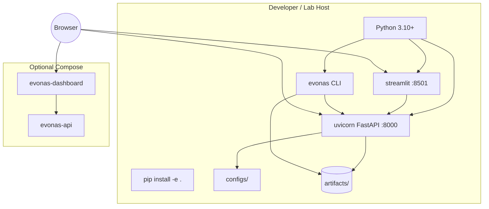

# Deployment Diagram — EvoNAS v1.0.0

## Profiles

| Profile | Command | Notes |
|---------|---------|-------|
| CLI-only | `evonas …` | No servers |
| Local serve | `evonas serve --demo` | API + dashboard |
| Docker | `docker compose up` | See `docs/ops/DEPLOYMENT.md` |
| Research | `evonas benchmark` / `python scripts/run_phase12a_campaign.py` | Writes `artifacts/research/` |

Cloud / K8s / auth: **out of scope for v1.0.0**.
