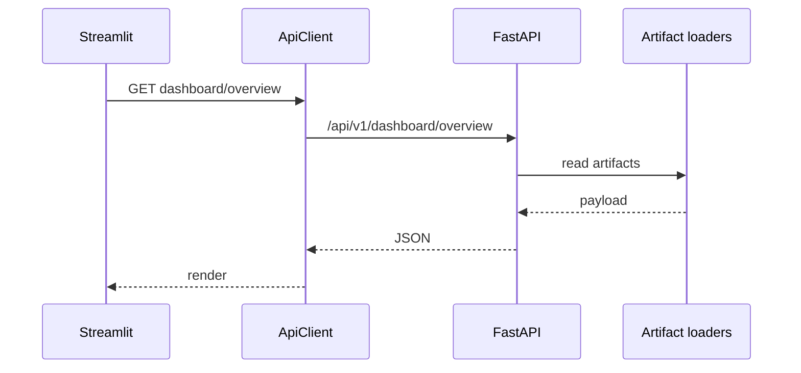
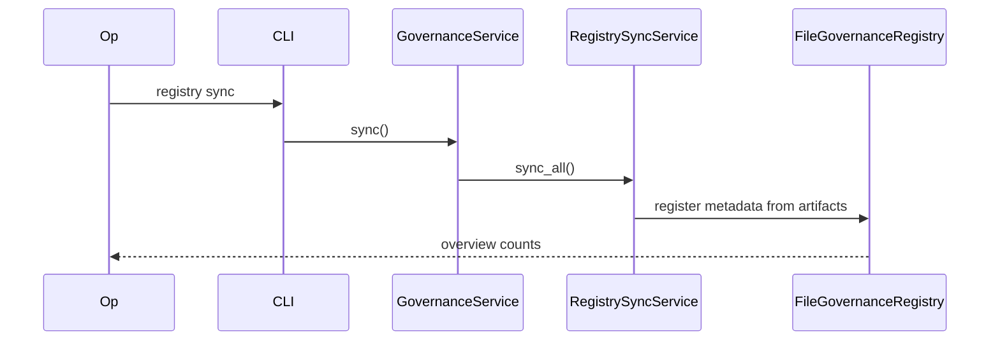

# Sequence Diagrams — EvoNAS v1.0.0

See also `docs/architecture/ARCHITECTURE_BOOK.md` §§5–7.

## Optimize (dry-run / mock)

```mermaid
sequenceDiagram
  participant User
  participant CLI
  participant Opt as OptimizeUseCase
  participant PSO as StandardPSO or SAPSO
  participant Mock as MockFitnessEvaluator
  participant Art as ArtifactManager
  User->>CLI: optimize --config --dry-run
  CLI->>Opt: run
  Opt->>PSO: initialize + run
  PSO->>Mock: evaluate
  Mock-->>PSO: fitness
  PSO-->>Opt: SearchResult
  Opt->>Art: write history / metrics
  Opt-->>CLI: summary JSON
```

## Dashboard read path



## Registry sync


