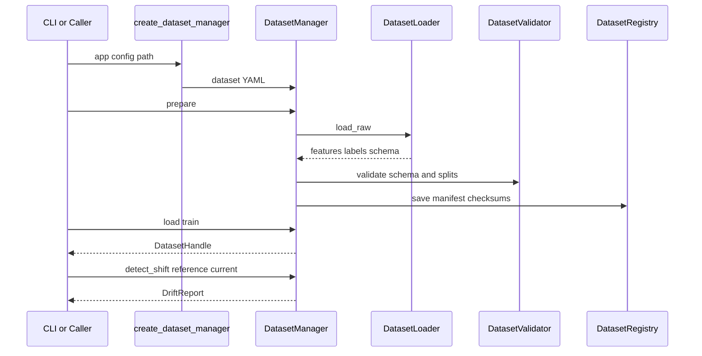
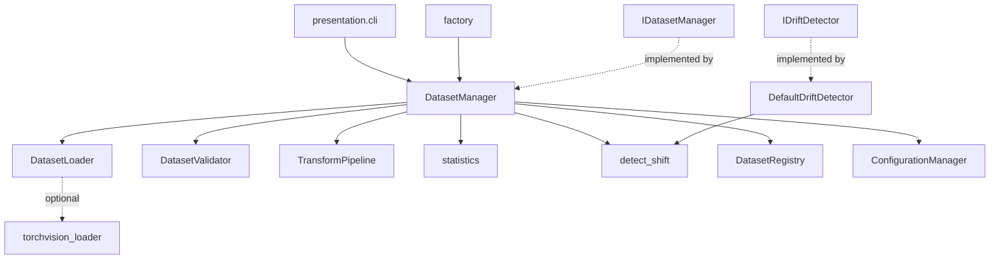

# Phase 1 Report — Dataset Management & Data Pipeline Foundation

**Project:** EvoNAS  
**Phase:** 1  
**Version:** v0.1.0  
**Status:** FROZEN — READY FOR PHASE 2  
**Date:** 2026-07-28  
**Authority:** [`idea.md`](../../idea.md) Master Engineering Specification  

---

## Overview

Phase 1 delivers the **data plane** of EvoNAS: deterministic, versioned, checksummed dataset access with train/val/test splits, statistics, transforms, manifests, and drift utilities. This layer is the foundation for continuous learning and closed-loop triggers in later phases.

Phase 1 does **not** include neural networks, training, PSO, or optimization.

---

## Objectives (from `idea.md`)

| Objective | Outcome |
|---|---|
| Deterministic dataset access | Seeded splits; stable SHA-256 checksums |
| Versioned manifests | `artifacts/datasets/<name>/manifest.json` |
| Statistics for drift | Per-split moments, histograms |
| PSI / KS drift utilities | Domain math + `DefaultDriftDetector` |
| Quick Mode toy dataset | `configs/datasets/toy_quick.yaml` |
| Config → dataset wiring | `create_dataset_manager` / `resolve_dataset_config_path` |

---

## Requirement Verification Checklist

| Requirement | Status | Evidence | Files |
|---|---|---|---|
| `IDatasetManager` for local datasets | **Done** | Protocol + `DatasetManager` runtime-checkable | `ports/dataset.py`, `local_dataset_manager.py` |
| Manifest schema | **Done** | `DatasetManifest`, atomic JSON write | `models.py`, `dataset_registry.py` |
| Split utilities | **Done** | `make_splits`, disjointness validation | `checksums.py`, `validator.py` |
| Statistics | **Done** | `compute_data_stats` | `statistics.py` |
| PSI / KS drift | **Done** | `detect_shift`, unit + integration tests | `drift.py`, `drift_detector.py` |
| `IDriftDetector` (optional) | **Done** | `DefaultDriftDetector` | `drift_detector.py` |
| Quick Mode toy config | **Done** | synthetic, no download | `configs/datasets/toy_quick.yaml` |
| MNIST / Fashion-MNIST / CIFAR-10 configs | **Done** | synthetic placeholders; torchvision optional | `configs/datasets/*.yaml`, `torchvision_loader.py` |
| Schema / DatasetHandle dataclasses | **Done** | frozen/slots models | `models.py` |
| Loaders | **Done** | synthetic + optional torchvision | `dataset_loader.py` |
| Checksum manifests | **Done** | prepare writes + stability check | `local_dataset_manager.py` |
| Wire config → dataset | **Done** | factory from `default.yaml` | `factory.py` |
| Windows for continuous learning | **Done** | `get_window` | `local_dataset_manager.py` |
| Subset for Quick Mode | **Done** | `subset(split, fraction, seed)` | `local_dataset_manager.py` |
| Unit tests (synthetic) | **Done** | 29 passed | `tests/data/` |
| Split disjointness test | **Done** | `test_split_disjointness` | `test_dataset_manager.py` |
| Deterministic seed test | **Done** | `test_deterministic_shuffle_seed` | `test_dataset_manager.py` |
| Drift fires on synthetic shift | **Done** | multiple tests | `test_drift.py`, manager tests |
| Quick load < 30s | **Done** | toy prepare ≪ 1s | CLI / example |
| Checksums stable across loads | **Done** | `test_prepare_load_checksum_stable` | `test_dataset_manager.py` |
| No PSO / NN / training | **Done** | verified by scope | — |

**Missing items at freeze:** none for Phase 1 scope.

---

## Completed Features

- Dataset loading (synthetic default; torchvision optional extra)
- Schema + handle validation
- Metadata / schema exposure
- Statistics computation and caching
- Train / val / test splits (deterministic, disjoint)
- Transform pipeline (normalize, flatten)
- Structured logging (no `print` in library path)
- YAML configuration + stable config hashing
- Manifest registry (versioning hook)
- Drift detection (PSI + KS) with future continuous-learning windows
- CLI: `evonas version`, `doctor`, `prepare-dataset`

---

## Architecture

Clean Architecture layers:

```text
ports/          → IDatasetManager, IDriftDetector, IConfigurationManager
domain/data/    → pure models, drift math, stats, transforms, validator
infrastructure/ → loader, registry, DatasetManager, factory, config, logging
presentation/   → CLI only (Phase 1)
```

### Architecture Review Report (short)

| Check | Result |
|---|---|
| Package structure matches `idea.md` | Pass |
| Domain free of torch/tensorflow | Pass |
| Dependency inversion via ports | Pass |
| SRP per module (loader ≠ validator ≠ registry) | Pass |
| No circular imports | Pass |
| DatasetManager is sole public orchestration facade | Pass |
| Benchmarks / PSO / training absent | Pass |

**Coupling notes:** `DatasetManager` depends on domain + infrastructure adapters via constructor injection — acceptable composition root pattern for Phase 1 (full DI container arrives later).

---

## Folder Structure (Phase 1)

```text
src/evonas/
  ports/dataset.py
  ports/configuration.py
  domain/common/{errors,enums}.py
  domain/data/{models,drift,statistics,transforms,validator}.py
  infrastructure/config/manager.py
  infrastructure/logging/setup.py
  infrastructure/data/
    local_dataset_manager.py
    dataset_loader.py
    dataset_registry.py
    drift_detector.py
    factory.py
    checksums.py
    torchvision_loader.py
  presentation/cli/main.py
configs/datasets/{toy_quick,mnist,fashion_mnist,cifar10}.yaml
configs/default.yaml
tests/data/
scripts/example_dataset_phase1.py
docs/phase_reports/phase1.md
```

---

## Classes & Public Interfaces (Frozen)

### Ports (frozen)

- `IDatasetManager` — `prepare`, `load`, `get_schema`, `get_window`, `subset`, `compute_statistics`, `checksums`, `detect_shift`, `drift_report`
- `IDriftDetector` — `detect(...)`
- `IConfigurationManager` — `load`, `validate`, `get`, `hash`

### Implementations (frozen for Phase 1 consumers)

| Symbol | Module | Role |
|---|---|---|
| `DatasetManager` | `infrastructure.data` | Public facade |
| `DatasetLoader` | `infrastructure.data` | Raw materialization |
| `DatasetRegistry` | `infrastructure.data` | Manifest I/O |
| `DefaultDriftDetector` | `infrastructure.data` | Drift adapter |
| `create_dataset_manager` | `infrastructure.data` | Config wiring |
| `DatasetValidator` | `domain.data` | Validation |
| `TransformPipeline` | `domain.data` | Transforms |
| `Schema`, `DatasetHandle`, `DataStats`, `DriftReport`, `DatasetManifest` | `domain.data` | Metadata models |

**Freeze rule:** Phase 2+ must not break these method signatures without an ECR to `idea.md`.

---

## Sequence Diagram



---

## Dependency Diagram



---

## Testing Summary

| Suite | Result |
|---|---|
| `pytest` | **29 passed** |
| Line coverage (`evonas`) | **82%** |
| Ruff lint | Pass |
| Ruff format | Pass |
| Mypy (`src/evonas`) | Pass |
| TODOs in source | None |

Primary gaps in coverage (accepted for Phase 1): optional `torchvision_loader` (requires `evonas[pytorch]`), CLI branches for future `run`/`replay`, JSON log formatter.

---

## Lessons Learned

1. Never use Python’s built-in `hash()` for reproducibility — it is process-salted; use SHA-256.
2. GitHub/CI-friendly datasets should default to synthetic sources; downloadable backends stay optional.
3. PSI requires positive histogram mass — clip out-of-range values when re-binning onto reference edges.
4. Application YAML must not use TOML-like `[project]` headers.

---

## Future Hooks (not implemented)

- Cloud object-store adapters
- DVC-like external versioning
- Streaming / federated partitions
- Continuous Learning Engine (Phase 7) consuming `get_window` + drift reports
- Decision Engine authorization on drift (Phase 6)

---

## Known Limitations

- Synthetic stand-ins for MNIST/Fashion-MNIST/CIFAR-10 unless `evonas[pytorch]` is installed
- In-memory materialization only (no memory-mapped shards)
- No multi-tenant dataset catalog service yet
- Application DI container deferred to later phases

---

## Completion Verdict

All Phase 1 deliverables, coding tasks, tests, and validation gates from `idea.md` are satisfied.

### Scores

| Dimension | Score | Notes |
|---|---|---|
| Architecture | **9/10** | Clean layers; DI container still deferred |
| Code quality | **9/10** | Lint/type clean; SRP respected |
| Documentation | **9/10** | Spec + this report + README roadmap |
| Tests | **9/10** | 29 tests, 82% coverage, gates covered |
| Readiness for Phase 2 | **Ready** | Data plane stable for baseline training |

### Technical debt

- Expand CLI tests; add torchvision smoke test marked optional
- Persist split index arrays to disk for very large datasets (future)

### Risks

- Optional download flakiness mitigated by synthetic defaults
- Manifest path conventions must remain stable for Replay later

### Recommendations

1. Begin Phase 2 (Baseline Model) against `DatasetHandle` / `Schema` only.
2. Do not widen `IDatasetManager` without ECR.
3. Keep domain free of training framework imports.

---

## Overall Phase Status

# READY FOR PHASE 2

**Justification:** Requirements complete, public APIs frozen, quality gates green, no Phase 2 leakage, continuous-learning hooks present without implementing Phase 7.
