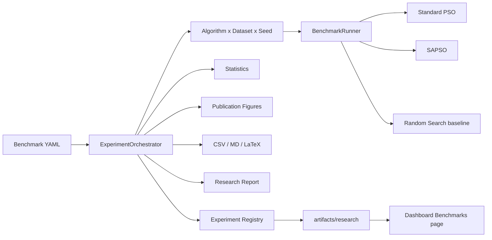

# Phase 10 Report — Scientific Evaluation & Experimental Framework

**Status:** Complete  
**Version:** v1.0.0-rc1 (`1.0.0rc1`)  
**Date:** 2026-07-30  

## Summary

Phase 10 adds a reproducible research benchmarking layer around existing optimizers. **No PSO/SAPSO/training/closed-loop algorithms were modified.** Random Search is isolated under `evonas.benchmarks` and is **not** wired into the closed-loop controller.

## Architecture



## Deliverables

| Item | Status |
|------|--------|
| ExperimentOrchestrator | Done |
| Multi-seed matrix | Done |
| Random Search baseline (`ISearchAlgorithm`) | Done |
| Stats (mean/median/var/std/CI + optional Wilcoxon + Cliff’s δ) | Done |
| Publication figures (PNG/SVG/PDF) | Done |
| Tables CSV/Markdown/LaTeX | Done |
| Registry + checksums + git/version meta | Done |
| Research reports | Done |
| CLI `benchmark` / `experiment` / `compare` / `report` | Done |
| Dashboard exposure via `artifacts/research/*/comparison.json` | Done |

## CLI

```bash
evonas benchmark --config configs/benchmarks/default.yaml
evonas experiment list
evonas experiment show research_sphere_suite
evonas compare --config configs/benchmarks/default.yaml --suite
evonas report --run-dir artifacts/research/research_sphere_suite
```

## Research integrity

Winner is declared solely from recorded mean fitness under the configured sense. The framework does **not** bias toward SAPSO.

## Deferred

Model registry, paper writing, website, cloud — later phases.
