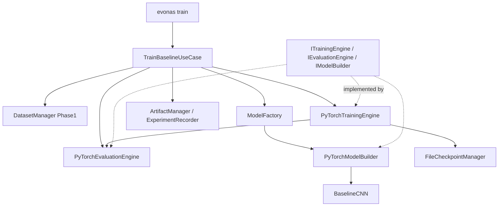

# Phase 2 Report — Baseline Learning System

**Project:** EvoNAS  
**Phase:** 2  
**Version:** v0.2.0  
**Status:** COMPLETE — READY FOR PHASE 3  
**Date:** 2026-07-28  
**Authority:** [`idea.md`](../../idea.md)  

---

## Overview

Phase 2 delivers the first complete **baseline training pipeline**: fixed ArchitectureSpec → ModelFactory → PyTorch TrainingEngine → EvaluationEngine → checkpoints → experiment artifacts. No PSO, NAS, closed-loop, or deployment code is included.

Success path:

```text
Phase 1 DatasetHandle → Baseline CNN → Train → Validate → Evaluate → Checkpoints → Experiment record
```

---

## Objectives (idea.md + milestone brief)

| Objective | Status |
|---|---|
| ArchitectureSpec for fixed baseline | Done |
| PyTorch ModelBuilder | Done |
| TrainingEngine + EvaluationEngine | Done |
| CLI `train` / `train-baseline` | Done |
| Metrics JSON under `artifacts/baselines/` | Done |
| Overfit tiny subset on CPU | Done |
| Interchangeable model interface | Done (`ITrainableModel`) |
| Config-driven hyperparameters | Done |

---

## Completed Subsystems

1. **Model interface** — `ITrainableModel`, `IModelBuilder`
2. **Baseline model** — `BaselineCNN` (fixed, not searched)
3. **Model factory** — `ModelFactory` (YAML / spec → model)
4. **Training engine** — `PyTorchTrainingEngine` (epochs, checkpoints, early stop hooks)
5. **Evaluation engine** — `PyTorchEvaluationEngine`
6. **Metrics** — Accuracy, Precision, Recall, F1, Confusion Matrix
7. **Checkpoint manager** — `FileCheckpointManager` (best + latest)
8. **Artifact manager** — run directories under `artifacts/baselines/`
9. **Experiment recorder** — `experiment.json` + `metrics.json`
10. **YAML configs** — `configs/models/baseline_cnn.yaml`, `configs/training/baseline.yaml`
11. **CLI** — `evonas train --config ...`
12. **Structured logging** — no library `print` in training path

---

## Architecture



Domain remains free of `torch` imports except infrastructure adapters.

---

## Folder Structure

```text
src/evonas/
  ports/training.py
  domain/model/architecture_spec.py
  domain/metrics/classification.py
  domain/training/types.py
  application/train_baseline.py
  infrastructure/training/
    baseline_cnn.py
    pytorch_builder.py
    pytorch_trainer.py
    pytorch_evaluator.py
    model_factory.py
    torch_data.py
  infrastructure/checkpoint/file_checkpoint_manager.py
  infrastructure/experiments/{artifact_manager,experiment_recorder}.py
configs/models/baseline_cnn.yaml
configs/training/baseline.yaml
configs/training/baseline_overfit.yaml
tests/training/
```

---

## Public Interfaces (Phase 2 freeze)

| Port / API | Methods |
|---|---|
| `ITrainableModel` | `parameters`, `train`, `eval`, `to`, `state_dict`, `load_state_dict`, `__call__` |
| `IModelBuilder` | `build`, `count_parameters` |
| `ITrainingEngine` | `train(spec, train_data, val_data, train_config) -> TrainedModelArtifact` |
| `IEvaluationEngine` | `evaluate(model, data) -> EvaluationResult` |
| `ICheckpointManager` | `save`, `load`, `list` |
| `ModelFactory.create` | `(model, spec)` |
| `TrainBaselineUseCase.run` | end-to-end YAML run |

---

## Testing Summary

| Gate | Result |
|---|---|
| pytest | **40 passed** |
| Coverage | **~86%** line |
| Ruff | Pass |
| Mypy | Pass |
| Overfit CPU test | train accuracy ≥ 0.85 on tiny synthetic set |

---

## Example Usage

```bash
pip install -e ".[dev,pytorch]"
evonas prepare-dataset --config configs/datasets/toy_quick.yaml
evonas train --config configs/training/baseline.yaml
# or
evonas train-baseline
```

Artifacts:

- `artifacts/baselines/<run_id>/metrics.json`
- `artifacts/baselines/<run_id>/checkpoints/{best,latest}.pt`
- `artifacts/baselines/baseline_v1/metrics.json` (alias)

---

## Explicitly Out of Scope

- PSO / SAPSO / NAS  
- Dynamic architecture generator (Phase 3)  
- Closed-loop controller / Decision Engine  
- Deployment / Dashboard  

---

## Known Limitations

- PyTorch backend only (TF stub deferred per idea.md risk mitigation via ports)
- Baseline CNN is intentionally simple
- No LR scheduler yet (config reserved for future without API break)

---

## Scores

| Dimension | Score |
|---|---|
| Architecture | 9/10 |
| Code quality | 9/10 |
| Documentation | 9/10 |
| Tests | 9/10 |
| Readiness for Phase 3 | Ready |

# READY FOR PHASE 3

Phase 2 baseline learning system is complete and consumable by the future Dynamic Neural Network Generator without redesigning trainer ports.
