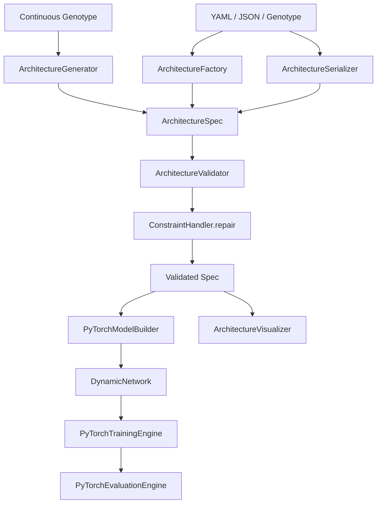
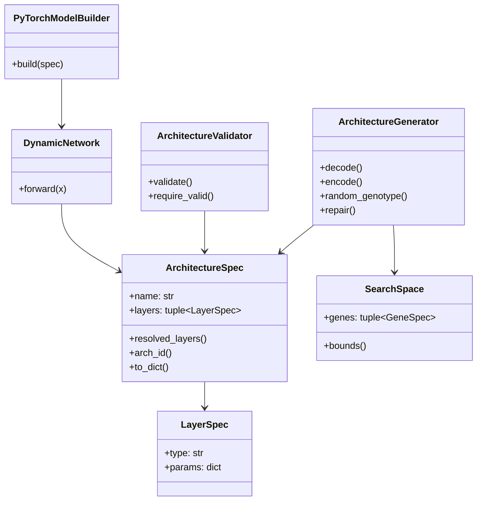
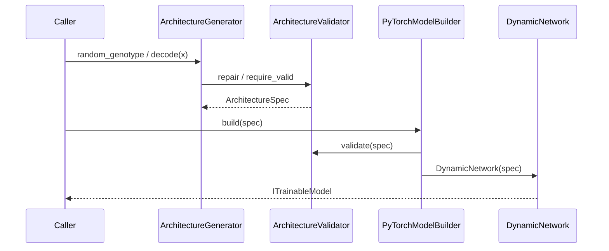
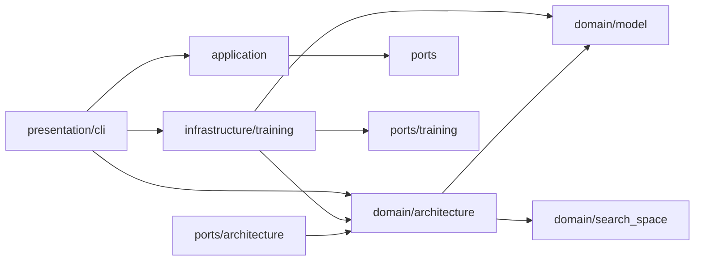

# Phase 3 Report — Dynamic Model Generation Framework

**Project:** EvoNAS  
**Phase:** 3  
**Version:** v0.3.0  
**Status:** COMPLETE — READY FOR PHASE 4  
**Date:** 2026-07-28  
**Authority:** [`idea.md`](../../idea.md)  

---

## Overview

Phase 3 replaces the fixed `BaselineCNN` build path with a fully dynamic Architecture → Model Builder pipeline. This phase enables future PSO (Phase 4+) by decoding genotypes into `ArchitectureSpec` objects. **No optimization, NAS, or closed-loop control is included.**

Success path:

```text
Architecture (YAML/JSON/genotype)
  → Validator / optional Repair
  → DynamicNetwork (PyTorch)
  → Existing Trainer / Evaluator (unchanged APIs)
  → Artifacts
```

---

## Objectives

| Objective | Status |
|---|---|
| Immutable Architecture + Layer IR | Done |
| JSON / YAML serialization + hashing / equality | Done |
| Dynamic PyTorch builder (no hardcoded depth/widths) | Done |
| Architecture validator + constraint repair | Done |
| Architecture factory (baseline / random / files) | Done |
| SearchSpace + ArchitectureGenerator encode/decode | Done |
| Complexity estimator | Done |
| Text architecture visualization | Done |
| Trainer remains on `ITrainableModel` | Done (unchanged) |
| CLI `build-model` / `inspect-model` / `validate-model` | Done |
| ≥95% of 100 random genotypes 1-epoch smoke | Done |

---

## Architecture Diagram



---

## Class Diagram



---

## Sequence — Genotype to Trainable Model



---

## Dependency Graph



Domain packages do **not** import `torch`. Torch appears only under `infrastructure/training/`.

---

## Public Interfaces

| API | Role |
|---|---|
| `LayerSpec` | Expandable per-layer IR |
| `ArchitectureSpec.resolved_layers()` | Explicit layers or Phase 2 legacy synthesis |
| `ArchitectureSerializer` | JSON / YAML / dict save-load + schema versions |
| `ArchitectureValidator` / `ConstraintHandler` | Structural validation + deterministic repair |
| `ArchitectureFactory` | baseline / random / YAML / JSON |
| `ArchitectureGenerator` | genotype ↔ spec (`IArchitectureGenerator`) |
| `SearchSpace` / `GeneSpec` | Bounded continuous genes |
| `estimate_complexity` | Param / depth proxy |
| `ArchitectureVisualizer` | Text diagrams |
| `DynamicNetwork` | PyTorch module from IR |
| `PyTorchModelBuilder.build` | Validated dynamic build (no BaselineCNN dependency) |
| `ITrainableModel` / `ITrainingEngine` | Unchanged Phase 2 contracts |

---

## Folder Structure Additions

```text
src/evonas/domain/architecture/
  layers.py, constraints.py, serializer.py, factory.py
  generator.py, complexity.py, visualization.py
src/evonas/domain/search_space/
  genes.py, space.py
src/evonas/ports/architecture.py
src/evonas/infrastructure/training/dynamic_network.py
configs/models/baseline.yaml
configs/models/future_template.yaml
configs/search_spaces/cnn_quick.yaml
configs/search_spaces/cnn_small.yaml
tests/architecture/
docs/phase_reports/phase3.md
```

---

## Configuration

Architectures are fully YAML-driven:

- `configs/models/baseline.yaml` — explicit layer IR baseline
- `configs/models/baseline_cnn.yaml` — Phase 2 legacy format (still valid via `resolved_layers`)
- `configs/models/future_template.yaml` — expandable template
- `configs/search_spaces/cnn_*.yaml` — gene bounds for future PSO

---

## CLI

```bash
evonas build-model --config configs/models/baseline.yaml
evonas inspect-model --config configs/models/baseline.yaml
evonas validate-model --config configs/models/baseline.yaml
```

Optimization commands are intentionally absent.

---

## Testing Summary

| Suite | Coverage focus |
|---|---|
| `tests/architecture/test_serializer.py` | JSON/YAML/hash/equality |
| `tests/architecture/test_validator_factory.py` | Constraints + factory |
| `tests/architecture/test_builder_viz.py` | Dynamic build + viz |
| `tests/architecture/test_generator.py` | Encode/decode + 100-genotype smoke |
| `tests/architecture/test_cli_architecture.py` | CLI |
| Existing `tests/training/` | Backward compatibility |

Quality gates for v0.3.0: **pytest / ruff / mypy** clean.

---

## Compatibility Notes

- Phase 2 training YAML and `TrainBaselineUseCase` continue to work.
- `BaselineCNN` remains in the tree as a historical reference but is **not** used by `PyTorchModelBuilder`.
- Trainers still depend only on `ITrainableModel`.

---

## Explicitly Out of Scope (Phase 4+)

- Particle Swarm Optimization / Self-Adaptive PSO  
- Architecture search / evolution loops  
- Closed-loop controller / decision engine  
- Continuous learning / deployment / dashboard  

---

## Verdict

**READY FOR PHASE 4** — Standard PSO can consume `ArchitectureGenerator.decode` and the existing training path without further IR redesign.
