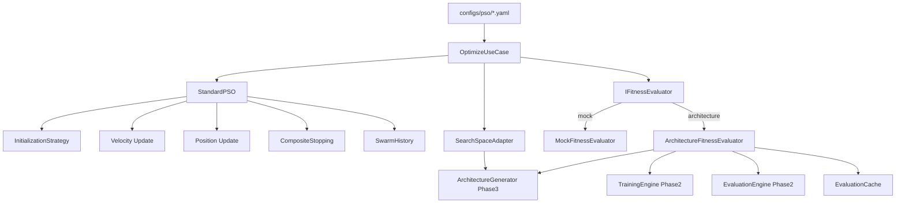
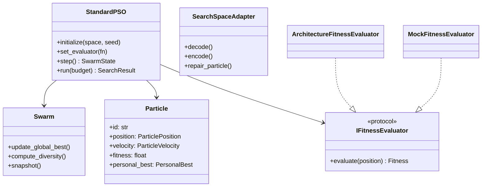
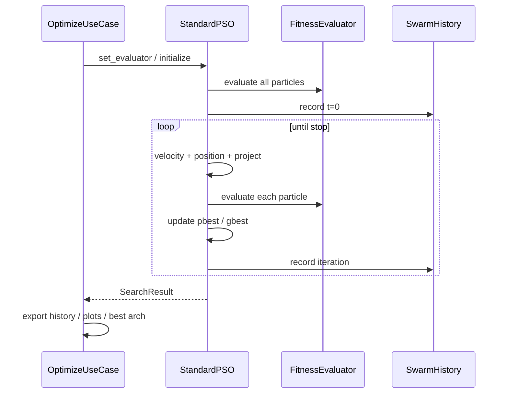
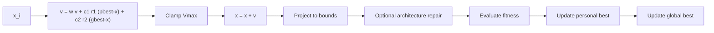

# Phase 4 Report — Standard Particle Swarm Optimization Engine

**Project:** EvoNAS  
**Phase:** 4  
**Version:** v0.4.0  
**Status:** COMPLETE — READY FOR PHASE 5  
**Date:** 2026-07-28  
**Authority:** [`idea.md`](../../idea.md)  

---

## Overview

Phase 4 introduces **classical Particle Swarm Optimization** with fixed coefficients \(w, c_1, c_2\). The engine optimizes continuous architecture genotypes, delegates decoding to Phase 3, and training/evaluation to Phase 2. **No self-adaptive coefficients, closed-loop control, or continuous learning.**

Success path:

```text
Population → Particle vectors → ArchitectureSpec → Dynamic Builder
  → Train → Evaluate → Fitness → PSO updates → Best architecture + history
```

---

## Objectives

| Objective | Status |
|---|---|
| Particle / velocity / position modules | Done |
| Swarm + global best + statistics | Done |
| StandardPSO (`ISearchAlgorithm`) fixed \(w,c_1,c_2\) | Done |
| Fitness evaluator interface + NN adapter | Done |
| Mock fitness (Sphere / Rastrigin) | Done |
| SearchSpace adapter (encode/decode/repair) | Done |
| Evaluation cache | Done |
| Stopping criteria (max iter / target / no-improve) | Done |
| History JSON / JSONL / CSV + plots | Done |
| CLI `evonas optimize` | Done |
| Config `configs/pso/standard.yaml` | Done |

---

## Architecture



**Invariant:** `StandardPSO` never imports PyTorch and never builds networks. It only moves vectors and calls the injected evaluator.

---

## Class Diagram



---

## Swarm Lifecycle



---

## Particle Lifecycle (one iteration)



---

## Standard PSO Equations (fixed)

\[
\mathbf{v}_i^{(t+1)} =
w\,\mathbf{v}_i^{(t)}
+ c_1\,\mathbf{r}_1 \odot (\mathbf{p}_i - \mathbf{x}_i)
+ c_2\,\mathbf{r}_2 \odot (\mathbf{g} - \mathbf{x}_i)
\]

\[
\mathbf{x}_i^{(t+1)} = \Pi_{\mathcal{X}}(\mathbf{x}_i^{(t)} + \mathbf{v}_i^{(t+1)})
\]

Defaults (idea.md §250): \(w=0.729\), \(c_1=c_2=1.49445\).

---

## Public Interfaces

| API | Role |
|---|---|
| `ISearchAlgorithm` | `initialize`, `set_evaluator`, `step`, `run`, `get_best`, `get_history` |
| `IFitnessEvaluator` | `evaluate(position) -> Fitness` |
| `Fitness` / `FitnessCalculator` | Scalar + components (multi-objective ready) |
| `StandardPSO` / `StandardPSOConfig` | Fixed-coefficient engine |
| `SearchSpaceAdapter` | Phase 3 SearchSpace bridge |
| `EvaluationCache` | Skip retrain for identical `arch_id` |
| `OptimizeUseCase` | YAML → artifacts orchestration |
| CLI `evonas optimize` | `--config`, `--out`, `--dry-run`, `--verbose` |

---

## Configuration

`configs/pso/standard.yaml` — architecture fitness (Quick Mode sized)  
`configs/pso/mock_sphere.yaml` — synthetic Sphere (no NN training)  
`configs/search_spaces/sphere_2d.yaml` — continuous 2D test space  

Nothing is hardcoded in the engine; coefficients and budgets come from YAML.

---

## CLI

```bash
evonas optimize --config configs/pso/standard.yaml
evonas optimize --config configs/pso/mock_sphere.yaml --dry-run --out artifacts/optimization
```

---

## Artifacts

```text
artifacts/optimization/<run_id>/
  config.resolved.yaml
  config.snapshot.json
  history.json / history.jsonl / history.csv
  summary.json / result.json
  best_architecture.json   # architecture mode
  checkpoints/swarm_iter_*.json
  cache/evals/             # architecture mode
  plots/*.png              # if matplotlib Agg available
```

---

## Testing Summary

| Suite | Focus |
|---|---|
| `tests/optimization/test_particle_updates.py` | Velocity / position / pbest |
| `tests/optimization/test_standard_pso.py` | Sphere / Rastrigin / stopping / determinism |
| `tests/optimization/test_fitness_cache_adapter.py` | Cache + adapter |
| `tests/optimization/test_optimize_cli.py` | Use-case + CLI |

Quality gates: **pytest / ruff / mypy** clean for v0.4.0.

---

## Explicitly Out of Scope (Phase 5+)

- Adaptive \(w, c_1, c_2\) / SAPSO  
- Closed-loop controller / decision engine  
- Continuous learning / deployment / dashboard  

---

## Verdict

**READY FOR PHASE 5** — Self-Adaptive PSO can wrap or subclass `StandardPSO` / `ISearchAlgorithm` without changing Phase 2–3 training or architecture IR.
