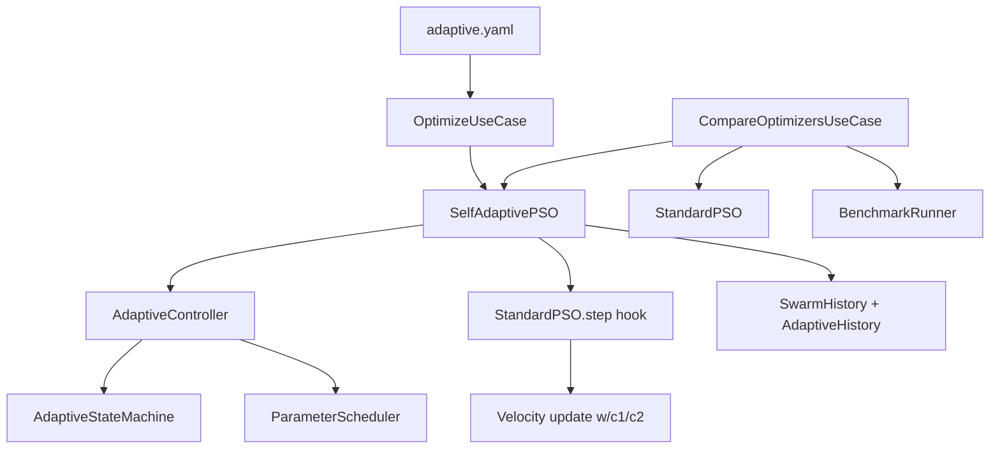
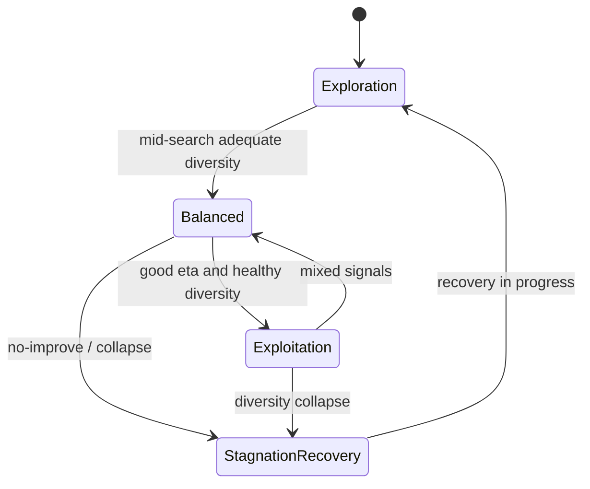
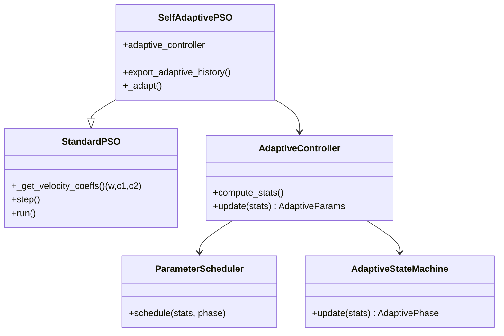
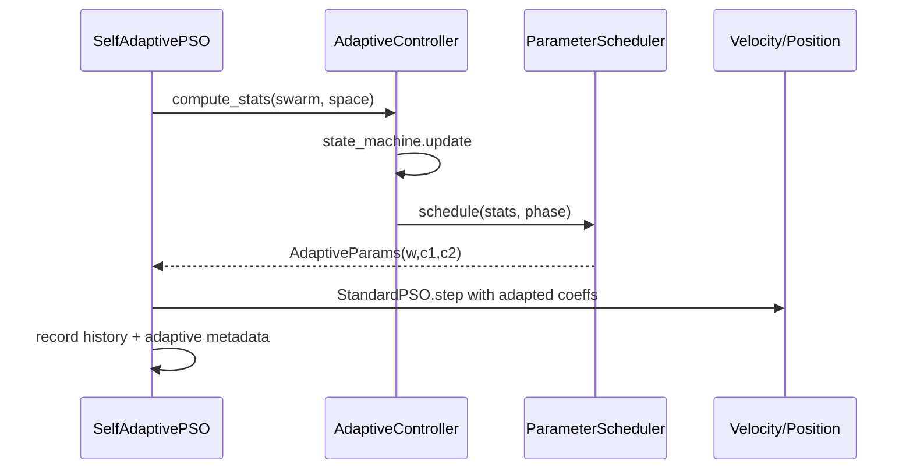

# Phase 5 Report — Self-Adaptive Particle Swarm Optimization (SAPSO)

**Project:** EvoNAS  
**Phase:** 5  
**Version:** v0.5.0  
**Status:** COMPLETE — READY FOR PHASE 6  
**Date:** 2026-07-29  
**Authority:** [`idea.md`](../../idea.md)  

---

## Overview

Phase 5 delivers the primary research contribution of EvoNAS: **deterministic Self-Adaptive PSO**. Coefficients \(w^{(t)}, c_1^{(t)}, c_2^{(t)}\) are computed each iteration from measurable swarm behaviour (diversity, improvement rate, stagnation, progress). Adaptation is **not random**. Standard PSO (Phase 4) remains unchanged and available for ablation.

Success path:

```text
Swarm stats → AdaptiveController → (w, c1, c2) → Standard velocity equation
  → Fitness → History (coeffs + phases) → Comparison vs Standard PSO
```

---

## Objectives

| Objective | Status |
|---|---|
| AdaptiveController (no optimization side effects) | Done |
| Swarm behaviour statistics | Done |
| Explainable adaptive rules R1–R4 | Done |
| Parameter scheduler (independent w/c1/c2) | Done |
| Adaptive state machine (4 phases) | Done |
| SAPSO extending StandardPSO via coefficient hook | Done |
| Adaptive history JSON/CSV + plots | Done |
| Comparison + benchmark framework | Done |
| Config `configs/pso/adaptive.yaml` | Done |
| CLI `optimize` (SAPSO) + `compare-optimizers` | Done |

---

## Architecture



**Extension model:** `StandardPSO._get_velocity_coeffs()` returns fixed config values. `SelfAdaptivePSO` overrides the hook only — velocity/position/eval logic is inherited unchanged.

---

## Adaptive State Machine



Phases: `exploration` | `balanced` | `exploitation` | `stagnation_recovery`.

---

## Adaptive Rules (Research Documentation)

### R1 — Adaptive inertia \(\phi\)-schedule (idea.md §15.4)

| | |
|---|---|
| **Purpose** | Raise momentum when diversity collapses or improvement slows |
| **Math** | \(w = w_{\min}+(w_{\max}-w_{\min})\phi\), \(\phi=\mathrm{clip}(\alpha(1-\hat\delta)+\beta\psi(\eta)+\gamma(1-t/T),0,1)\) |
| **Expected effect** | Low \(\hat\delta\) / slow \(\eta\) → higher \(w\) |
| **Advantages** | Configurable \(\alpha,\beta,\gamma,\eta_{\mathrm{slow}},\eta_{\mathrm{good}}\) (REQ-OPT-005) |
| **Limitations** | Heuristic weights may need landscape-specific tuning |

### R2 — Diversity-aware \(c_1,c_2\)

| | |
|---|---|
| **Purpose** | Balance cognitive vs social learning |
| **Math** | \(c_1=c_{\min}+(c_{\max}-c_{\min})\hat\delta\), \(c_2=C_{\mathrm{sum}}-c_1\) (clamped) |
| **Expected effect** | High diversity → stronger personal (cognitive) term |
| **Advantages** | Soft \(C_{\mathrm{sum}}\) invariant when feasible |
| **Limitations** | Clamping can dominate soft schedule |

### R3 — Diversity-collapse override

| | |
|---|---|
| **Purpose** | Prevent premature convergence |
| **Math** | if \(\hat\delta<\delta_{\mathrm{collapse}}\) → raise \(w\), raise \(c_1\), lower \(c_2\) |
| **Expected effect** | Reopen exploration via personal bests |
| **Advantages** | Direct measurable trigger |
| **Limitations** | Threshold \(\delta_{\mathrm{collapse}}\) is landscape-sensitive |

### R4 — Refinement / exploitation

| | |
|---|---|
| **Purpose** | Local polish when converging with adequate diversity |
| **Math** | \(w\leftarrow w_{\mathrm{refine}}\); lower \(c_1\); raise \(c_2\) |
| **Expected effect** | Stronger social pull toward \(\mathbf{g}\) |
| **Advantages** | Spends budget polishing good basins |
| **Limitations** | Risk of false-convergence trapping |

---

## Class Diagram



---

## Sequence — One SAPSO Iteration



---

## Configuration

- `configs/pso/adaptive.yaml` — architecture-mode SAPSO  
- `configs/pso/adaptive_mock.yaml` — mock Sphere SAPSO  
- `configs/optimization/sapso_default.yaml`  
- `configs/optimization/sapso_ablation_fixed.yaml`  
- `configs/optimization/pso_vs_sapso.yaml` — comparison  

All thresholds (\(w_{\min}/w_{\max}\), \(c_{\min}/c_{\max}\), \(\delta_{\mathrm{collapse}}\), stagnation, etc.) are YAML-driven.

---

## CLI

```bash
evonas optimize --config configs/pso/adaptive_mock.yaml
evonas optimize --config configs/pso/adaptive.yaml
evonas compare-optimizers --config configs/optimization/pso_vs_sapso.yaml
```

---

## Comparison Methodology

1. Identical `SearchSpace`, seeds, swarm size, iteration budget.
2. Identical evaluator factory (mock Sphere for reproducible CI/research tables).
3. Aggregate mean / median / std / best / worst across seeds (`BenchmarkRunner`).
4. Report `winner` by mean best fitness and `delta_mean_fitness_sapso_minus_pso`.

---

## Artifacts (SAPSO run)

```text
artifacts/optimization/<run_id>/
  history.json|.csv|.jsonl
  adaptive_history.json|.csv
  state_transitions.csv
  summary.json
  plots/{convergence,inertia,c1,c2,diversity,coefficients,state_transitions}.png
```

---

## Testing

| Suite | Focus |
|---|---|
| `test_sapso_adaptive.py` | Bounds, collapse response, phases, SAPSO Sphere, fixed PSO regression |
| `test_sapso_cli.py` | Use-case + compare CLI |
| Existing Phase 4 tests | Backward compatibility |

Quality gates: **pytest / ruff / mypy** clean (v0.5.0).

---

## Explicitly Out of Scope (Phase 6+)

Closed-loop controller, decision engine, continuous learning, deployment, dashboard.

---

## Verdict

**READY FOR PHASE 6** — Closed-loop orchestration can consume `ISearchAlgorithm` bindings for either Standard PSO or SAPSO without changing adaptive core.
