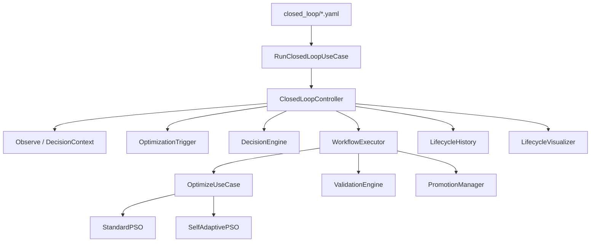
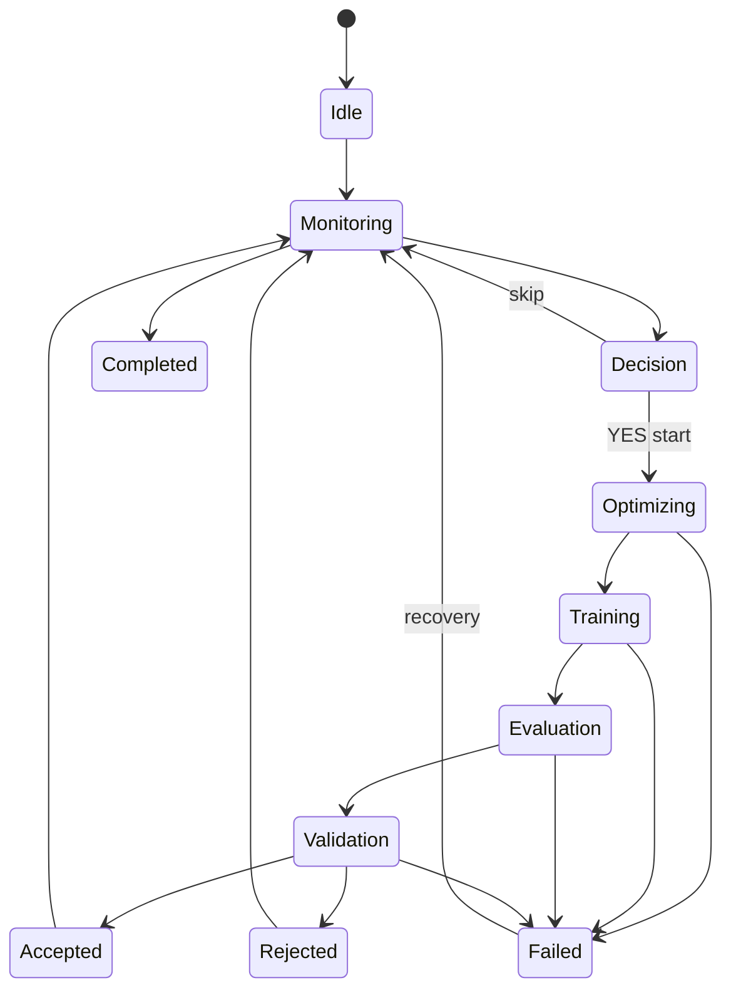
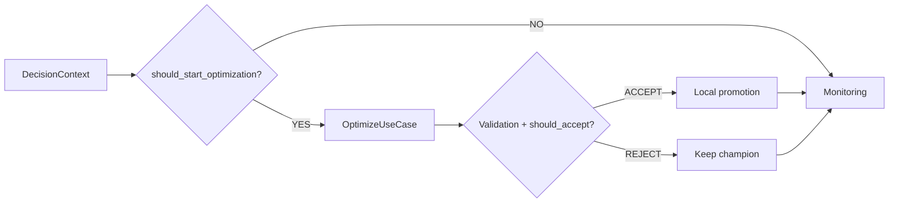

# Phase 6 Report — Closed-Loop Autonomous Optimization Controller

**Project:** EvoNAS  
**Phase:** 6  
**Version:** v0.6.0  
**Status:** COMPLETE — READY FOR PHASE 7  
**Date:** 2026-07-29  
**Authority:** [`idea.md`](../../idea.md)  

---

## Overview

Phase 6 turns EvoNAS from an optimization framework into an **autonomous AI lifecycle platform**. The `ClosedLoopController` orchestrates existing services — it never updates PSO equations, builds networks, trains models, or computes fitness directly.

Success path:

```text
Observe → DecisionContext → Trigger → DecisionEngine
  → Optimize (PSO | SAPSO via OptimizeUseCase)
  → Train/Eval (inside fitness path) → Validate → Promote|Reject
  → Record → Monitoring
```

---

## Objectives

| Objective | Status |
|---|---|
| ClosedLoopController orchestrator | Done |
| Immutable DecisionContext | Done |
| Policy-driven DecisionEngine | Done |
| Configurable Decision policies (YAML) | Done |
| OptimizationTrigger families | Done |
| Lifecycle state machine + logged transitions | Done |
| WorkflowExecutor | Done |
| ValidationEngine | Done |
| PromotionManager (local, no deploy) | Done |
| Failure recovery | Done |
| Configs + CLI (`run-loop` / `simulate-loop` / `inspect-loop`) | Done |
| Simulation / dry-run | Done |
| History recorder (JSON/CSV/JSONL) | Done |
| Lifecycle visualizations | Done |
| Ports + tests + docs | Done |

---

## Architecture



**Invariant:** Controller depends on interfaces / use-cases. Phase 4 and Phase 5 search engines are **not modified**.

---

## Lifecycle State Machine



Every transition is appended to `LifecycleHistory` and exported as CSV.

---

## Sequence (one cycle)

```mermaid
sequenceDiagram
  participant CLC as ClosedLoopController
  participant TR as OptimizationTrigger
  participant DE as DecisionEngine
  participant OPT as OptimizeUseCase
  participant VAL as ValidationEngine
  participant PRO as PromotionManager

  CLC->>CLC: Observe → DecisionContext
  CLC->>TR: evaluate(ctx)
  CLC->>DE: should_start_optimization
  alt YES
    CLC->>OPT: run (SAPSO|PSO)
    CLC->>VAL: validate(candidate vs current)
    CLC->>DE: should_accept_candidate
    CLC->>PRO: accept|reject (local)
  else NO
    CLC->>CLC: return Monitoring
  end
  CLC->>CLC: export history + plots
```

---

## Decision Flow



### Policies (YAML)

Configured via `configs/policies/default_policy.yaml` and/or inline `policy:` in closed-loop configs:

| Rule | Config keys |
|---|---|
| Accuracy below floor | `degradation.accuracy_floor` |
| Fitness stagnation | `degradation.min_expected_improvement` + history deltas |
| Dataset drift | `drift.psi_threshold` + observation `drift_status` |
| Max optimizations | `budgets.max_optimizations` |
| Wall-clock budget | `budgets.max_search_wallclock_minutes` |
| Cooldown | `optimization.cooldown_hours` |
| Min improvement to promote | `validation.min_improvement_abs` |
| Complexity / train time caps | `validation.max_complexity_params`, `max_train_seconds` |

`should_deploy` / `should_rollback` remain **NO** until Phase 8 (`allow_deploy` / `allow_rollback` default false).

---

## Module Map

| Module | Path |
|---|---|
| Controller | `application/closed_loop/controller.py` |
| Workflow | `application/closed_loop/workflow.py` |
| Use-cases | `application/closed_loop/use_cases.py` |
| DecisionContext | `domain/decision/context.py` |
| DecisionEngine | `domain/decision/engine.py` |
| Policies | `domain/decision/policies.py` |
| Trigger | `domain/trigger/optimization_trigger.py` |
| Lifecycle states | `domain/lifecycle/states.py` |
| History | `domain/lifecycle/history.py` |
| Validation | `domain/validation/engine.py` |
| Promotion | `domain/promotion/manager.py` |
| Visualization | `infrastructure/closed_loop/visualization.py` |
| Ports | `ports/closed_loop.py` |

---

## Configuration Examples

### Default closed loop

`configs/closed_loop/default.yaml` — SAPSO, mock fitness friendly, policy path reference.

### Simulation

`configs/closed_loop/simulate.yaml` — deterministic `candidate_metrics_override` for accept demos.

```bash
evonas simulate-loop --config configs/closed_loop/simulate.yaml --out artifacts/closed_loop/demo
evonas inspect-loop --run-dir artifacts/closed_loop/demo/closed_loop_simulate
```

---

## Failure Recovery

Training / optimization / evaluation / config failures are caught by the controller. Illegal or unexpected exceptions move the machine to **FAILED**, then recover to **MONITORING**. Decision audit continues via history events.

---

## Testing

| Suite | Coverage |
|---|---|
| `tests/decision/` | Policy load, decision rules, triggers, validation, promotion, transitions |
| `tests/closed_loop/` | Controller cycles, skip, reject, recovery, SAPSO/PSO select, CLI |

Quality gates: `pytest`, `ruff`, `mypy`.

---

## Explicit Non-Goals (later phases)

- Continuous learning datasets / windows (Phase 7)
- Deployment / rollback / Docker (Phase 8)
- FastAPI / dashboard / registry / notifications

---

## Validation Checklist

- [x] Observe builds `DecisionContext`
- [x] Policies configurable in YAML
- [x] Trigger families evaluated
- [x] Optimizer selectable (`sapso` default, `pso` allowed)
- [x] Candidates validated before local promotion
- [x] Full lifecycle recorded
- [x] Simulation mode without deployment
- [x] Standard PSO / SAPSO engines untouched

---

## Risks & Mitigations

| Risk | Mitigation |
|---|---|
| God-object controller | Delegate to WorkflowExecutor + domain services |
| Accidental engine rewrite | Controller only calls `OptimizeUseCase` |
| Premature deploy | Promotion is local metadata; deploy questions gated |

---

## Next Phase

**Phase 7 — Continuous Learning Engine:** data windows, retention, drift-driven retrain-vs-optimize recommendations feeding the same DecisionContext / Trigger surface.
