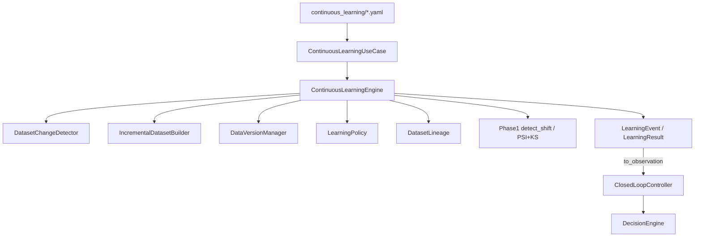
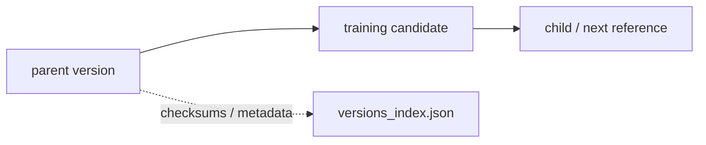
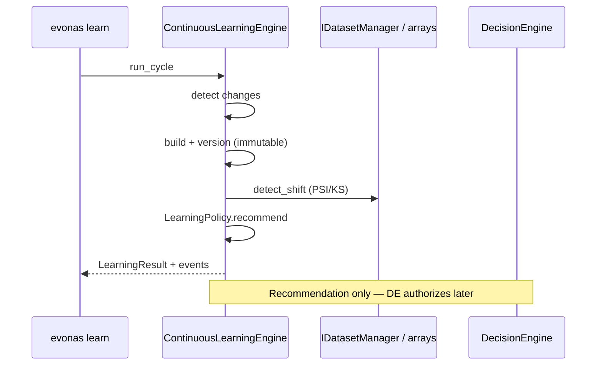
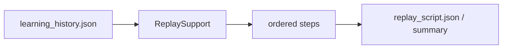

# Phase 7 Report — Continuous Learning & Data Evolution Engine

**Project:** EvoNAS  
**Phase:** 7  
**Version:** v0.7.0  
**Status:** COMPLETE — READY FOR PHASE 8  
**Date:** 2026-07-29  
**Authority:** [`idea.md`](../../idea.md)  

---

## Overview

Phase 7 adds a production-quality **continuous learning / data evolution** subsystem. It prepares new data for optimization and emits structured recommendations. It does **not** decide whether optimization occurs — that remains the Phase 6 Decision Engine.

Success path:

```text
Detect New Data → Validate → Version Dataset → Compute Drift
  → Prepare Training Candidate → LearningEvent / Recommendation
  → Notify ClosedLoopController (observation mapping)
  → Decision Engine decides
```

---

## Objectives

| Objective | Status |
|---|---|
| ContinuousLearningEngine entry point | Done |
| Immutable DataVersionManager | Done |
| DatasetChangeDetector | Done |
| IncrementalDatasetBuilder (append/replace/merge/windows/sample) | Done |
| LearningPolicy (recommendations only) | Done |
| Drift via Phase 1 PSI/KS (no duplication) | Done |
| Dataset lineage | Done |
| LearningEvent / LearningResult | Done |
| Deterministic replay | Done |
| Config + CLI (`learn` / `detect-data` / `replay-learning`) | Done |
| History + visualization | Done |
| Ports + tests + docs | Done |

---

## Architecture



**Invariant:** CLE never runs PSO/SAPSO, never authorizes lifecycle verbs, never deploys models.

---

## Dataset Lineage



---

## Sequence



---

## Policies

Configured under `continuous_learning.policy` (never triggers optimization):

| Key | Effect |
|---|---|
| `min_new_samples` | Hold unless enough novelty (unless schema/significant drift) |
| `max_drift_psi` | Optimize recommendation when PSI exceeds threshold |
| `mild_drift_psi` | Mild drift + new data → retrain recommendation |
| `retrain_cooldown_hours` | Suppress recommendations during cooldown |
| `optimize_on_schema_change` | Schema mismatch → `OPTIMIZE_ARCH` |
| `retention.max_versions` | Prune old raw versions while keeping newest |

Recommendations: `HOLD` | `RETRAIN_SAME_ARCH` | `OPTIMIZE_ARCH` (idea.md §166).

---

## Replay Workflow



```bash
evonas learn --config configs/continuous_learning/default.yaml --cycles 2 --out artifacts/cl_demo
evonas replay-learning --history artifacts/cl_demo/run/learning_history.json
```

---

## Module Map

| Module | Path |
|---|---|
| Engine | `domain/continuous/engine.py` |
| Events | `domain/continuous/events.py` |
| Versions | `domain/continuous/versions.py` |
| Change detection | `domain/continuous/change_detector.py` |
| Builder | `domain/continuous/builder.py` |
| Policy | `domain/continuous/policy.py` |
| Lineage | `domain/continuous/lineage.py` |
| Windows | `domain/continuous/windows.py` |
| Retention | `domain/continuous/retention.py` |
| Replay | `domain/continuous/replay.py` |
| History | `domain/continuous/history.py` |
| Viz | `infrastructure/continuous/visualization.py` |
| Use-cases | `application/continuous/use_cases.py` |
| Ports | `ports/continuous.py` |

---

## Closed-Loop Integration

Controller accepts optional `continuous_learning` implementing `IContinuousLearningEngine`.  
`_observe()` merges `to_observation()` into existing Phase 6 fields:

- `drift_status`, `drift_report` (includes `psi_max`)
- `force_optimization` when recommendation is `OPTIMIZE_ARCH`
- `experiment_metadata.cl_recommendation` / `cl_reason`

No DecisionEngine or PSO changes.

---

## Explicit Non-Goals

Dashboard, FastAPI, cloud deploy, external DBs, notifications, auth, model registry (later phases).

---

## Testing

| Suite | Coverage |
|---|---|
| `tests/continuous/test_engine.py` | versioning, changes, merge strategies, policy, lineage, engine, replay |
| `tests/continuous/test_cli.py` | learn/detect/replay CLI + controller observation hook |

---

## Validation Checklist

- [x] Detect / validate / version datasets
- [x] Build updated datasets without mutating parents
- [x] Compute drift via Phase 1 APIs
- [x] Emit recommendations (not decisions)
- [x] Return structured events / observation mapping
- [x] Simulation CLI only
- [x] Phase 1–6 engines untouched (aside from optional CL injection port on controller)

---

## Next Phase

**Phase 8 — Deployment Manager:** localhost staging / promote / LKG / rollback, consuming accepted candidates from Phase 6 promotion metadata.
