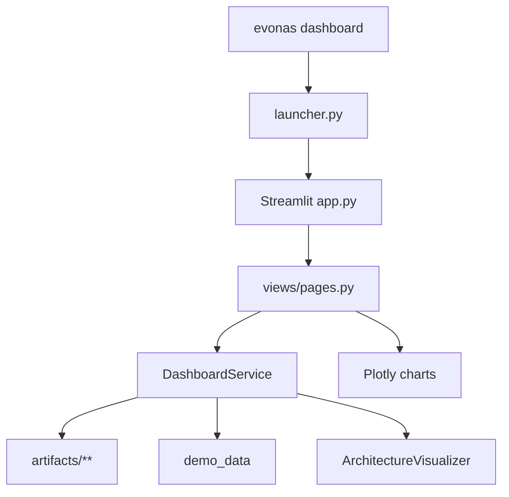

# Phase 8 Report — EvoNAS AI Operations Dashboard

**Project:** EvoNAS  
**Phase:** 8 (Operations Dashboard)  
**Version:** v0.8.0  
**Status:** COMPLETE  
**Date:** 2026-07-30  
**Authority:** [`idea.md`](../../idea.md) (dashboard scope aligns with idea.md Phase 9 Streamlit UI; deployment remains deferred)

---

## Overview

Phase 8 delivers a polished **AI Operations Dashboard** — a Streamlit control center that visualizes Phases 1–7 **without modifying** Dataset Manager, Trainer, Standard PSO, SAPSO, ClosedLoopController, or Continuous Learning Engine.

```text
Landing → Overview → Optimization → SAPSO → Architecture → Training
  → Continuous Learning → Closed Loop → Experiments → Replay
  → Benchmarks → Artifacts → Health → Settings
```

---

## Objectives

| Objective | Status |
|---|---|
| Multipage Streamlit console | Done |
| Demo Mode (no train/optimize) | Done |
| Read-only artifact consumption | Done |
| Plotly interactive charts | Done |
| Architecture explorer + Mermaid | Done |
| CLI `evonas dashboard` | Done |
| Optional extra `[dashboard]` | Done |
| Tests for services / CLI | Done |

---

## Architecture



**Invariant:** Presentation layer only. No duplicated PSO/CL/decision math.

---

## Pages

| Page | Data source |
|---|---|
| Landing | loop/opt/CL summaries or demo KPIs |
| System Overview | Mermaid platform map + live snapshot |
| Optimization Center | `history.json` / `summary.json` |
| SAPSO Analytics | `adaptive_history.json` |
| Architecture Explorer | `best_architecture.json` + visualizer |
| Training | baseline `metrics.json` / `history.json` |
| Continuous Learning | `learning_history.json` / `lineage.json` |
| Closed Loop Monitor | `lifecycle_history.json` / `decisions.jsonl` |
| Experiments | scanned artifact runs |
| Replay Center | step slider over recorded frames |
| Benchmarks | `comparison.json` |
| Artifact Browser | file preview |
| System Health | artifact footprint / runtime |
| Settings | read-only YAML configs |

---

## Usage

```bash
pip install -e ".[dashboard,dev]"
evonas dashboard --demo
# open http://localhost:8501
```

---

## Screenshot Placeholders

Capture for papers / portfolio:

1. Landing KPIs (Demo Mode)  
2. SAPSO coefficient Plotly chart  
3. Closed-loop transition chart  
4. Continuous learning drift + lineage  
5. Architecture Mermaid explorer  
6. Replay step slider  
7. Benchmark winner panel  

Store later under `docs/visual/exports/` (gitignored until curated).

---

## Non-Goals (later)

Deployment, FastAPI, authentication, cloud infra — **not** in v0.8.0.

---

## Validation

- Dashboard services unit-tested without launching Streamlit server  
- Existing Phase 1–7 engines untouched  
- Quality gates: pytest, ruff, mypy
