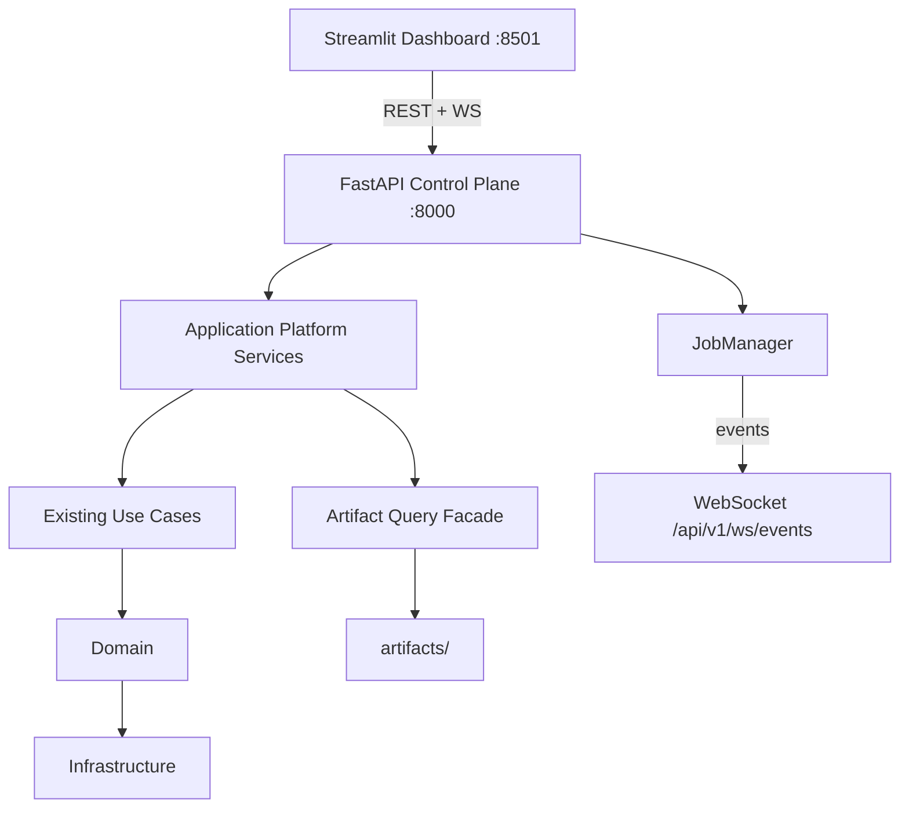

# Phase 9 Report — Platform Services & Deployment Layer

**Status:** Complete  
**Version:** v0.9.0  
**Date:** 2026-07-30  

**Authority:** [`idea.md`](../../idea.md) (FastAPI control plane + local Docker topology; cloud/auth deferred)

## Summary

Phase 9 exposes the existing EvoNAS platform through a production-quality **FastAPI control plane**, background **JobManager**, **WebSocket** live events, Docker Compose, and CLI (`api` / `serve` / `status`). The Streamlit dashboard no longer reads artifacts directly — it consumes `/api/v1/*` only.

## Architecture



**Dependency rule preserved:** routes never instantiate use cases; FastAPI `Depends()` resolves services from `PlatformContainer`.

## Deliverables

| Item | Status |
|------|--------|
| FastAPI `/api/v1/*` | Done |
| DI + platform services | Done |
| JobManager (queued→cancelled) | Done |
| WebSocket live events | Done |
| Artifact browse/preview/download | Done |
| Dashboard via API client | Done |
| `evonas api` / `serve` / `status` | Done |
| `configs/api`, `configs/deploy` | Done |
| Dockerfile + Dockerfile.dashboard + compose | Done |
| OpenAPI /docs /redoc | Done |
| Tests | Done |

## Endpoint groups

- `health`, `status`, `system`, `version`, `config`
- `dashboard/*` (landing, overview, optimization, sapso, lifecycle, …)
- `optimization`, `training`, `closed-loop`, `continuous-learning`, `benchmarks` (+ `/jobs`)
- `experiments`, `datasets`, `architectures`, `artifacts`, `replay`, `jobs`, `events`
- WebSocket: `/api/v1/ws/events`

## Usage

```bash
pip install -e ".[api,dashboard,dev]"
evonas serve --demo
# or
evonas api --port 8000
evonas dashboard --demo   # requires API (EVONAS_API_URL)
evonas status
docker compose up --build
```

Swagger: http://127.0.0.1:8000/docs  

## Explicitly deferred

Authentication, cloud deploy, Kubernetes, external DBs, model registry, distributed training — post-v1.0 / later phases.

## Quality gates

- pytest, ruff, mypy green for v0.9.0
