# EvoNAS — Master Engineering Specification

**Document Classification:** Internal Engineering Design Specification  
**Document Status:** Canonical — Binding for All Implementation Decisions  
**Document Version:** 1.1.0  
**Branding:** EvoNAS 
**Effective Date:** 2026-07-28  
**Owning Role:** Chief Architect / Principal Research Engineer  
**Audience:** All engineers, researchers, and agents contributing to EvoNAS  
**Supersedes:** None (foundational document)  
**Related Artifacts:** Repository source tree, experiment manifests, IEEE manuscripts (future)

---

## Document Control

### Purpose of This Document

This document is the **Master Engineering Specification** of EvoNAS. It is not marketing copy, not a README, and not tutorial notes. It is the permanent engineering bible of the platform.

Every contributor — human or automated agent — MUST read this document before:

- writing any code
- making any architectural decision
- implementing any feature
- modifying any existing module
- generating documentation
- planning any future phase
- answering any project-related design question

**Rule of Authority:** If an implementation choice conflicts with this specification, the specification wins unless an explicit Engineering Change Request (ECR) amends this document first.

**Rule of Traceability:** Every non-trivial design decision in code MUST be traceable to a section, requirement ID, or phase deliverable defined herein.

**Rule of Completeness:** Ambiguity is treated as a defect in this document. When ambiguity is discovered, this document is updated before code is written to “fill the gap.”

### How Cursor and Future Agents Must Use This Document

1. Load and internalize this document at the start of every implementation session.
2. Map the requested task to a Phase ID and Module ID defined herein.
3. Implement only against interfaces and contracts defined herein.
4. Do not invent alternate optimization algorithms for the core engine.
5. Do not collapse modules into monolithic scripts.
6. Prefer Dependency Injection, Clean Architecture boundaries, and interface-first design.
7. When extending the system, update this document in the same change set as code when the extension is architectural.

### Requirement Identifier Convention

Throughout this specification, requirements are tagged as:

- `REQ-ARCH-*` — Architecture / platform requirements
- `REQ-OPT-*` — Optimization / SAPSO requirements
- `REQ-DEC-*` — Decision engine requirements
- `REQ-CL-*` — Continuous learning / closed-loop requirements
- `REQ-DATA-*` — Dataset / data pipeline requirements
- `REQ-TRAIN-*` — Training / evaluation requirements
- `REQ-DEP-*` — Deployment / rollback requirements
- `REQ-OBS-*` — Observability / monitoring / metrics requirements
- `REQ-API-*` — API / dashboard / UX requirements
- `REQ-RES-*` — Research / reproducibility requirements
- `REQ-SEC-*` — Security / safety requirements
- `REQ-PERF-*` — Performance / scalability requirements
- `NFR-*` — Non-functional requirements
- `PHASE-*` — Phase gate requirements

---

# PART I — IDENTITY, VISION, AND PHILOSOPHY

## 1. Project Identity

### 1.1 Project Name

**EvoNAS**

### 1.2 Full Title

**EvoNAS: An Autonomous Closed-Loop AutoML Platform for Continuous Neural Architecture Optimization using Self-Adaptive Particle Swarm Optimization**

### 1.3 Tagline

**An AI System that Continuously Improves Another AI.**

### 1.4 One-Sentence Mission

EvoNAS is an autonomous AI lifecycle management platform that continuously observes deployed models, decides when optimization is warranted, redesigns neural architectures via Self-Adaptive Particle Swarm Optimization (SAPSO), retrains and validates candidates, deploys improvements, rolls back failures, and repeats forever without requiring a human in the optimization loop.

### 1.5 What EvoNAS Is

EvoNAS is:

1. An **Autonomous AI Lifecycle Management Platform**
2. A **Closed-Loop Continuous Optimization System**
3. A **Production-Grade AutoML Operating Layer**
4. A **Research Framework** designed for IEEE-quality publication
5. An **AI Operating System** for model evolution, analogous in spirit to Vertex AI, SageMaker, Azure AutoML, Kubeflow, and MLflow — focused specifically on continuous architecture evolution under SAPSO

### 1.6 What EvoNAS Is Not

EvoNAS is **NOT**:

1. A Neural Architecture Search homework assignment
2. A standalone PSO script with a training loop glued on
3. A Genetic Algorithm / NSGA-II / Bayesian Optimization / Differential Evolution / Ant Colony / Whale / Grey Wolf optimizer (these may appear only as **benchmark baselines** in research comparisons, never as the core engine)
4. A one-shot “search → deploy → done” NAS tool
5. A notebook-driven research prototype without service boundaries
6. A framework that requires a human to manually decide retrain / deploy / rollback for every cycle

### 1.7 Core Constraint — Optimization Algorithm Lock

`REQ-OPT-001` (Mandatory, Non-Negotiable):

> The **sole** optimization engine used for architecture search inside EvoNAS SHALL be **Self-Adaptive Particle Swarm Optimization (SAPSO)** derived from Particle Swarm Optimization. No other metaheuristic may replace SAPSO as the production search engine.

Allowed exceptions:

- Benchmark comparison modules may implement Grid Search, Random Search, and Standard (non-adaptive) PSO **only** for research evaluation.
- Future papers may compare against GA/BO/etc. in an isolated `benchmarks/` package that is **not** wired into the closed-loop controller.

---

## 2. Project Vision

### 2.1 The Problem EvoNAS Solves

Modern AI systems are typically:

1. Trained once on a fixed dataset snapshot
2. Validated once against a fixed holdout set
3. Deployed once into production
4. Manually monitored by humans
5. Manually improved when performance degrades
6. Manually redeployed after ad-hoc experimentation

This lifecycle is brittle for the following reasons:

- **Distribution drift** causes silent degradation.
- **Concept drift** invalidates previously optimal decision boundaries.
- **Architecture obsolescence** occurs when data complexity grows beyond the capacity of the original network.
- **Human latency** creates weeks or months between detection and remediation.
- **Tribal knowledge** replaces reproducible optimization policy.
- **One-shot NAS** does not revisit architecture after deployment.

EvoNAS removes the human from the **optimization decision loop** while retaining humans for governance, policy configuration, safety thresholds, and research oversight.

### 2.2 The Desired End State

In steady state, EvoNAS operates as a perpetual machine:

```
Observe → Analyze → Decide → Optimize → Retrain → Validate → Deploy → Monitor → Repeat
```

forever.

The platform must feel like a real AutoML operating system:

- Jobs are first-class entities
- Models are versioned artifacts
- Experiments are reproducible
- Decisions are auditable
- Deployments are gated
- Failures are rolled back
- Metrics are continuously collected
- Policies are configurable without code changes

### 2.3 Vision Statement (Formal)

`REQ-ARCH-001`:

> EvoNAS SHALL provide an autonomous, closed-loop, continuously operating AutoML platform in which Self-Adaptive PSO redesigns neural architectures in response to monitored performance degradation or scheduled evolution policies, with automatic evaluation, deployment, and rollback, while preserving full experiment reproducibility and research extensibility.

### 2.4 Success Criteria for the Vision

The vision is considered realized when all of the following are true:

1. A model can be deployed and left under EvoNAS supervision without manual architecture redesign.
2. Performance degradation below configured thresholds automatically triggers SAPSO search.
3. Improved candidates are validated against policy gates before deployment.
4. Failed deployments automatically roll back to the last known good version.
5. Every decision is logged with rationale and metrics.
6. Research Mode, Quick Mode, and Replay Mode are all operational.
7. TensorFlow and PyTorch backends are interchangeable behind training interfaces.
8. Future model families (CNN, MLP, ViT, detection, segmentation, time series, tabular, federated, edge, XAI, LLM adapters, agents) can be added via plugins without redesigning the closed-loop controller.

---

## 3. Project Philosophy

### 3.1 Primary Philosophical Axiom

> **EvoNAS is an Autonomous AI Lifecycle Management Platform. Neural Architecture Search is one capability inside the platform — not the platform itself.**

This axiom drives every architectural choice.

### 3.2 Secondary Axioms

1. **Autonomy over automation:** Automation executes predefined scripts. Autonomy decides *whether*, *when*, and *how* to act based on observed state and policy.
2. **Closed loop over open loop:** Open-loop NAS ends at deployment. Closed-loop EvoNAS never ends.
3. **Policy over hardcoding:** Thresholds, budgets, and gates live in configuration and decision policies — not scattered magic numbers in code.
4. **Interfaces over implementations:** Modules depend on contracts, not concrete classes.
5. **Reproducibility over cleverness:** Every run must be reconstructible from manifests, seeds, and artifact hashes.
6. **Safety over aggression:** Prefer no deployment over unsafe deployment. Prefer rollback over silent degradation.
7. **Research and production coexistence:** The same codebase must support IEEE experiments and production-like operation modes.
8. **SAPSO exclusivity for search:** Novelty is the autonomous framework + adaptive PSO strategy, not algorithm shopping.

### 3.3 The Observe–Analyze–Decide–Optimize–Retrain–Validate–Deploy–Monitor Loop

Each stage has a precise meaning:

| Stage | Purpose | Primary Owner Module |
|------|---------|----------------------|
| Observe | Collect live and offline metrics, predictions, labels (if available), resource usage | Performance Monitor, Metrics Engine |
| Analyze | Detect drift, degradation, stagnation, budget exhaustion | Performance Monitor, Metrics Engine |
| Decide | Answer should-optimize / should-retrain / should-deploy / should-rollback / should-continue / should-stop | Decision Engine, Optimization Trigger |
| Optimize | Run SAPSO over architecture search space | Self-Adaptive PSO, Particle modules |
| Retrain | Materialize architecture and train weights | Architecture Generator, Training Engine |
| Validate | Compute fitness, compare against champion, run gates | Evaluation Engine, Fitness Calculator, Model Selector |
| Deploy | Promote champion to serving endpoint / artifact registry | Deployment Manager, Model Registry |
| Monitor | Continue observation post-deploy; feed next cycle | Performance Monitor, Continuous Learning Engine |
| Repeat | Persist state, schedule next cycle, never terminate unless policy says stop | Closed-Loop Controller |

`REQ-CL-001`: The Closed-Loop Controller SHALL orchestrate these stages as a state machine with explicit transitions, never as an ad-hoc script sequence without recoverable state.

### 3.4 Why This Philosophy Matters Engineering-Wise

Without this philosophy, contributors will:

- Build a PSO NAS script and call it “done”
- Skip decision gates
- Hardcode deployment
- Ignore rollback
- Treat monitoring as optional logging
- Make TensorFlow-only assumptions
- Block future IEEE extensions behind brittle couplings

With this philosophy, every module exists to support perpetual autonomous operation under auditability and safety constraints.

---

## 4. Positioning Against Industry Platforms

EvoNAS should *feel* like:

| Platform | What EvoNAS Inherits Conceptually |
|----------|-------------------------------------|
| Google Vertex AI | Job orchestration, model registry thinking, managed pipelines |
| Amazon SageMaker | Training jobs, endpoints, experiment tracking patterns |
| Azure AutoML | Automated model selection / optimization UX patterns |
| Kubeflow | Pipeline modularity, componentization |
| MLflow | Experiment tracking, model versioning, artifact URIs |

EvoNAS does **not** attempt to reimplement the entire cloud ML platform. It implements the **autonomous continuous architecture evolution brain** that those platforms generally leave to humans or external pipelines.

`REQ-ARCH-002`: EvoNAS SHALL be designed as a modular platform with service-like boundaries even when initially running as a single-process application, so that later extraction into microservices does not require redesign of domain logic.

---

# PART II — RESEARCH CONTEXT AND CONTRIBUTION

## 5. Current State of Neural Architecture Search (NAS)

### 5.1 Historical Trajectory

Neural Architecture Search emerged to automate the design of neural network topologies. Early approaches used reinforcement learning controllers (e.g., NASNet-era ideas), evolutionary algorithms, and later differentiable NAS (DARTS-style) and one-shot supernet methods.

Typical NAS pipeline (open loop):

```
Define Search Space → Search → Derive Architecture → Train → Evaluate → Deploy → Stop
```

### 5.2 Strengths of Classical NAS

- Reduces manual architecture engineering
- Can discover non-obvious topologies
- Supports multi-objective tradeoffs in some formulations
- Enables reproducible search if seeds and spaces are fixed

### 5.3 Weaknesses Relative to EvoNAS’s Ambition

1. **One-shot mentality:** Search ends at first deployment.
2. **No continuous monitoring coupling:** Drift does not restart search automatically.
3. **Weak decision policy:** “When to search again?” is usually a human judgment.
4. **Deployment/rollback omitted:** Many papers stop at accuracy tables.
5. **Production lifecycle ignored:** Versioning, audit, rollback, and serving gates are research afterthoughts.
6. **Algorithm-centric novelty:** Papers compete on search tricks rather than autonomous lifecycle.

`REQ-RES-001`: EvoNAS’s research narrative SHALL position NAS as a subsystem, not the product thesis.

---

## 6. Current State of AutoML

### 6.1 Industry AutoML Scope

Commercial AutoML typically covers:

- Feature preprocessing
- Model family selection
- Hyperparameter optimization
- Sometimes limited architecture search
- Experiment tracking and leaderboards

### 6.2 Gaps EvoNAS Targets

1. Continuous post-deployment architecture evolution is rare as a first-class closed loop.
2. Decision engines for optimize/deploy/rollback are often external (human or separate MLOps scripts).
3. Self-adaptive metaheuristics with explicit diversity/convergence adaptation are under-integrated into full platforms.
4. Research reproducibility and production autonomy are rarely co-designed in one codebase.

---

## 7. Current State of Adaptive Particle Swarm Optimization

### 7.1 Standard PSO Recap

Standard PSO maintains a swarm of particles. Each particle has position \(x\) and velocity \(v\). Updates use inertia \(w\), cognitive coefficient \(c_1\), and social coefficient \(c_2\).

Classical weakness: fixed \(w, c_1, c_2\) can cause premature convergence or excessive exploration depending on landscape.

### 7.2 Adaptive PSO Literature (Summary of Gap)

Adaptive PSO variants modify parameters based on iteration progress, fitness improvement rate, swarm diversity, or success history. Many papers propose parameter schedules or feedback rules, but few embed adaptive PSO inside a full autonomous AutoML lifecycle with deployment gates and continuous learning.

### 7.3 EvoNAS Stance

`REQ-OPT-002`: EvoNAS SHALL treat **Self-Adaptive PSO parameter control** as a primary research contribution *within* the broader autonomous framework contribution — not as the sole novelty claim.

The adaptive strategy must respond to:

- Slowing convergence → increase exploration
- Decreasing swarm diversity → rebalance exploration/exploitation
- Detected convergence → emphasize local refinement

Exact equations are specified in Part IV (Mathematical Specification).

---

## 8. Current State of Continuous Learning

### 8.1 Continuous / Lifelong Learning Landscape

Continuous learning research often focuses on:

- Catastrophic forgetting
- Incremental class learning
- Online gradient updates
- Replay buffers / regularization (EWC, etc.)

### 8.2 Distinction: Continuous Learning vs EvoNAS Continuous Optimization

EvoNAS’s continuous learning is **lifecycle continuous optimization**:

- Not merely online SGD on a fixed architecture
- Architecture itself may evolve
- Triggered by monitored degradation and decision policy
- Includes validation gates and deployment control

`REQ-CL-002`: Continuous Learning Engine SHALL coordinate data windowing, drift signals, and retrain/optimization triggers, and SHALL NOT be implemented as unbounded online training without evaluation gates.

---

## 9. Research Gaps and Exact EvoNAS Contributions

### 9.1 Identified Gaps

| Gap ID | Gap Description |
|--------|-----------------|
| GAP-1 | NAS systems are open-loop and terminate after first search |
| GAP-2 | AutoML platforms lack autonomous architecture re-evolution under drift |
| GAP-3 | Adaptive PSO is studied in isolation from production lifecycle concerns |
| GAP-4 | Decision policies for optimize/deploy/rollback are underspecified in research codebases |
| GAP-5 | Reproducible closed-loop experiment frameworks for continuous NAS are scarce |
| GAP-6 | TensorFlow/PyTorch interchangeability is rarely designed into NAS controllers |
| GAP-7 | Replayable visualization of past optimization without retraining is uncommon |

### 9.2 EvoNAS Contribution Map

| Contribution | Maps To Gap | Nature |
|--------------|-------------|--------|
| Autonomous closed-loop AutoML platform | GAP-1, GAP-2 | Primary system contribution |
| Decision Engine for lifecycle actions | GAP-4 | Primary systems/MLOps contribution |
| Self-Adaptive PSO for architecture search | GAP-3 | Algorithmic contribution inside platform |
| Continuous Learning Engine coupled to monitoring | GAP-2, GAP-5 | Methodological contribution |
| Experiment tracking + model registry + reproducibility | GAP-5 | Research infrastructure contribution |
| Backend-agnostic training interfaces | GAP-6 | Software architecture contribution |
| Research / Quick / Replay execution modes | GAP-7 | Usability + research contribution |
| Automatic rollback + deployment gates | GAP-4 | Reliability contribution |

### 9.3 Novelty Statement (Authoritative)

> The novelty of EvoNAS is **not** Particle Swarm Optimization itself. The novelty is the **complete autonomous framework** that continuously manages the AI lifecycle — observing, deciding, optimizing with Self-Adaptive PSO, retraining, validating, deploying, rolling back, and monitoring — as a production-oriented, research-ready platform.

### 9.4 Future IEEE Publication Directions

Potential paper families (non-exhaustive):

1. **Systems paper:** “EvoNAS: An Autonomous Closed-Loop AutoML Platform for Continuous Neural Architecture Optimization”
2. **Algorithm paper:** “Self-Adaptive PSO for Neural Architecture Search under Drift-Triggered Continuous Optimization”
3. **Decision policy paper:** “Policy-Gated Deployment and Rollback for Autonomous AutoML Controllers”
4. **Empirical paper:** Benchmarks vs Grid / Random / Standard PSO under identical search spaces
5. **Extension papers:** ViT search spaces, edge constraints, multi-objective latency-accuracy Pareto under SAPSO (still SAPSO-only engine)
6. **Reproducibility paper:** Replay Mode and experiment manifests for continuous NAS

`REQ-RES-002`: All publications MUST clearly state SAPSO exclusivity for the optimization engine and treat other algorithms as baselines only.

---

# PART III — SYSTEM OVERVIEW AND OPERATING MODES

## 10. System Overview

### 10.1 High-Level Capability Stack

```
+--------------------------------------------------------------+
| Presentation: Dashboard (Streamlit) + API (FastAPI)           |
+--------------------------------------------------------------+
| Control Plane: Closed-Loop Controller + Decision Engine      |
+--------------------------------------------------------------+
| Optimization Plane: SAPSO + Particles + Constraints          |
+--------------------------------------------------------------+
| Model Plane: Arch Generator + Train + Eval + Fitness         |
+--------------------------------------------------------------+
| Data Plane: Dataset Manager + Windows + Drift Features       |
+--------------------------------------------------------------+
| Artifact Plane: Registry + Checkpoints + Experiments         |
+--------------------------------------------------------------+
| Ops Plane: Deploy + Rollback + Notify + Logging + Metrics    |
+--------------------------------------------------------------+
```

### 10.2 Three Execution Modes

`REQ-ARCH-003`: EvoNAS SHALL support exactly three first-class execution modes:

#### 10.2.1 Research Mode

**Purpose:** Full scientific optimization runs for papers and deep experimentation.

**Characteristics:**

- Full swarm size and iteration budgets
- Complete training epochs per candidate (as configured)
- Full metrics logging and artifact persistence
- Deterministic seeding where feasible
- Suitable for overnight / multi-hour / multi-day runs
- Enables ablation of adaptive strategies

**Typical CLI:**

```bash
evonas run --mode research --config configs/research/cifar10_sapso.yaml
```

#### 10.2.2 Quick Mode

**Purpose:** Fast smoke / demo / CI-friendly closed-loop exercise.

**Characteristics:**

- Reduced swarm size
- Reduced iterations
- Reduced epochs / early-stop aggressive
- Smaller data subsets allowed via config
- Must finish within minutes on a developer machine (target: ≤ 10 minutes on CPU for toy configs; GPU optional)
- Still exercises Decision Engine, SAPSO, train/eval, deploy/rollback stubs

`REQ-PERF-001`: Quick Mode reference config SHALL complete an end-to-end closed loop on the default toy dataset within 10 minutes on a mid-range laptop CPU.

#### 10.2.3 Replay Mode

**Purpose:** Visualize and analyze previously completed optimization without retraining.

**Characteristics:**

- Loads experiment artifacts, particle trajectories, fitness histories, decision logs
- Reconstructs dashboard visualizations and convergence plots
- Does not call Training Engine for candidate evaluation
- Critical for demos, debugging, paper figures, and audit

```bash
evonas replay --experiment-id exp_20260728_001
```

`REQ-RES-003`: Replay Mode SHALL be bit-faithful to stored metrics and trajectories; it MUST NOT recompute fitness by training.

### 10.3 Mode Selection Matrix

| Concern | Research | Quick | Replay |
|---------|----------|-------|--------|
| SAPSO iterations | High | Low | N/A (stored) |
| Training cost | High | Low | None |
| Artifact write | Full | Full (lighter) | Read-only |
| Decision Engine | Live | Live | Replays logged decisions |
| Deployment | Optional/real | Stub or local | Visualize only |
| CI usage | Nightly | PR checks | Docs/demo |

---

## 11. Autonomous Decision Engine — Conceptual Contract

The Decision Engine is the **brain** of EvoNAS.

It MUST be able to answer:

1. Should optimization start?
2. Should retraining happen?
3. Should deployment happen?
4. Should rollback happen?
5. Should optimization continue?
6. Should optimization stop?

`REQ-DEC-001`: Every lifecycle transition that changes system behavior (start search, stop search, retrain, deploy, rollback) SHALL be authorized by the Decision Engine using explicit policy evaluation — never by silent side effects inside Training Engine or PSO.

Detailed decision logic, inputs, outputs, and state machine are specified in Part V.

---

# PART IV — MATHEMATICAL SPECIFICATION

## 12. Search Space and Architecture Encoding

### 12.1 Design Motivation

Neural architectures must be represented as particles in a continuous (or mixed continuous–discrete) space suitable for PSO velocity updates, then decoded into valid network graphs/layers.

Why continuous encoding?

- PSO natively operates on real-valued vectors.
- Discrete choices can be obtained via rounding, softmax sampling, or thresholding after continuous updates.
- Continuous space enables smooth velocity dynamics and adaptive parameter control.

### 12.2 Particle Position as Architecture Encoding

Let a particle’s position at iteration \(t\) be:

\[
\mathbf{x}_i^{(t)} = \left(x_{i,1}^{(t)}, x_{i,2}^{(t)}, \ldots, x_{i,D}^{(t)}\right) \in \mathbb{R}^{D}
\]

where \(D\) is the dimensionality of the architecture genotype.

#### 12.2.1 Canonical MLP / CNN Genotype (Phase 1–6 Default)

For the initial platform scope (image classification CNN/MLP hybrid search), define logical blocks:

1. **Depth genes** — number of layers / blocks
2. **Width genes** — channels or units per block
3. **Kernel genes** — convolution kernel sizes
4. **Activation genes** — activation type selectors
5. **Normalization genes** — batch/layer/none
6. **Pooling genes** — pool type / stride selectors
7. **Dropout genes** — regularization strengths
8. **Optimizer-hyper genes (optional)** — learning rate encoding if co-searched
9. **Skip connection genes** — residual enable flags

Each logical gene maps to one or more continuous dimensions with bounds \([L_d, U_d]\).

`REQ-OPT-003`: The Architecture Generator SHALL define a bijective (or surjective with deterministic tie-breaks) decoding function:

\[
\mathcal{D}: \mathbb{R}^{D} \rightarrow \mathcal{A}
\]

where \(\mathcal{A}\) is the set of valid architecture specifications (DAGs / layer lists).

### 12.3 Discrete Decoding Operators

For a continuous gene \(x \in [L, U]\) representing a categorical choice among \(K\) options indexed \(0..K-1\):

\[
k = \mathrm{clip}\left(\left\lfloor \frac{(x - L)}{(U - L)} \cdot K \right\rfloor,\; 0,\; K-1\right)
\]

For integer-valued width \(w \in \{w_{\min}, \ldots, w_{\max}\}\):

\[
w = \mathrm{round}\big(L_w + (U_w - L_w)\cdot \sigma(x)\big)
\quad \text{or simply} \quad
w = \mathrm{clip}\big(\mathrm{round}(x), w_{\min}, w_{\max}\big)
\]

depending on whether the dimension is stored in latent normalized form or direct integer-like reals.

**Why:** Deterministic decoding is mandatory for reproducibility (`REQ-RES-004`).

### 12.4 Constraints on Architectures

Let \(C(\mathbf{x}) = 0\) denote feasibility. Constraints include:

1. Parameter count \(\leq P_{\max}\)
2. FLOPs \(\leq F_{\max}\) (optional)
3. Depth within \([d_{\min}, d_{\max}]\)
4. Channel counts powers-of-two preference (soft or hard)
5. Compatible tensor shapes across layers
6. Memory estimate \(\leq M_{\max}\) for target device
7. Latency estimate \(\leq \tau_{\max}\) (optional, future)

Constraint Handler repairs or penalizes infeasible particles (Section 15).

---

## 13. Particle Representation (Full Derivation)

### 13.1 Particle State

Each particle \(i\) maintains:

\[
\begin{aligned}
\mathbf{x}_i^{(t)} &\in \mathbb{R}^{D} && \text{position (architecture genotype)} \\
\mathbf{v}_i^{(t)} &\in \mathbb{R}^{D} && \text{velocity} \\
\mathbf{p}_i^{(t)} &\in \mathbb{R}^{D} && \text{personal best position} \\
f_i^{(t)} &\in \mathbb{R} && \text{current fitness} \\
f(\mathbf{p}_i^{(t)}) &\in \mathbb{R} && \text{personal best fitness}
\end{aligned}
\]

Swarm globals:

\[
\begin{aligned}
\mathbf{g}^{(t)} &\in \mathbb{R}^{D} && \text{global best position} \\
f(\mathbf{g}^{(t)}) &\in \mathbb{R} && \text{global best fitness} \\
N &\in \mathbb{N} && \text{swarm size} \\
T_{\max} &\in \mathbb{N} && \text{max iterations}
\end{aligned}
\]

### 13.2 Initialization

For each dimension \(d\) and particle \(i\):

\[
x_{i,d}^{(0)} \sim \mathcal{U}(L_d, U_d)
\]

\[
v_{i,d}^{(0)} \sim \mathcal{U}(-|U_d-L_d|,\; |U_d-L_d|) \cdot \rho
\]

where \(\rho \in (0,1]\) is an initial velocity scale (config: `init_velocity_scale`, default 0.1–0.5).

Personal best initialized to initial position; global best is argbest over initial fitness evaluations.

`REQ-OPT-004`: Initialization MUST be seed-controlled via Configuration Manager.

---

## 14. Velocity and Position Update Equations

### 14.1 Classical Velocity Update (Standard PSO Baseline)

\[
\mathbf{v}_i^{(t+1)} =
w\,\mathbf{v}_i^{(t)}
+ c_1\,\mathbf{r}_1^{(t)} \odot \left(\mathbf{p}_i^{(t)} - \mathbf{x}_i^{(t)}\right)
+ c_2\,\mathbf{r}_2^{(t)} \odot \left(\mathbf{g}^{(t)} - \mathbf{x}_i^{(t)}\right)
\]

where:

- \(w\) = inertia weight
- \(c_1\) = cognitive acceleration
- \(c_2\) = social acceleration
- \(\mathbf{r}_1, \mathbf{r}_2 \sim \mathcal{U}(0,1)^{D}\) componentwise
- \(\odot\) = Hadamard (elementwise) product

### 14.2 Position Update

\[
\mathbf{x}_i^{(t+1)} = \mathbf{x}_i^{(t)} + \mathbf{v}_i^{(t+1)}
\]

Then clamp or repair:

\[
\mathbf{x}_i^{(t+1)} \leftarrow \Pi_{\mathcal{X}}\left(\mathbf{x}_i^{(t+1)}\right)
\]

where \(\Pi_{\mathcal{X}}\) projects onto the feasible box \([L,U]^D\) and/or constraint repair.

### 14.3 Velocity Clamping

\[
v_{i,d} \leftarrow \mathrm{sign}(v_{i,d}) \cdot \min\left(|v_{i,d}|,\; V_d^{\max}\right)
\]

with typical \(V_d^{\max} = \kappa (U_d - L_d)\), \(\kappa \in [0.1, 0.5]\).

**Why clamp:** Prevents explosion of velocities that destroy swarm stability in high-dimensional architecture spaces.

---

## 15. Self-Adaptive PSO — Adaptive Strategies (Full Derivation)

### 15.1 Design Goals

Traditional PSO uses fixed \(w, c_1, c_2\). EvoNAS adapts them from optimization behavior.

Behavioral targets:

1. **Convergence slowing** → increase exploration
2. **Diversity decreasing** → rebalance exploration/exploitation
3. **Convergence detected** → local refinement

### 15.2 Swarm Diversity Metric

Define mean position:

\[
\bar{\mathbf{x}}^{(t)} = \frac{1}{N}\sum_{i=1}^{N} \mathbf{x}_i^{(t)}
\]

Diversity (average Euclidean deviation):

\[
\delta^{(t)} = \frac{1}{N}\sum_{i=1}^{N} \left\| \mathbf{x}_i^{(t)} - \bar{\mathbf{x}}^{(t)} \right\|_2
\]

Normalize by search-space diagonal length:

\[
\hat{\delta}^{(t)} = \frac{\delta^{(t)}}{\sqrt{\sum_{d=1}^{D}(U_d - L_d)^2} + \varepsilon}
\]

### 15.3 Convergence Progress Metric

Let \(f^{*(t)} = f(\mathbf{g}^{(t)})\) be best fitness so far (assume maximization; if minimizing, negate).

Improvement rate over window \(H\):

\[
\eta^{(t)} = \frac{f^{*(t)} - f^{*(t-H)}}{|f^{*(t-H)}| + \varepsilon}
\]

If \(\eta^{(t)}\) is small, convergence is slowing.

### 15.4 Adaptive Inertia Strategy

Let \(w \in [w_{\min}, w_{\max}]\), defaults \(w_{\min}=0.4\), \(w_{\max}=0.9\).

Proposed EvoNAS adaptive inertia:

\[
w^{(t)} = w_{\min} + (w_{\max} - w_{\min}) \cdot \phi^{(t)}
\]

where exploration pressure \(\phi^{(t)} \in [0,1]\) is:

\[
\phi^{(t)} = \mathrm{clip}\left(
\alpha (1 - \hat{\delta}^{(t)}) + \beta \cdot \psi(\eta^{(t)}) + \gamma \cdot \left(1 - \frac{t}{T_{\max}}\right)
,\; 0,\; 1\right)
\]

with:

\[
\psi(\eta) = \begin{cases}
1 & \text{if } \eta < \eta_{\text{slow}} \quad \text{(slow improvement → explore)} \\
0.5 & \text{if } \eta_{\text{slow}} \le \eta < \eta_{\text{good}} \\
0 & \text{if } \eta \ge \eta_{\text{good}} \quad \text{(good improvement → exploit more via lower }w\text{ bias)}
\end{cases}
\]

**Interpretation carefully aligned to goals:**

- Low diversity \(\hat{\delta}\) small ⇒ \((1-\hat{\delta})\) large ⇒ raise \(w\) ⇒ more exploration momentum
- Slow improvement ⇒ \(\psi=1\) ⇒ raise \(w\)
- Late iterations ⇒ third term shrinks ⇒ encourage refinement unless diversity collapse demands exploration

**Alternative refinement mode** when convergence criterion fires:

\[
w^{(t)} \leftarrow w_{\text{refine}} \quad (e.g., 0.3\text{–}0.4)
\]

and shrink velocity clamps.

`REQ-OPT-005`: The adaptive inertia implementation MUST expose all coefficients \(\alpha,\beta,\gamma,\eta_{\text{slow}},\eta_{\text{good}}\) in configuration for ablation studies.

### 15.5 Adaptive \(c_1, c_2\) Strategy

Maintain:

\[
c_1^{(t)} + c_2^{(t)} = C_{\text{sum}} \quad \text{(e.g., } 4.1\text{)}
\]

or soft bounds \(c_1,c_2 \in [c_{\min}, c_{\max}]\).

Diversity-aware balance:

\[
\begin{aligned}
c_1^{(t)} &= c_{\min} + (c_{\max}-c_{\min})\cdot \hat{\delta}^{(t)} \\
c_2^{(t)} &= C_{\text{sum}} - c_1^{(t)}
\end{aligned}
\]

**Why:** High diversity ⇒ stronger cognitive term (individuals explore personal niches). Low diversity ⇒ stronger social term can be dangerous (premature collapse); therefore when diversity is *too low*, override:

\[
\text{if } \hat{\delta}^{(t)} < \delta_{\text{collapse}}:
\quad c_1^{(t)} \uparrow,\; c_2^{(t)} \downarrow,\; w^{(t)} \uparrow
\quad \text{(reintroduce exploration)}
\]

When convergence detected and diversity still adequate:

\[
c_1^{(t)} \downarrow,\; c_2^{(t)} \uparrow,\; w^{(t)} \downarrow
\quad \text{(local refinement around } \mathbf{g}\text{)}
\]

### 15.6 Complete SAPSO Velocity Update

\[
\mathbf{v}_i^{(t+1)} =
w^{(t)}\,\mathbf{v}_i^{(t)}
+ c_1^{(t)}\,\mathbf{r}_1^{(t)} \odot \left(\mathbf{p}_i^{(t)} - \mathbf{x}_i^{(t)}\right)
+ c_2^{(t)}\,\mathbf{r}_2^{(t)} \odot \left(\mathbf{g}^{(t)} - \mathbf{x}_i^{(t)}\right)
\]

followed by velocity clamp, position update, projection, constraint repair, evaluation.

### 15.7 Personal and Global Best Updates

Assuming fitness maximization:

\[
\begin{aligned}
\text{if } f(\mathbf{x}_i^{(t+1)}) > f(\mathbf{p}_i^{(t)}): &\quad \mathbf{p}_i^{(t+1)} = \mathbf{x}_i^{(t+1)} \\
\text{else: } &\quad \mathbf{p}_i^{(t+1)} = \mathbf{p}_i^{(t)}
\end{aligned}
\]

\[
\mathbf{g}^{(t+1)} = \arg\max_{i} f(\mathbf{p}_i^{(t+1)})
\]

(With deterministic tie-break by particle index or architecture hash.)

---

## 16. Fitness Function

### 16.1 Primary Fitness (Phase Defaults)

For classification tasks:

\[
f(\mathbf{x}) = \mathrm{Acc}_{\mathrm{val}}(\mathcal{D}(\mathbf{x})) - \lambda_p \cdot \widehat{P}(\mathbf{x}) - \lambda_\ell \cdot \widehat{L}(\mathbf{x})
\]

where:

- \(\mathrm{Acc}_{\mathrm{val}}\) = validation accuracy after training budget
- \(\widehat{P}\) = normalized parameter count penalty
- \(\widehat{L}\) = optional normalized latency / FLOPs penalty
- \(\lambda_p, \lambda_\ell \ge 0\) = penalty weights

### 16.2 Multi-Metric Fitness (Configurable)

\[
f = \sum_{k} \omega_k \cdot m_k - \sum_{j} \lambda_j \cdot p_j
\]

Metrics \(m_k\) may include accuracy, F1, AUC; penalties \(p_j\) include params, FLOPs, memory, train time.

`REQ-TRAIN-001`: Fitness Calculator MUST be pure with respect to metrics inputs (no hidden training side effects). Training happens in Training Engine; Evaluation Engine produces metrics; Fitness Calculator aggregates.

### 16.3 Handling Failed Training

If training diverges / OOM / invalid graph:

\[
f(\mathbf{x}) = f_{\text{fail}}
\]

where \(f_{\text{fail}}\) is a configured sentinel worse than any plausible real fitness (e.g., \(-1\) for accuracy-based maximization).

---

## 17. Decision Variables, Stopping Criteria, Convergence Criteria

### 17.1 Decision Variables (Optimization)

Decision variables are the genotype dimensions \(\mathbf{x} \in \mathbb{R}^D\) under box constraints \(L_d \le x_d \le U_d\) plus architectural feasibility constraints \(C(\mathbf{x})=0\).

### 17.2 Stopping Criteria (SAPSO Loop)

Stop optimization when any fire:

1. \(t \ge T_{\max}\)
2. Fitness evaluation budget \(E \ge E_{\max}\)
3. Wall-clock budget exceeded
4. Decision Engine issues STOP_OPTIMIZATION
5. Convergence criteria satisfied AND refinement budget exhausted

### 17.3 Convergence Criteria

Convergence detected if:

\[
\left( \hat{\delta}^{(t)} < \delta_{\text{conv}} \right)
\;\wedge\;
\left( \eta^{(t)} < \eta_{\text{conv}} \right)
\;\wedge\;
\left( t \ge T_{\text{min}} \right)
\]

Optionally also require no improvement for \(H_{\text{stall}}\) iterations.

`REQ-OPT-006`: Convergence detection MUST NOT alone deploy a model; it only signals the Decision Engine.

---

## 18. Constraint Handler Mathematics

### 18.1 Box Projection

\[
x_d \leftarrow \min(U_d, \max(L_d, x_d))
\]

### 18.2 Penalty Method

\[
f_{\text{penalized}} = f - \mu \sum_j \max(0, g_j(\mathbf{x}))^2
\]

### 18.3 Repair Method

Decode → if invalid, deterministically repair (e.g., reduce depth, shrink channels) → re-encode or directly overwrite continuous genes to match repaired architecture.

`REQ-OPT-007`: Prefer repair for hard structural constraints; use penalties for soft resource preferences. Document choice per constraint in config schema.

---


# PART V — SOFTWARE ARCHITECTURE

## 19. Architectural Style

### 19.1 Mandatory Styles

`REQ-ARCH-010`: EvoNAS SHALL follow **Clean Architecture** with dependency inversion.

`REQ-ARCH-011`: EvoNAS SHALL apply **SOLID** principles across all modules.

`REQ-ARCH-012`: EvoNAS SHALL prefer **Dependency Injection** for constructing services.

`REQ-ARCH-013`: Modules SHALL communicate through **interfaces / protocols** whenever practical.

`REQ-ARCH-014`: TensorFlow and PyTorch SHALL be interchangeable behind `TrainingBackend` and `ModelBuilder` interfaces.

`REQ-ARCH-015`: Future optimization algorithms for *benchmarking only* SHALL plug into a `SearchAlgorithm` interface; production closed-loop wiring SHALL bind only SAPSO.

### 19.2 Layered Clean Architecture

```
[ Presentation Layer ]
    Dashboard (Streamlit), API (FastAPI), CLI
           |
           v
[ Application / Use-Case Layer ]
    ClosedLoopController, RunResearchMode, RunQuickMode, ReplayExperiment
           |
           v
[ Domain Layer ]
    DecisionEngine, SAPSO, Particle, Fitness, Policies, ArchitectureSpec
           |
           v
[ Infrastructure Layer ]
    TF/PT backends, FS/DB artifact stores, Docker deploy adapters, logging sinks
```

**Dependency rule:** Inner layers never import outer layers. Domain has zero dependency on TensorFlow, PyTorch, Streamlit, or FastAPI.

### 19.3 Why Clean Architecture Here

Because EvoNAS must:

- Survive backend swaps (TF ↔ PT)
- Survive storage swaps (local FS → S3 → DB)
- Survive UI swaps (Streamlit → React later)
- Remain publishable as research code without cloud lock-in
- Allow agents/humans to modify one module without cascading breakage

### 19.4 Package Boundary Rules

1. `evonas.domain.*` — pure Python, no heavy ML framework imports
2. `evonas.application.*` — orchestration use cases
3. `evonas.infrastructure.*` — concrete adapters
4. `evonas.interfaces.*` or `evonas.ports.*` — Protocol/ABC definitions
5. `evonas.presentation.*` — API/dashboard/CLI

Circular imports are defects.

---

## 20. Core Domain Objects

### 20.1 ArchitectureSpec

Immutable dataclass describing a decoded network:

- `arch_id` (hash of canonical JSON)
- `framework_agnostic_layers: list[LayerSpec]`
- `estimated_params`
- `estimated_flops` (optional)
- `genotype: tuple[float, ...]`
- `metadata`

### 20.2 ModelVersion

- `model_id`
- `version`
- `architecture_spec`
- `weights_uri`
- `metrics`
- `parent_version`
- `created_at`
- `status` ∈ {candidate, champion, staged, production, rolled_back, archived}

### 20.3 Experiment

- `experiment_id`
- `mode` ∈ {research, quick, replay}
- `config_hash`
- `seed`
- `status`
- `artifacts_uri`
- `decision_log_uri`
- `swarm_history_uri`

### 20.4 DecisionRecord

- `decision_id`
- `timestamp`
- `question` (enum)
- `inputs` (metrics snapshot ids, thresholds)
- `outcome` (bool + action enum)
- `rationale` (structured)
- `policy_version`

### 20.5 MetricsSnapshot

- `snapshot_id`
- `model_version`
- `timestamp`
- `accuracy`, `loss`, drift scores, latency, throughput, error rate, data window id

---

## 21. Interface Catalog (Ports)

All interfaces below are conceptual contracts. Python realization uses `typing.Protocol` or `abc.ABC`.

### 21.1 IDatasetManager

```text
load(split) -> DatasetHandle
get_schema() -> Schema
get_window(start, end) -> DatasetHandle
compute_statistics() -> DataStats
detect_shift(reference, current) -> DriftReport
```

### 21.2 IConfigurationManager

```text
load(path) -> AppConfig
validate(config) -> ValidationResult
resolve_mode(mode) -> ModeConfig
get(key) -> Any
hash(config) -> str
```

### 21.3 IExperimentManager

```text
create(config) -> Experiment
start(experiment_id)
finish(experiment_id, status)
attach_artifact(experiment_id, name, uri)
get(experiment_id) -> Experiment
list(filter) -> list[Experiment]
```

### 21.4 IPerformanceMonitor

```text
collect() -> MetricsSnapshot
compare_to_baseline(snapshot, baseline) -> DegradationReport
is_degraded(report, policy) -> bool
stream_subscribe(callback)
```

### 21.5 IOptimizationTrigger

```text
evaluate(context) -> TriggerDecision
```

### 21.6 IDecisionEngine

```text
should_start_optimization(ctx) -> DecisionRecord
should_retrain(ctx) -> DecisionRecord
should_deploy(ctx) -> DecisionRecord
should_rollback(ctx) -> DecisionRecord
should_continue_optimization(ctx) -> DecisionRecord
should_stop_optimization(ctx) -> DecisionRecord
```

### 21.7 ISearchAlgorithm (SAPSO implements this)

```text
initialize(space, seed)
step() -> SwarmState
run(budget) -> SearchResult
get_best() -> Particle
get_history() -> SwarmHistory
```

### 21.8 IArchitectureGenerator

```text
decode(genotype) -> ArchitectureSpec
encode(spec) -> genotype
validate(spec) -> bool
estimate_complexity(spec) -> ComplexityReport
```

### 21.9 ITrainingEngine

```text
train(spec, data, train_config) -> TrainedModelArtifact
```

### 21.10 IEvaluationEngine

```text
evaluate(model, data) -> MetricSet
```

### 21.11 IFitnessCalculator

```text
compute(metrics, complexity, penalties) -> Fitness
```

### 21.12 IModelSelector

```text
select_champion(candidates, policy) -> ModelVersion | None
```

### 21.13 IDeploymentManager

```text
stage(model_version)
promote(model_version)
get_production() -> ModelVersion
```

### 21.14 IRollbackManager

```text
rollback(to_version | automatic) -> RollbackResult
```

### 21.15 IModelRegistry

```text
register(model_version)
get(model_id, version)
set_stage(model_id, version, stage)
```

### 21.16 ICheckpointManager

```text
save(state)
load(uri) -> state
list()
```

### 21.17 IMetricsEngine

```text
emit(name, value, tags)
query(name, range) -> TimeSeries
```

### 21.18 IVisualizationEngine

```text
plot_convergence(history) -> FigureArtifact
plot_diversity(history) -> FigureArtifact
plot_decision_timeline(records) -> FigureArtifact
```

### 21.19 INotificationSystem

```text
notify(event, severity, payload)
```

### 21.20 IPluginRegistry (Future)

```text
register(plugin)
get(extension_point, name)
list(extension_point)
```

---

# PART VI — AUTONOMOUS DECISION ENGINE (DETAILED)

## 22. Role and Authority

The Decision Engine is the sole authority for lifecycle verbs:

- START_OPTIMIZATION
- STOP_OPTIMIZATION
- CONTINUE_OPTIMIZATION
- RETRAIN
- DEPLOY
- ROLLBACK
- NO_OP

`REQ-DEC-010`: No other module may mutate production pointers, start SAPSO loops, or discard champions without a DecisionRecord.

## 23. Decision Context Object

```text
DecisionContext:
  mode
  current_production_model
  latest_metrics_snapshot
  drift_report
  optimization_state (idle|running|converged|failed)
  swarm_state (optional)
  candidate_model (optional)
  champion_candidate_metrics
  budgets (time, evals, cost)
  policy
  recent_decision_history
  data_availability
  health_signals (OOM rate, error rate, latency SLO)
```

## 24. Policies

Policies are versioned YAML/JSON objects, e.g.:

```yaml
policy_version: "1.0.0"
degradation:
  accuracy_drop_abs: 0.02
  accuracy_drop_rel: 0.05
  window_hours: 24
  min_samples: 1000
drift:
  psi_threshold: 0.2
  ks_p_value: 0.01
optimization:
  max_parallel_searches: 1
  cooldown_hours: 6
  min_expected_improvement: 0.005
deployment:
  min_improvement_abs: 0.005
  max_latency_regression_pct: 10
  require_statistical_significance: false
rollback:
  error_rate_spike_factor: 2.0
  accuracy_floor: 0.70
  manual_override: true
budgets:
  max_search_wallclock_minutes: 180
  max_train_hours: 24
```

`REQ-DEC-011`: Policies MUST be loaded via Configuration Manager and hashed into Experiment metadata.

## 25. Decision Procedures

### 25.1 Should Optimization Start?

**Inputs:** degradation, drift, cooldown, budgets, whether search already running, mode.

**Logic (normative):**

```
IF mode == replay: return NO
IF optimization_state == running: return NO
IF within cooldown since last search: return NO
IF budgets exhausted: return NO
IF degradation.is_significant OR drift.is_significant OR schedule.forced_evolution:
    IF data_availability.sufficient:
        return YES (START_OPTIMIZATION)
return NO
```

**Why cooldown:** Prevents thrashing under noisy metrics.

### 25.2 Should Retraining Happen?

Retrain can mean:

- Train a decoded candidate during SAPSO evaluation (always yes if particle evaluated)
- Full retrain of champion on expanded data window outside search

For lifecycle retrain outside search:

```
IF new_labeled_data >= threshold AND (drift OR scheduled_retrain):
    IF should_start_optimization == NO AND architecture still adequate:
        return YES (RETRAIN_SAME_ARCH)
ELSE IF optimization produced new architecture:
    return YES (RETRAIN as part of candidate eval / final fit)
ELSE:
    return NO
```

### 25.3 Should Deployment Happen?

```
IF candidate is null: return NO
IF candidate.fitness <= production.fitness + min_improvement: return NO
IF latency/resource regressions violate gates: return NO
IF validation suite fails: return NO
IF safety checks fail: return NO
return YES (DEPLOY)
```

`REQ-DEC-012`: Deployment requires **strict improvement** under configured gates unless `allow_parity_deploy` is explicitly enabled (default false).

### 25.4 Should Rollback Happen?

```
IF production health violates rollback policy within soak window:
    return YES (ROLLBACK to last_known_good)
IF deploy verification failed:
    return YES
return NO
```

### 25.5 Should Optimization Continue?

```
IF stop criteria met: return NO
IF budgets exceeded: return NO
IF DecisionEngine.stop requested by operator: return NO
IF convergence detected AND refinement_budget remaining: return YES (refinement)
IF convergence detected AND refinement exhausted: return NO
return YES
```

### 25.6 Should Optimization Stop?

Complement of continue, plus hard fails:

```
IF repeated evaluation failures > threshold: return YES (STOP, FAILED)
IF wallclock exceeded: return YES
IF converged and refinement done: return YES (STOP, SUCCESS)
IF operator kill: return YES
return NO
```

## 26. Decision Engine Implementation Notes

- Pure domain service; deterministic given same context + policy + seed for stochastic tie-breaks
- Emits DecisionRecord to Experiment Manager / Logging
- Notifies Notification System on YES for deploy/rollback/start
- Unit-tested with table-driven cases covering boundary thresholds

---

# PART VII — DETAILED MODULE SPECIFICATIONS

## 27. Dataset Manager

### 27.1 Responsibilities

- Acquire, cache, version, and serve datasets
- Provide train/val/test splits
- Provide time-based or index-based windows for continuous learning
- Compute dataset statistics for drift
- Abstract storage (local, HTTP, future cloud)

### 27.2 Why It Exists

Without a first-class Dataset Manager, continuous learning becomes ad-hoc file paths sprinkled across trainers — destroying reproducibility.

### 27.3 Key Types

- `DatasetHandle`, `Split`, `DataWindow`, `DriftReport`, `Schema`

### 27.4 Expected Outputs

- Deterministic splits given seed
- Manifest JSON with checksums for each partition

### 27.5 Testing

- Checksum stability
- Split disjointness
- Window correctness
- Drift detector smoke tests on synthetic shift

### 27.6 Risks

- Silent resampling differences between backends
- Label leakage across windows

### 27.7 Future Extensions

- Streaming datasets, federated partitions, synthetic data generators

---

## 28. Configuration Manager

### 28.1 Responsibilities

- Load YAML/JSON configs
- Validate against JSON Schema / Pydantic models
- Merge defaults < env < file < CLI overrides
- Produce config hashes for experiments
- Expose typed `AppConfig`

### 28.2 Why

Configuration is policy-as-code for autonomy. Invalid configs must fail fast.

### 28.3 Coding Rules

- No raw `dict["key"]` access in domain logic; use typed config objects
- Secrets never stored in config files committed to git

### 28.4 Testing

- Schema validation tests
- Merge precedence tests
- Golden hash tests

---

## 29. Experiment Manager

### 29.1 Responsibilities

- Create experiment IDs
- Persist experiment metadata
- Track status lifecycle
- Attach artifacts (models, plots, logs, swarm histories)
- Query historical experiments for Replay Mode

### 29.2 Artifact Layout (Normative)

```text
artifacts/experiments/{experiment_id}/
  meta.json
  config.resolved.yaml
  decisions.jsonl
  metrics/
  swarm/
    history.jsonl
    best_particle.json
  models/
  figures/
  logs/
```

### 29.3 Why

IEEE reproducibility and Replay Mode both depend on this structure.

---

## 30. Performance Monitor

### 30.1 Responsibilities

- Collect online/offline performance metrics
- Maintain sliding windows
- Produce DegradationReport
- Feed Optimization Trigger and Decision Engine

### 30.2 Metrics

Accuracy (if labels), loss proxies, prediction confidence distribution, latency p50/p95, error rate, throughput, data volume, drift scores (PSI, KS, embedding distance — pluggable)

### 30.3 Why

Autonomy is impossible without observation.

---

## 31. Optimization Trigger

### 31.1 Responsibilities

- Translate monitor outputs + schedules into a TriggerDecision
- Apply cooldown and concurrency constraints
- Remain a thin specialist; final authority remains Decision Engine

### 31.2 Why Separate from Decision Engine?

Trigger specializes in “is there a reason to consider optimization?” Decision Engine specializes in “given global context and policy, authorize action?” Separation preserves SRP.

---

## 32. Self-Adaptive PSO Module

### 32.1 Responsibilities

- Maintain swarm state
- Apply adaptive \(w,c_1,c_2\) updates
- Call constraint handler
- Request evaluation via callbacks/ports (not direct TF/PT imports)
- Emit swarm history events

### 32.2 Subcomponents

- Particle Representation
- Particle Initialization
- Velocity Update
- Position Update
- Adaptive Controller
- Constraint Handler
- Stopping Criteria Evaluator

### 32.3 Why Callback Evaluation

SAPSO must not know how neural nets train. It only knows genotypes and fitness values. This keeps domain purity and enables Replay/mock evaluation in tests.

---

## 33. Particle Representation Module

### 33.1 Responsibilities

- Define Particle dataclass
- Serialization to JSON for swarm history
- Cloning / copy semantics
- Bounds metadata references

### 33.2 Fields

`id, x, v, pbest_x, pbest_f, f, age, failures`

---

## 34. Particle Initialization Module

### 34.1 Responsibilities

- Sample initial positions/velocities
- Support alternative strategies: uniform, Latin Hypercube, seeded warm-start from prior champions
- Ensure diversity lower bound at t=0 when possible

### 34.2 Why Warm Start

Continuous learning may initialize one particle near the current production genotype to accelerate refinement while others explore.

`REQ-OPT-020`: Warm-start particle count MUST be configurable (`warm_start_count`), default 1 in continuous cycles, 0 in cold research ablations.

---

## 35. Velocity Update Module

### 35.1 Responsibilities

- Implement SAPSO velocity equation
- Inject adaptive coefficients from Adaptive Controller
- Apply stochastic vectors with injected RNG (for testability)

---

## 36. Position Update Module

### 36.1 Responsibilities

- Apply \(x \leftarrow x + v\)
- Project to box constraints
- Delegate structural repairs to Constraint Handler

---

## 37. Constraint Handler

### 37.1 Responsibilities

- Box clamp
- Architectural feasibility repair
- Soft penalty computation hooks
- Resource constraint enforcement

### 37.2 Why

Invalid architectures waste training budget and destabilize search.

---

## 38. Architecture Generator

### 38.1 Responsibilities

- Decode genotype → ArchitectureSpec
- Encode ArchitectureSpec → genotype (for warm starts)
- Validate graph constraints
- Estimate params/FLOPs
- Emit framework-agnostic IR

### 38.2 IR Example (Conceptual)

```json
{
  "stem": {"type": "conv", "out": 32, "k": 3, "act": "relu", "norm": "bn"},
  "blocks": [
    {"type": "conv", "out": 64, "k": 3, "act": "relu", "norm": "bn", "pool": "max2"},
    {"type": "conv", "out": 128, "k": 3, "act": "relu", "norm": "bn", "pool": "max2"}
  ],
  "head": {"type": "dense", "units": 10, "act": "softmax"},
  "dropout": 0.3
}
```

### 38.3 Backend Materialization

`ModelBuilderTF.from_spec(spec)` and `ModelBuilderPT.from_spec(spec)` live in infrastructure.

---

## 39. Training Engine

### 39.1 Responsibilities

- Train weights for a given ArchitectureSpec + dataset + train config
- Honor budgets (epochs, early stopping, time)
- Return TrainedModelArtifact with metrics hooks
- Catch OOM/failures and map to failure fitness path

### 39.2 Why Not Inside PSO

SRP + testability + backend swap.

### 39.3 Training Config Knobs

batch size, lr, optimizer name, epochs, early stop patience, device, mixed precision flag, seed

---

## 40. Evaluation Engine

### 40.1 Responsibilities

- Evaluate trained models on val/test/live holdouts
- Produce MetricSet
- Support multiple tasks later via strategy plugins

---

## 41. Fitness Calculator

### 41.1 Responsibilities

- Combine metrics + penalties into scalar fitness
- Support research ablations of λ weights
- Remain deterministic

---

## 42. Model Selector

### 42.1 Responsibilities

- Rank candidates
- Apply selection policy (best fitness, Pareto soft rules, constrained best)
- Propose champion to Decision Engine (does not deploy)

---

## 43. Deployment Manager

### 43.1 Responsibilities

- Stage models
- Promote to production pointer
- Integrate with local serving, Docker, future cloud endpoints
- Record deployment events

### 43.2 Environments

- `local` (in-process / localhost endpoint)
- `docker`
- `cloud` (future adapter)

---

## 44. Rollback Manager

### 44.1 Responsibilities

- Maintain last-known-good pointer
- Execute rollback on Decision Engine command
- Verify health after rollback
- Emit notifications

`REQ-DEP-001`: Every successful production promotion MUST snapshot previous production as LKG before switching pointers.

---

## 45. Dashboard

### 45.1 Responsibilities (Streamlit)

- Run mode controls (Research/Quick/Replay)
- Live metrics
- Swarm convergence & diversity plots
- Decision timeline
- Model registry browser
- Config editor (validated)
- Experiment comparison

### 45.2 Why Streamlit First

Fast research UI without blocking domain development. API remains the programmatic source of truth.

---

## 46. API Layer (FastAPI)

### 46.1 Endpoint Groups

- `/health`
- `/experiments`
- `/runs` (start/stop)
- `/models`
- `/metrics`
- `/decisions`
- `/deployments`
- `/replay/{experiment_id}`

### 46.2 Why

Headless operation, CI integration, future cloud control plane.

---

## 47. Logging

### 47.1 Rules

- Structured logging (JSON) for machine pipelines
- Human-readable console for local dev
- Correlation IDs: `experiment_id`, `run_id`, `particle_id`, `decision_id`
- Levels: DEBUG/INFO/WARNING/ERROR/CRITICAL
- Never log secrets

### 47.2 Module Logger Naming

`evonas.<package>.<module>`

---

## 48. Checkpoint Manager

### 48.1 Responsibilities

- Persist Closed-Loop Controller state
- Persist SAPSO swarm state mid-run
- Enable crash recovery
- Enable Replay scaffolding

`REQ-CL-010`: Research Mode long runs MUST checkpoint at least every N iterations (configurable, default 5) and after each DecisionRecord.

---

## 49. Metrics Engine

### 49.1 Responsibilities

- Unify metric emission from train/eval/monitor/deploy
- Provide query API for dashboard
- Store time series under experiment or global ops namespace

---

## 50. Visualization Engine

### 50.1 Responsibilities

- Generate convergence curves
- Diversity over time
- Adaptive parameter trajectories (\(w,c_1,c_2\))
- Architecture complexity vs fitness scatter
- Decision Gantt / timeline
- Export PNG/SVG for papers

---

## 51. Notification System

### 51.1 Responsibilities

- Emit events: optimization started/stopped, deploy, rollback, failures
- Adapters: console, file, future email/Slack/webhook

---

## 52. Future Plugin System

### 52.1 Extension Points

- Search space plugins (ViT, detection heads, time series backbones)
- Drift detector plugins
- Training backend plugins
- Serving adapters
- Fitness objectives
- Benchmark algorithms (non-production)

### 52.2 Why Now in Spec

To prevent hardwired CNN assumptions from becoming irreversible.

---

## 53. Closed-Loop Controller

### 53.1 Responsibilities

- Own the state machine
- Call monitors, decision engine, SAPSO, train/eval, deploy/rollback
- Persist transitions
- Enforce single active optimization (default)

### 53.2 State Machine States

```
IDLE
MONITORING
ANALYZING
AWAITING_DECISION
OPTIMIZING
RETRAINING
VALIDATING
DEPLOYING
SOAKING
ROLLING_BACK
STOPPED
FAILED
REPLAYING
```

Transitions are defined in Part XI diagrams and MUST be coded explicitly.

---

## 54. Continuous Learning Engine

### 54.1 Responsibilities

- Manage data windows
- Coordinate drift signals with Dataset Manager + Monitor
- Propose retrain vs optimize recommendations to Decision Engine
- Prevent unbounded data growth via retention policy

### 54.2 Why

Continuous learning is a policy-driven data+trigger subsystem, not infinite online SGD.

---

## 55. Model Registry

### 55.1 Responsibilities

- Store model metadata + URIs
- Stages: none/staging/production/archived
- Lineage: parent versions, experiment ids, genotypes
- Query APIs for dashboard and deployment

---


# PART VIII — IMPLEMENTATION PHASES (DETAILED ROADMAP)

This roadmap is normative. A phase is complete only when its Validation section passes.

---

## PHASE 0 — Repository Foundation

### Purpose

Establish the engineering substrate on which all later phases depend: repository layout, packaging, tooling, CI skeleton, coding standards enforcement, configuration skeleton, logging skeleton, and empty module shells with interfaces.

### Architecture

- Monorepo Python package `evonas`
- `pyproject.toml` as single source of truth for dependencies
- `src/` layout
- Interface stubs under `ports/`
- Empty application services
- Tooling: ruff/black/mypy/pytest (exact pins in lockfile)
- Docker baseline
- Pre-commit hooks optional but recommended

### Deliverables

1. Repository structure matching Part IX
2. Installable package (`pip install -e .`)
3. CLI stub: `evonas --help`
4. Config schema stub
5. Logging bootstrap
6. CI workflow stub (lint + test empty suite)
7. `idea.md` present at repo root (this document)
8. LICENSE, CONTRIBUTING (minimal), .gitignore, .dockerignore

### Folder Structure (Phase 0 Creates)

```text
EvoNAS/
  idea.md
  README.md                 # thin pointer to idea.md; not the bible
  pyproject.toml
  LICENSE
  .gitignore
  .dockerignore
  Dockerfile
  docker-compose.yml
  configs/
    default.yaml
    modes/
      research.yaml
      quick.yaml
      replay.yaml
  src/evonas/
    __init__.py
    __main__.py
    py.typed
    ports/
    domain/
    application/
    infrastructure/
    presentation/
  tests/
  scripts/
  artifacts/                # gitignored content
  docs/
    architecture/           # generated diagrams exports later
```

### Coding Tasks

1. Create package skeleton
2. Define empty Protocols in `ports/`
3. Implement `ConfigurationManager` minimal loader
4. Implement structured logger factory
5. Implement CLI with Typer/argparse stub commands: `run`, `replay`, `version`
6. Add pytest smoke test `test_import`
7. Add Dockerfile that installs package
8. Pin Python version (3.11+ recommended)

### Interfaces Introduced

- `IConfigurationManager` (minimal)
- Logger factory (not necessarily interface)

### Expected Outputs

- `python -c "import evonas"` succeeds
- `evonas version` prints semver
- CI green on empty tests

### Testing

- Import tests
- Config load default.yaml
- CLI help exit 0

### Validation

- Fresh clone → `pip install -e .[dev]` → tests pass
- No module imports TensorFlow/PyTorch yet (optional deps)

### Risks

- Overbuilding infra before domain exists
- Premature microservices

### Future Extensions

- Poetry/uv lock; monorepo packages split later if needed

---

## PHASE 1 — Dataset Management

### Purpose

Provide deterministic, versioned, checksummed access to datasets with splits and statistics for drift.

### Architecture

- `DatasetManager` domain service + local FS adapter
- Dataset manifests
- Built-in toy datasets for Quick Mode (e.g., subset of MNIST/Fashion-MNIST/CIFAR-10 via torchvision/tensorflow_datasets — behind interface)

### Deliverables

1. `IDatasetManager` fully implemented for local datasets
2. Manifest schema
3. Split utilities
4. Statistics + simple PSI/KS drift utilities
5. Quick Mode toy dataset config

### Folder Structure Additions

```text
src/evonas/domain/data/
  models.py
  drift.py
src/evonas/infrastructure/data/
  local_dataset_manager.py
  torchvision_loader.py
configs/datasets/
  mnist.yaml
  fashion_mnist.yaml
  cifar10.yaml
  toy_quick.yaml
tests/data/
```

### Coding Tasks

1. Define Schema/DatasetHandle dataclasses
2. Implement loaders
3. Implement checksum manifests
4. Implement drift metrics
5. Wire config → dataset selection

### Interfaces

- `IDatasetManager`
- `IDriftDetector` (optional split)

### Expected Outputs

- Manifest files under `artifacts/datasets/`
- Unit tests with synthetic data

### Testing

- Split disjointness
- Deterministic shuffle with seed
- Drift fires on synthetic shift

### Validation

- Quick dataset loads in < 30s
- Checksums stable across two loads

### Risks

- Dataset download flakiness in CI → cache or skip markers

### Future Extensions

- Cloud object storage adapters; data versioning (DVC-like)

---

## PHASE 2 — Baseline Model

### Purpose

Establish a non-NAS baseline CNN/MLP that can be trained and evaluated end-to-end, providing reference metrics for later comparisons.

### Architecture

- Fixed ArchitectureSpec for baseline
- TrainingEngine + EvaluationEngine first vertical slice
- One backend first (PyTorch recommended for research flexibility), TF adapter stubbed

### Deliverables

1. Baseline architecture config
2. Working train/eval loop
3. Metrics logged to Experiment Manager (minimal)
4. Baseline results JSON

### Folder Structure Additions

```text
src/evonas/domain/model/
  architecture_spec.py
src/evonas/infrastructure/training/
  pytorch_trainer.py
  pytorch_evaluator.py
configs/models/
  baseline_cnn.yaml
tests/training/
```

### Coding Tasks

1. Implement ArchitectureSpec for fixed baseline
2. Implement PyTorch ModelBuilder for fixed spec
3. Implement TrainingEnginePT
4. Implement EvaluationEnginePT
5. CLI: `evonas train-baseline`

### Interfaces

- `ITrainingEngine`
- `IEvaluationEngine`
- `IModelBuilder`

### Expected Outputs

- `artifacts/baselines/baseline_v1/metrics.json`
- Checkpoint weights

### Testing

- Overfit tiny subset test (accuracy → high)
- Device CPU test

### Validation

- Baseline accuracy within expected band on toy data
- Reproducible within seed tolerance

### Risks

- Backend lock-in — mitigate with interface now

### Future Extensions

- TF baseline parity test

---

## PHASE 3 — Dynamic Neural Network Generator

### Purpose

Enable genotype ↔ architecture decoding so PSO can search variable networks.

### Architecture

- Search space definition objects
- Encoder/decoder
- Complexity estimators
- Validation/repair hooks

### Deliverables

1. SearchSpace schema
2. ArchitectureGenerator implementation
3. Random genotype → trainable model path
4. Invalid genotype repair demos

### Folder Structure Additions

```text
src/evonas/domain/search_space/
  space.py
  genes.py
src/evonas/domain/architecture/
  generator.py
  constraints.py
  complexity.py
configs/search_spaces/
  cnn_small.yaml
  cnn_quick.yaml
tests/architecture/
```

### Coding Tasks

1. Define gene bounds and categorical maps
2. Implement decode/encode
3. Integrate with ModelBuilder
4. Property-based tests for shape validity

### Interfaces

- `IArchitectureGenerator`
- `IConstraintHandler` (initial)

### Expected Outputs

- 100 random genotypes → ≥95% successfully train 1-epoch smoke (Quick space)

### Testing

- Round-trip encode(decode(x)) within quantization tolerance
- Shape validation

### Validation

- No silent invalid graphs reaching train without repair/fail classification

### Risks

- Combinatorial explosion of space — keep Phase 3 space intentionally small

### Future Extensions

- Cell-based spaces, transformer blocks

---

## PHASE 4 — Standard PSO Engine

### Purpose

Implement classical PSO (fixed \(w,c_1,c_2\)) as baseline optimizer implementing `ISearchAlgorithm`.

### Architecture

- PSO engine using evaluation callback
- Particle init/velocity/position modules
- History logging

### Deliverables

1. Standard PSO
2. Integration with ArchitectureGenerator + Training/Eval (expensive path)
3. Mock fitness mode for unit tests
4. Quick Mode PSO config

### Folder Structure Additions

```text
src/evonas/domain/optimization/
  particle.py
  initialization.py
  velocity.py
  position.py
  pso.py
  history.py
tests/optimization/
```

### Coding Tasks

1. Implement Particle
2. Implement StandardPSO.run
3. Wire fitness evaluation adapter
4. Checkpoint swarm every N iters

### Interfaces

- `ISearchAlgorithm`
- Evaluation callback protocol

### Expected Outputs

- Swarm history JSONL
- Best architecture + metrics

### Testing

- PSO on Sphere/Rastrigin synthetic functions
- Deterministic seeded run

### Validation

- On synthetic functions, PSO improves best fitness vs iteration 0
- On Quick NN space, completes within Quick Mode budget

### Risks

- Excessive training cost — mandate mock eval in unit tests

### Future Extensions

- Topology variants (global vs local best rings) as config

---

## PHASE 5 — Self-Adaptive PSO

### Purpose

Replace fixed coefficients with adaptive strategies; this is a primary algorithmic research deliverable.

### Architecture

- AdaptiveController computing \(w^{(t)}, c_1^{(t)}, c_2^{(t)}\)
- Diversity + improvement metrics
- SAPSO subclass or decorator over PSO

### Deliverables

1. SAPSO engine
2. Adaptive parameter logs
3. Ablation configs (fixed vs adaptive)
4. Visualization of \(w,c_1,c_2\) trajectories

### Folder Structure Additions

```text
src/evonas/domain/optimization/
  adaptive.py
  sapso.py
  diversity.py
configs/optimization/
  pso_standard.yaml
  sapso_default.yaml
  sapso_ablation_*.yaml
```

### Coding Tasks

1. Implement diversity \(\hat{\delta}\)
2. Implement improvement rate \(\eta\)
3. Implement adaptive rules from Part IV
4. Unit test coefficient ranges and collapse response

### Interfaces

- Extends `ISearchAlgorithm`
- `IAdaptiveController`

### Expected Outputs

- Comparison table Standard PSO vs SAPSO on Quick + Research configs
- Adaptive coefficient plots

### Testing

- When diversity artificially collapsed, \(w\) and \(c_1\) respond as specified
- Coefficient bounds always respected

### Validation

- SAPSO never violates box constraints on coefficients
- Research Mode ablation runnable

### Risks

- Over-tuned adaptive heuristics — keep coefficients configurable for papers

### Future Extensions

- Per-dimension adaptive velocities; success-history adaptation

---

## PHASE 6 — Closed Loop Controller

### Purpose

Orchestrate Observe→…→Monitor as an explicit state machine with Decision Engine authorization.

### Architecture

- ClosedLoopController application service
- DecisionEngine domain service
- OptimizationTrigger
- State persistence via Checkpoint Manager

### Deliverables

1. State machine implementation
2. DecisionEngine with policy YAML
3. End-to-end loop on Quick Mode (possibly with stub deploy)
4. Decision logs JSONL

### Folder Structure Additions

```text
src/evonas/domain/decision/
  engine.py
  policies.py
  records.py
src/evonas/domain/trigger/
  optimization_trigger.py
src/evonas/application/closed_loop/
  controller.py
  states.py
configs/policies/
  default_policy.yaml
tests/decision/
tests/closed_loop/
```

### Coding Tasks

1. Encode states/transitions
2. Implement six decision questions
3. Integrate SAPSO start/stop
4. Persist DecisionRecords

### Interfaces

- `IDecisionEngine`
- `IOptimizationTrigger`
- Controller use cases

### Expected Outputs

- A complete Quick Mode loop producing decisions + candidate + (staged) deploy

### Testing

- Table-driven policy tests
- State transition tests
- Failure injection → FAILED state

### Validation

- No production switch without DecisionRecord
- Cooldown respected

### Risks

- God-object controller — mitigate by delegating to services

### Future Extensions

- Multi-model multi-loop supervisors

---

## PHASE 7 — Continuous Learning Engine

### Purpose

Add data windows, drift-driven triggers, retention, and retrain-vs-optimize recommendations.

### Architecture

- ContinuousLearningEngine coordinating Dataset windows + Monitor + Trigger
- Retention policies
- Scheduled evolution policies

### Deliverables

1. Windowed data API
2. Drift-triggered recommendations
3. Integration tests simulating drift → optimize

### Folder Structure Additions

```text
src/evonas/domain/continuous/
  engine.py
  windows.py
  retention.py
configs/continuous/
  default.yaml
tests/continuous/
```

### Coding Tasks

1. Implement windows
2. Simulate streams from static datasets (index cursors)
3. Wire into controller ANALYZING state

### Interfaces

- `IContinuousLearningEngine`

### Expected Outputs

- Drift simulation report + triggered START_OPTIMIZATION decision

### Testing

- Synthetic covariate shift triggers policy
- Retention deletes old windows per policy

### Validation

- Continuous loop runs N cycles without human intervention

### Risks

- Label delay — support unsupervised drift-only triggers with conservative deploy gates

### Future Extensions

- True streaming connectors; active learning label requests

---

## PHASE 8 — Deployment Manager

### Purpose

Make deploy/rollback real for localhost and Docker; stage/promote/LKG.

### Architecture

- DeploymentManager + RollbackManager
- LocalModelServer adapter
- Docker Compose service swap / container tag promote
- Model Registry integration

### Deliverables

1. Local HTTP inference endpoint
2. Promote/rollback commands
3. Soak monitoring hooks
4. Docker deployment path

### Folder Structure Additions

```text
src/evonas/infrastructure/deploy/
  local_server.py
  docker_deployer.py
  rollback.py
src/evonas/domain/deploy/
  manager.py
tests/deploy/
```

### Coding Tasks

1. Implement stage/promote
2. LKG snapshots
3. Health checks
4. Wire DecisionEngine deploy/rollback

### Interfaces

- `IDeploymentManager`
- `IRollbackManager`
- `IServingAdapter`

### Expected Outputs

- Working localhost inference
- Rollback restores previous metrics pointer

### Testing

- Promote then rollback integration test
- Health check failure triggers rollback decision path

### Validation

- Docker compose demo script succeeds

### Risks

- Port conflicts; mitigate with configurable ports

### Future Extensions

- Kubernetes adapters; canary / blue-green

---

## PHASE 9 — Dashboard

### Purpose

Streamlit operational UI for modes, metrics, swarm visuals, decisions, registry.

### Architecture

- Presentation layer only; calls application services / API
- Prefer API-backed dashboard to avoid duplicating business logic

### Deliverables

1. Streamlit app
2. Live run page
3. Replay page
4. Registry page
5. Policy view page

### Folder Structure Additions

```text
src/evonas/presentation/dashboard/
  app.py
  pages/
  components/
tests/presentation/  # light smoke
```

### Coding Tasks

1. Build multipage Streamlit
2. Plotly/Matplotlib figures via Visualization Engine
3. Mode launchers

### Interfaces

- Consumes API / application services

### Expected Outputs

- `evonas dashboard` launches UI

### Testing

- Import smoke; optional UI snapshot tests later

### Validation

- Replay Mode visualizes a completed experiment without GPU training

### Risks

- UI logic leaking into domain — forbid

### Future Extensions

- React/Next front-end consuming FastAPI

---

## PHASE 10 — Experiment Tracking

### Purpose

Harden experiment metadata, comparisons, artifact catalogs, and export for papers.

### Architecture

- Experiment Manager mature implementation
- Comparison utilities
- Export to CSV/LaTeX tables

### Deliverables

1. Experiment index DB or JSON index
2. `evonas experiments list|show|compare`
3. Paper export scripts

### Folder Structure Additions

```text
src/evonas/infrastructure/experiments/
  file_store.py
  index.py
scripts/export_paper_tables.py
```

### Coding Tasks

1. Indexing
2. Compare diffs of configs/metrics
3. Attach figures automatically post-run

### Interfaces

- `IExperimentManager` complete

### Expected Outputs

- Comparison markdown/CSV between baseline, random, grid, PSO, SAPSO

### Testing

- Artifact attachment atomicity
- Idempotent finish()

### Validation

- Replay uses only Experiment Manager artifacts

### Risks

- Large artifact disks — retention policy

### Future Extensions

- MLflow tracking backend adapter

---

## PHASE 11 — Model Registry

### Purpose

First-class model versioning, stages, lineage, and registry UI/API.

### Architecture

- Registry domain + FS/DB adapter
- Stages compatible with Deployment Manager

### Deliverables

1. Registry CRUD
2. Lineage graph export
3. Stage transitions audited

### Folder Structure Additions

```text
src/evonas/domain/registry/
  registry.py
  lineage.py
src/evonas/infrastructure/registry/
  file_registry.py
```

### Coding Tasks

1. Implement register/get/set_stage
2. Enforce stage transition rules
3. Integrate with deploy/rollback

### Interfaces

- `IModelRegistry`

### Expected Outputs

- Registry browsable in dashboard
- Lineage JSON

### Testing

- Illegal transitions rejected
- LKG integrity

### Validation

- Production stage singleton invariant (configurable)

### Risks

- Orphaned weight files — garbage collector script

### Future Extensions

- Model cards; signed artifacts

---

## PHASE 12 — Research Extensions

### Purpose

Prepare IEEE-facing benchmarks, ablations, extended spaces, and publication assets — without violating SAPSO exclusivity in production loop.

### Architecture

- `benchmarks/` package isolated
- Grid/Random/Standard PSO baselines
- Extended search spaces (optional)
- Documentation of experimental protocol

### Deliverables

1. Benchmark runners
2. Statistical comparison utilities (means, std, Wilcoxon optional)
3. Figure generation scripts
4. Experiment protocol doc section in `docs/research/`
5. Optional ViT/time-series plugin prototypes behind flags

### Folder Structure Additions

```text
src/evonas/benchmarks/
  grid_search.py
  random_search.py
  runner.py
  stats.py
docs/research/
  protocol.md
  claims.md
configs/benchmarks/
scripts/run_benchmark_suite.py
```

### Coding Tasks

1. Implement baseline searchers for research only
2. Ensure ClosedLoopController cannot bind them as production engine without explicit research flag
3. Produce comparison tables

### Interfaces

- Benchmark searchers implement `ISearchAlgorithm` but are not default DI bindings

### Expected Outputs

- Paper-ready tables/figures under `artifacts/papers/`

### Testing

- Benchmarks run on mock fitness
- Guard test: default container wiring == SAPSO

### Validation

- Research checklist complete (seeds, trials, hardware notes)

### Risks

- Scope creep into GA/BO production wiring — **forbidden**

### Future Extensions

- Multi-objective SAPSO; edge latency constraints; federated loop

---

## Phase Dependency Graph

```text
Phase0 → Phase1 → Phase2 → Phase3 → Phase4 → Phase5 → Phase6 → Phase7 → Phase8 → Phase9
                                      ↓                ↓                 ↓
                                    Phase10 ←──────── Phase11 ←──────────┘
                                      ↓
                                    Phase12
```

Phase10 may begin scaffolding earlier, but hardens after Phase6. Phase11 may scaffold with Phase8.

---


# PART IX — INDUSTRY-GRADE PROJECT STRUCTURE

## 56. Complete Directory Tree (Target End State)

```text
EvoNAS/
├── idea.md                          # THIS DOCUMENT — engineering bible (canonical)
├── README.md                        # Thin entrypoint; points to idea.md; setup commands only
├── LICENSE
├── CONTRIBUTING.md
├── SECURITY.md
├── pyproject.toml                   # Package metadata, deps, tool configs
├── uv.lock / requirements.lock      # Locked deps (choose one toolchain and stick to it)
├── .gitignore
├── .dockerignore
├── .pre-commit-config.yaml
├── Dockerfile                       # API + worker image
├── Dockerfile.dashboard             # Optional separate dashboard image
├── docker-compose.yml               # Local multi-service orchestration
├── .env.example                     # Non-secret env template
│
├── configs/
│   ├── default.yaml                 # Global defaults
│   ├── modes/
│   │   ├── research.yaml
│   │   ├── quick.yaml
│   │   └── replay.yaml
│   ├── datasets/
│   │   ├── mnist.yaml
│   │   ├── fashion_mnist.yaml
│   │   ├── cifar10.yaml
│   │   └── toy_quick.yaml
│   ├── models/
│   │   └── baseline_cnn.yaml
│   ├── search_spaces/
│   │   ├── cnn_small.yaml
│   │   └── cnn_quick.yaml
│   ├── optimization/
│   │   ├── pso_standard.yaml
│   │   ├── sapso_default.yaml
│   │   └── sapso_ablation_fixed_w.yaml
│   ├── policies/
│   │   ├── default_policy.yaml
│   │   └── aggressive_policy.yaml
│   ├── continuous/
│   │   └── default.yaml
│   ├── deploy/
│   │   ├── localhost.yaml
│   │   └── docker.yaml
│   └── benchmarks/
│       └── suite_default.yaml
│
├── src/
│   └── evonas/
│       ├── __init__.py              # Package version export
│       ├── __main__.py              # python -m evonas
│       ├── py.typed                 # PEP 561 marker
│       │
│       ├── ports/                   # Interfaces / Protocols (dependency inversion)
│       │   ├── __init__.py
│       │   ├── dataset.py
│       │   ├── configuration.py
│       │   ├── experiment.py
│       │   ├── monitoring.py
│       │   ├── trigger.py
│       │   ├── decision.py
│       │   ├── search.py
│       │   ├── architecture.py
│       │   ├── training.py
│       │   ├── evaluation.py
│       │   ├── fitness.py
│       │   ├── selection.py
│       │   ├── deploy.py
│       │   ├── registry.py
│       │   ├── checkpoint.py
│       │   ├── metrics.py
│       │   ├── visualization.py
│       │   ├── notification.py
│       │   └── plugins.py
│       │
│       ├── domain/                  # Pure business logic (no TF/PT/FastAPI/Streamlit)
│       │   ├── __init__.py
│       │   ├── common/
│       │   │   ├── ids.py           # ID generators
│       │   │   ├── errors.py        # Domain errors
│       │   │   ├── enums.py
│       │   │   └── types.py
│       │   ├── data/
│       │   │   ├── models.py
│       │   │   └── drift.py
│       │   ├── model/
│       │   │   └── architecture_spec.py
│       │   ├── search_space/
│       │   │   ├── space.py
│       │   │   └── genes.py
│       │   ├── architecture/
│       │   │   ├── generator.py
│       │   │   ├── constraints.py
│       │   │   └── complexity.py
│       │   ├── optimization/
│       │   │   ├── particle.py
│       │   │   ├── initialization.py
│       │   │   ├── velocity.py
│       │   │   ├── position.py
│       │   │   ├── diversity.py
│       │   │   ├── adaptive.py
│       │   │   ├── pso.py
│       │   │   ├── sapso.py
│       │   │   └── history.py
│       │   ├── fitness/
│       │   │   └── calculator.py
│       │   ├── selection/
│       │   │   └── selector.py
│       │   ├── decision/
│       │   │   ├── engine.py
│       │   │   ├── policies.py
│       │   │   └── records.py
│       │   ├── trigger/
│       │   │   └── optimization_trigger.py
│       │   ├── continuous/
│       │   │   ├── engine.py
│       │   │   ├── windows.py
│       │   │   └── retention.py
│       │   ├── deploy/
│       │   │   ├── manager.py
│       │   │   └── rollback.py
│       │   ├── registry/
│       │   │   ├── registry.py
│       │   │   └── lineage.py
│       │   └── monitoring/
│       │       └── performance_monitor.py
│       │
│       ├── application/             # Use cases / orchestration
│       │   ├── __init__.py
│       │   ├── closed_loop/
│       │   │   ├── controller.py
│       │   │   └── states.py
│       │   ├── runs/
│       │   │   ├── research_mode.py
│       │   │   ├── quick_mode.py
│       │   │   └── replay_mode.py
│       │   ├── baseline/
│       │   │   └── train_baseline.py
│       │   └── di/
│       │       └── container.py     # Composition root / DI wiring
│       │
│       ├── infrastructure/          # Adapters (IO, frameworks)
│       │   ├── __init__.py
│       │   ├── config/
│       │   │   └── manager.py
│       │   ├── data/
│       │   │   ├── local_dataset_manager.py
│       │   │   └── torchvision_loader.py
│       │   ├── training/
│       │   │   ├── pytorch_builder.py
│       │   │   ├── pytorch_trainer.py
│       │   │   ├── pytorch_evaluator.py
│       │   │   ├── tf_builder.py
│       │   │   ├── tf_trainer.py
│       │   │   └── tf_evaluator.py
│       │   ├── experiments/
│       │   │   ├── file_store.py
│       │   │   └── index.py
│       │   ├── registry/
│       │   │   └── file_registry.py
│       │   ├── checkpoint/
│       │   │   └── file_checkpoint_manager.py
│       │   ├── metrics/
│       │   │   └── file_metrics_engine.py
│       │   ├── visualization/
│       │   │   └── mpl_plotly_engine.py
│       │   ├── deploy/
│       │   │   ├── local_server.py
│       │   │   ├── docker_deployer.py
│       │   │   └── rollback_adapter.py
│       │   ├── notification/
│       │   │   ├── console.py
│       │   │   └── webhook.py
│       │   └── logging/
│       │       └── setup.py
│       │
│       ├── presentation/
│       │   ├── __init__.py
│       │   ├── cli/
│       │   │   └── main.py
│       │   ├── api/
│       │   │   ├── app.py
│       │   │   ├── routes/
│       │   │   │   ├── health.py
│       │   │   │   ├── experiments.py
│       │   │   │   ├── runs.py
│       │   │   │   ├── models.py
│       │   │   │   ├── metrics.py
│       │   │   │   ├── decisions.py
│       │   │   │   └── deployments.py
│       │   │   └── schemas.py
│       │   └── dashboard/
│       │       ├── app.py
│       │       ├── pages/
│       │       │   ├── run.py
│       │       │   ├── replay.py
│       │       │   ├── registry.py
│       │       │   ├── metrics.py
│       │       │   └── policies.py
│       │       └── components/
│       │
│       └── benchmarks/              # Research baselines ONLY
│           ├── __init__.py
│           ├── grid_search.py
│           ├── random_search.py
│           ├── runner.py
│           └── stats.py
│
├── tests/
│   ├── conftest.py
│   ├── unit/
│   │   ├── optimization/
│   │   ├── decision/
│   │   ├── architecture/
│   │   ├── fitness/
│   │   └── continuous/
│   ├── integration/
│   │   ├── test_quick_loop.py
│   │   ├── test_deploy_rollback.py
│   │   └── test_replay.py
│   ├── contract/
│   │   └── test_ports_wiring.py
│   └── fixtures/
│       ├── configs/
│       └── synthetic_data/
│
├── scripts/
│   ├── bootstrap_dev.ps1
│   ├── bootstrap_dev.sh
│   ├── run_quick_demo.py
│   ├── run_benchmark_suite.py
│   ├── export_paper_tables.py
│   └── generate_diagrams.py
│
├── docs/
│   ├── architecture/
│   ├── research/
│   │   ├── protocol.md
│   │   └── claims.md
│   └── ops/
│       └── runbooks.md
│
└── artifacts/                       # Local runtime outputs (gitignored)
    ├── experiments/
    ├── baselines/
    ├── datasets/
    ├── papers/
    └── tmp/
```

## 57. Why Each Top-Level Exists

| Path | Why |
|------|-----|
| `idea.md` | Canonical engineering authority |
| `README.md` | Onboarding pointer only; prevents README becoming a second conflicting spec |
| `configs/` | Policy and experiment configuration as code |
| `src/evonas/ports` | Explicit contracts for DI and testing |
| `src/evonas/domain` | Framework-agnostic brain |
| `src/evonas/application` | Use-case orchestration / state machine |
| `src/evonas/infrastructure` | Replaceable adapters |
| `src/evonas/presentation` | Human/machine interfaces |
| `src/evonas/benchmarks` | Isolated research baselines; not production engine |
| `tests/` | Quality gates |
| `scripts/` | Operator and research utilities |
| `docs/` | Human docs derived from this spec; never override it |
| `artifacts/` | Reproducible run outputs |

## 58. File-Level Responsibilities (Selected Critical Files)

### `application/di/container.py`

Composition root. Wires concrete adapters to ports based on config (`backend: pytorch|tensorflow`, `deploy_target: local|docker`). **Why:** prevents scattered `if backend` conditionals.

### `application/closed_loop/controller.py`

State machine executor. **Why:** single place for lifecycle transitions.

### `domain/optimization/sapso.py`

Self-Adaptive PSO. **Why:** core algorithmic contribution; must remain framework-agnostic.

### `domain/decision/engine.py`

Brain for lifecycle verbs. **Why:** autonomy without hidden side effects.

### `infrastructure/training/pytorch_*.py` / `tf_*.py`

Backend adapters. **Why:** interchangeable training stacks.

### `presentation/api/app.py`

FastAPI entry. **Why:** headless control plane.

### `presentation/dashboard/app.py`

Streamlit entry. **Why:** research/ops visibility.

### `benchmarks/*.py`

Non-production searchers. **Why:** IEEE comparisons without contaminating closed loop defaults.

---

# PART X — CODING STANDARDS AND ENGINEERING PROCESS

## 59. Python Style Guide

`REQ-ARCH-020`:

1. Python 3.11+
2. Formatter: Black (or Ruff format) — line length 100
3. Linter: Ruff
4. Types: mypy strict (gradually enforced; domain/application must be typed first)
5. Docstrings: Google style for public APIs; focus on WHY and contracts
6. No wildcard imports
7. Absolute imports within package

## 60. Naming Conventions

| Entity | Convention | Example |
|--------|------------|---------|
| Modules/files | snake_case | `adaptive.py` |
| Classes | PascalCase | `SelfAdaptivePSO` |
| Functions/methods | snake_case | `should_deploy` |
| Constants | UPPER_SNAKE | `MAX_SWARM_SIZE` |
| Config keys | snake_case YAML | `max_iterations` |
| Experiment IDs | `exp_YYYYMMDD_HHMMSS_shortuuid` | |
| Interfaces | `I` prefix or `Protocol` suffix | `IDecisionEngine` / `DecisionEnginePort` |

Pick one interface naming style in Phase 0 and keep it (`I*` recommended in this spec).

## 61. Logging Rules

1. Use module loggers: `logging.getLogger(__name__)`
2. Structured extra fields: experiment_id, particle_id, decision_id
3. INFO: state transitions, decisions, best fitness updates
4. DEBUG: per-particle details (may be sampled)
5. ERROR: failures with stack traces
6. Never log dataset raw PII (future tabular) without redaction policy

## 62. Configuration Rules

1. All thresholds in config/policy files
2. Validate on load; fail fast
3. Resolved config written to experiment artifacts
4. Environment variables only for secrets/paths/ports
5. Mode configs override defaults explicitly

## 63. Testing Rules

1. Unit tests for domain pure logic (PSO math, decisions, decode)
2. Integration tests for Quick Mode loop
3. Contract tests ensuring DI container binds SAPSO as default search engine
4. No GPU required for CI; mark GPU tests
5. Deterministic seeds in tests
6. Coverage target: ≥80% domain decision+optimization; overall ratchet upward

## 64. Git Workflow

1. `main` protected
2. Feature branches: `feature/<phase>-<short-desc>`
3. Conventional commits preferred: `feat:`, `fix:`, `docs:`, `refactor:`, `test:`, `chore:`
4. PR required; must reference Phase ID
5. No force-push to `main`
6. `idea.md` changes in same PR when architecture changes

## 65. Documentation Standards

1. `idea.md` is authoritative
2. README remains thin
3. Code comments explain non-obvious WHY
4. Research protocol lives in `docs/research/`
5. Runbooks in `docs/ops/`

## 66. Code Review Standards

Reviewers MUST check:

1. Aligns with this specification
2. No forbidden optimizer introduced into production path
3. Interfaces respected
4. Tests updated
5. Config changes documented
6. Decision Engine not bypassed
7. Reproducibility artifacts produced for runs

## 67. Error Handling and Exception Strategy

### Exception Hierarchy

```text
EvoNASError
├── ConfigError
├── DataError
├── ArchitectureError
├── OptimizationError
├── TrainingError
├── EvaluationError
├── DecisionError
├── DeploymentError
└── CheckpointError
```

Rules:

1. Raise domain errors; do not use bare `Exception`
2. Infrastructure catches framework errors and translates
3. Closed-loop maps errors to FAILED/ROLLBACK decisions as appropriate
4. Transient errors may retry with bounded backoff (config)

## 68. Type Hints

1. All public function signatures annotated
2. Use `from __future__ import annotations`
3. Prefer `Protocol` for ports
4. Use Pydantic/dataclasses for configs and records

## 69. Dependency Management

1. Core deps minimal
2. Extra groups: `pytorch`, `tensorflow`, `dashboard`, `api`, `dev`, `research`
3. Quick Mode should run with `pytorch` + `dashboard` extras ideally
4. Pin versions in lockfile for reproducibility

---

# PART XI — DEPLOYMENT ARCHITECTURE

## 70. Deployment Targets

`REQ-DEP-010`: EvoNAS SHALL support:

1. **Localhost** — API + optional dashboard + local inference server
2. **Docker** — compose stack
3. **Streamlit Dashboard** — UI
4. **FastAPI Backend** — control plane
5. **Future Cloud** — adapter-based (Vertex/SageMaker/Azure) without domain redesign

## 71. Localhost Topology

```text
CLI / Dashboard / API clients
        |
        v
FastAPI Control Plane (8000)
        |
        +--> ClosedLoop Worker (same process or sidecar)
        +--> Model Inference Server (8001)
        +--> Artifact Store (./artifacts)
Streamlit (8501) --> FastAPI
```

## 72. Docker Compose Services

```text
services:
  api:        # FastAPI
  worker:     # Closed-loop / training worker
  dashboard:  # Streamlit
  infer:      # Production model server
  # future: db, redis, minio
```

Volumes: `artifacts:/data/artifacts`

## 73. Deployment Manager Behavior

1. `stage`: load candidate into staging endpoint / warm weights
2. `promote`: switch production pointer; retain LKG
3. `soak`: monitor for rollback policy window
4. `rollback`: restore LKG; mark failed version

## 74. Cloud Future Adapters (Non-Blocking Design)

Interfaces only in early phases:

- `IJobScheduler.submit_training(job)`
- `IArtifactStore.put/get`
- `IEndpointManager.update_weights`

No cloud SDK calls inside domain.

---

# PART XII — BENCHMARK STRATEGY

## 75. Methods Under Comparison

| Method | Role |
|--------|------|
| Baseline Model | Fixed architecture reference |
| Grid Search | Discrete exhaustive/coarse baseline |
| Random Search | Stochastic baseline |
| Standard PSO | Non-adaptive PSO baseline |
| Self-Adaptive PSO | Proposed optimizer inside EvoNAS |

Forbidden as production engines; allowed only in `benchmarks/`: GA, NSGA-II, BO, DE, ACO, WOA, GWO, etc.

## 76. Metrics

For each method record:

1. Best validation accuracy (or task metric)
2. Test accuracy
3. Training time (aggregate)
4. Search time (wall clock)
5. Architecture complexity (depth, width profile)
6. Parameter count
7. Inference speed (samples/sec, latency p50/p95)
8. Number of evaluated architectures
9. Fitness trajectory
10. Deploy-gate pass rate (for closed-loop experiments)

## 77. Protocol Requirements

`REQ-RES-010`:

1. Fixed search space across methods
2. Fixed training budget per evaluation
3. Fixed seeds set {s1..sk}, k≥3 (prefer 5–10 for papers)
4. Hardware noted (CPU/GPU model)
5. Statistical summary: mean ± std; optional significance tests
6. All configs hashed and archived

## 78. Success Claim Discipline

Claims must distinguish:

- SAPSO vs Standard PSO (algorithmic)
- Closed-loop EvoNAS vs one-shot NAS (systems)
- Decision/rollback safety properties (reliability)

Do not claim universal SOTA without evidence.

---


# PART XIII — VISUAL ARCHITECTURE (MERMAID)

All diagrams below are normative references for implementers. When code diverges from a diagram, update both diagram and prose in the same change set.

---

## 79. Overall Architecture

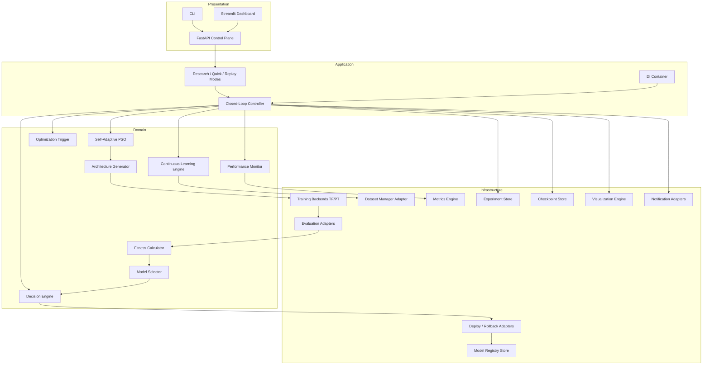

**Why this shape:** Presentation never reaches infrastructure without application/domain mediation. SAPSO never imports TF/PT directly.

---

## 80. Closed Loop Flow

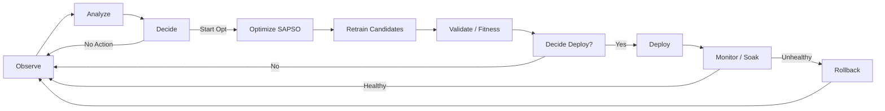

---

## 81. Sequence Diagram — Drift-Triggered Optimization Cycle

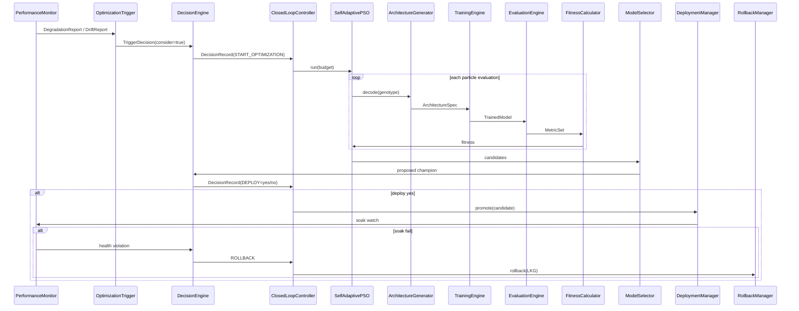

---

## 82. Module Interaction Diagram

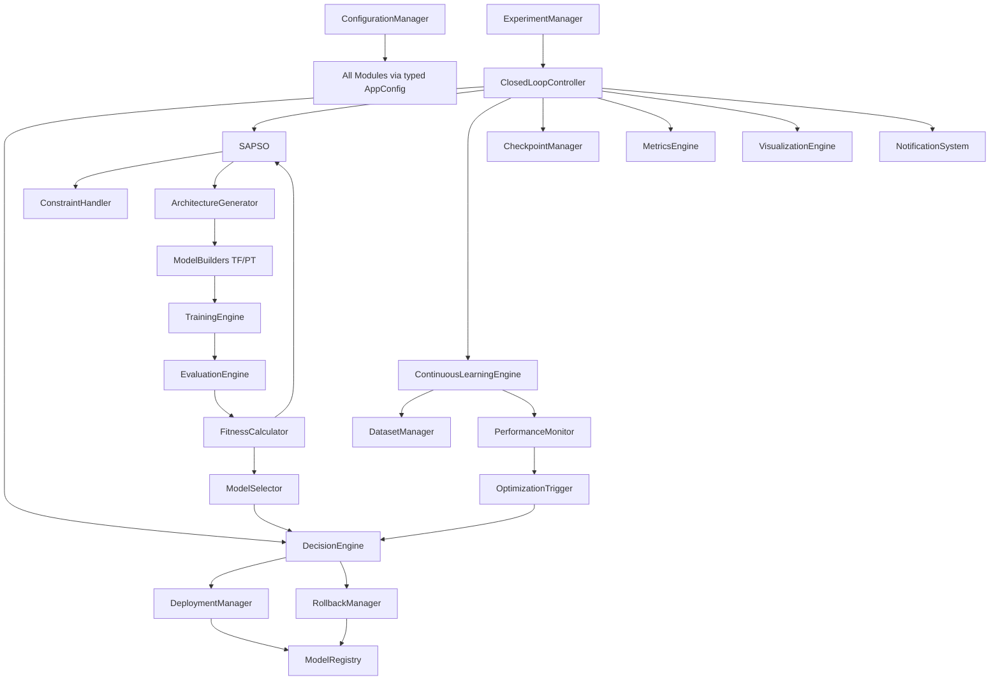

---

## 83. Deployment Diagram

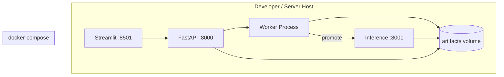

---

## 84. Training Pipeline

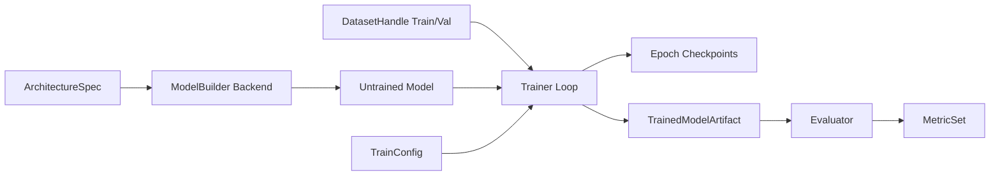

---

## 85. Optimization Pipeline

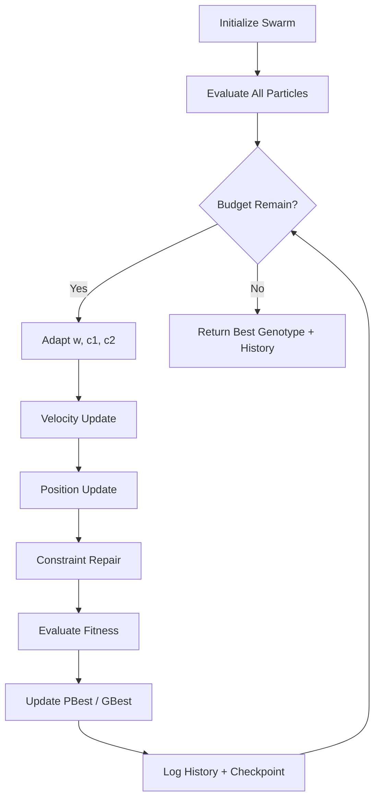

---

## 86. Class Diagram (Core Domain)

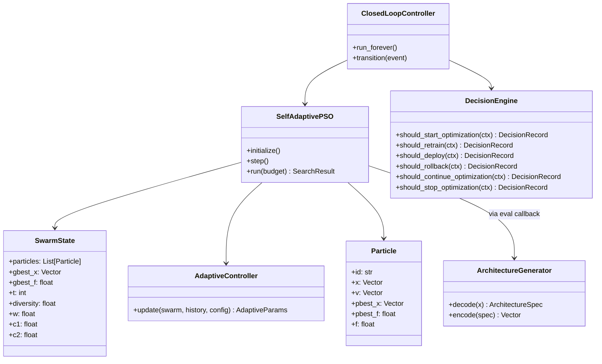

---

## 87. Folder Structure Diagram

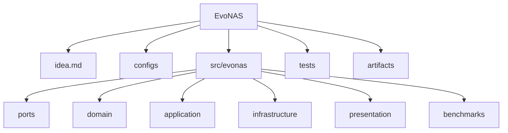

---

## 88. Decision Flow

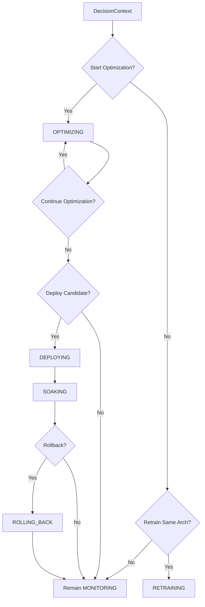

---

## 89. Continuous Learning Flow

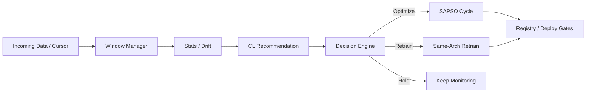

---

## 90. State Machine

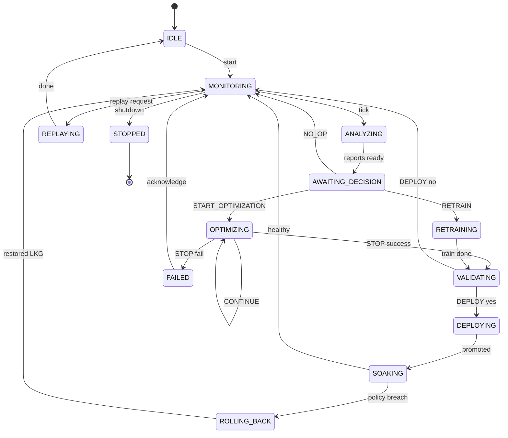

---

# PART XIV — LONG-TERM VISION AND EXTENSIBILITY

## 91. Extensibility Doctrine

`REQ-ARCH-030`: The closed-loop controller, decision engine, experiment/registry subsystems, and SAPSO engine MUST remain stable while new model families are introduced as **search space plugins + model builder plugins + evaluation metrics plugins**.

No major redesign means:

1. No new hardcoded CNN-only assumptions in controller
2. No fitness logic embedded in PSO
3. No dataset format assumptions beyond DatasetHandle abstractions
4. No serving assumptions beyond IServingAdapter

## 92. Future Model Families

| Family | Search Space Plugin | Notes |
|--------|---------------------|-------|
| CNN | default early phases | image classification |
| MLP | tabular/vector | dense stacks |
| Vision Transformers | patch/embed/depth/heads | higher dim genotype |
| Object Detection | backbone + neck + head genes | custom eval mAP |
| Segmentation | encoder/decoder genes | mIoU fitness |
| Time Series | TCN/LSTM/Transformer genes | horizon metrics |
| Tabular Models | MLP/FT-Transformer genes | AUC/F1 |
| Federated Learning | client fraction / aggregation genes OR architecture-only with FL trainer adapter | trainer plugin |
| Edge AI | latency/memory hard constraints emphasized | device profiles |
| Explainable AI | optional post-hoc explain adapters; fidelity penalties | not search core |
| LLMs | adapter/LoRA rank & target module search; NOT full pretrain from scratch initially | careful budgets |
| Agentic AI | tool-routing policies / planner depth as genotype in future agent spaces | speculative |

## 93. LLM and Agentic Future (Anticipatory Design)

EvoNAS will not initially train foundation LLMs from scratch. Anticipated path:

1. Treat **adapter configurations** and **routing architectures** as genotypes
2. Use evaluation harnesses for task suites
3. Keep SAPSO as search engine
4. Decision Engine still gates deploy/rollback of adapter versions

## 94. Multi-Objective Future

Future SAPSO may maintain archive of non-dominated solutions (accuracy vs latency). Even then:

- Engine remains PSO-family / self-adaptive
- NSGA-II may appear only as benchmark comparator

---

# PART XV — SECURITY, SAFETY, AND GOVERNANCE

## 95. Safety Principles

1. Prefer no deploy over unsafe deploy
2. Always retain LKG
3. Budget caps mandatory
4. Human override switches in policy (`manual_override: true`)
5. Audit every decision

## 96. Security Requirements

`REQ-SEC-001`: Secrets only via env / secret manager; never commit.

`REQ-SEC-002`: Artifact paths constrained under artifacts root (prevent path traversal).

`REQ-SEC-003`: API must support future auth middleware; local mode may run open but must be documented unsafe for shared hosts.

`REQ-SEC-004`: Model deserialization only from trusted registry URIs.

## 97. Governance Roles (Human)

Even though optimization is autonomous, humans own:

- Policy thresholds
- Budget approvals
- Production freeze windows
- Ethical/dataset licensing constraints
- Publication claims review

---

# PART XVI — OPERATIONAL SEMANTICS AND SLAs

## 98. Controller Tick Semantics

On each monitoring tick:

1. Collect MetricsSnapshot
2. Update Continuous Learning windows if due
3. Build DecisionContext
4. Evaluate trigger + decisions
5. Execute authorized actions
6. Checkpoint
7. Emit metrics/notifications

Tick interval is config (`monitor_interval_seconds`).

## 99. Idempotency

- `promote` is idempotent for same version
- `start_optimization` refused if already running
- Experiment `finish` idempotent

## 100. Crash Recovery

On worker restart:

1. Load last checkpoint
2. If state OPTIMIZING, resume swarm from checkpoint
3. If state DEPLOYING/SOAKING, re-verify health and continue
4. Log recovery DecisionRecord note

---

# PART XVII — DETAILED DATA CONTRACTS

## 101. ArchitectureSpec JSON Schema (Conceptual)

Required fields:

- `schema_version`
- `task_type`
- `input_shape`
- `num_classes` (if classification)
- `stem`, `blocks`, `head`
- `regularization`
- `genotype`
- `estimated_params`

## 102. DecisionRecord JSONL Example

```json
{"decision_id":"dec_...", "ts":"2026-07-28T12:00:00Z", "question":"should_deploy", "outcome":true, "action":"DEPLOY", "policy_version":"1.0.0", "rationale":{"improvement_abs":0.012, "latency_regression_pct":3.1}, "experiment_id":"exp_..."}
```

## 103. Swarm History JSONL Example

```json
{"t":12, "best_f":0.91, "mean_f":0.84, "diversity":0.17, "w":0.72, "c1":1.9, "c2":2.2, "evals":260}
```

---

# PART XVIII — WORKED EXAMPLE (QUICK MODE NARRATIVE)

## 104. End-to-End Story

1. Operator runs `evonas run --mode quick --config configs/modes/quick.yaml`
2. DI wires PyTorch backend + local deploy + default policy
3. Experiment Manager creates `exp_...` and writes resolved config
4. Baseline or current production model is registered if none exists
5. Controller enters MONITORING
6. Synthetic degradation injected in Quick demo OR first-cycle forced evolution flag `force_initial_search: true`
7. Decision Engine returns START_OPTIMIZATION
8. SAPSO runs with N=8 particles, T=5 iterations, 1–2 epochs each
9. Best candidate validated; if improves beyond gate, deploy to localhost:8001
10. Soak one tick; success → MONITORING
11. Artifacts available; Replay Mode can visualize without training

This story is the acceptance narrative for Phase 6–9 integration.

---

# PART XIX — NON-FUNCTIONAL REQUIREMENTS

## 105. NFR Catalog

| ID | Requirement |
|----|-------------|
| NFR-1 | Quick Mode E2E ≤ 10 minutes on CPU with toy config |
| NFR-2 | Domain unit tests ≤ 2 minutes in CI |
| NFR-3 | Deterministic seeded synthetic PSO tests |
| NFR-4 | Artifact writes atomic (temp + rename) |
| NFR-5 | Memory: particle eval should release GPU memory between builds |
| NFR-6 | Modular imports: `import evonas.domain` must not import torch/tf |
| NFR-7 | Default DI binds SAPSO only |
| NFR-8 | Config validation errors are human-readable |
| NFR-9 | Dashboard usable at 1280×720 |
| NFR-10 | Logs correlatable by experiment_id |

---

# PART XX — ANTI-PATTERNS (EXPLICITLY FORBIDDEN)

## 106. Forbidden Implementations

1. Putting training code inside `sapso.py`
2. Hardcoding accuracy thresholds in Python instead of policy YAML
3. Deploying from Training Engine directly
4. Using Genetic Algorithm as core search “just for now”
5. One giant Jupyter notebook as the product
6. README replacing `idea.md` as authority
7. Silent catches of all exceptions
8. Non-seeded “random” in Research Mode without recording seed
9. Mutating production pointer without LKG snapshot
10. Circular imports between domain and infrastructure

---

# PART XXI — ACCEPTANCE GATES BY ROLE

## 107. Architect Acceptance

- Clean architecture boundaries verified by import linters / tests
- Ports exist for every infrastructure adapter

## 108. Research Acceptance

- SAPSO equations match Part IV
- Ablation configs exist
- Benchmark harness isolated

## 109. MLOps Acceptance

- Deploy/rollback/soak works
- Experiment artifacts complete
- Replay works offline

## 110. Agent/Cursor Acceptance

- Before coding, map task → Phase + Module + REQ IDs
- After coding, ensure no anti-pattern introduced

---


# PART XXII — AUTHORITATIVE PSEUDOCODE

## 111. Self-Adaptive PSO Pseudocode

```text
algorithm SAPSO(space, evaluate, config, rng):
    swarm ← InitializeParticles(space, config, rng)
    for particle in swarm:
        particle.f ← evaluate(particle.x)
        particle.pbest_x ← particle.x
        particle.pbest_f ← particle.f
    gbest ← ArgBest(swarm)
    history ← []
    t ← 0

    while not Stop(t, history, config) and DecisionAllowsContinue():
        diversity ← NormalizedDiversity(swarm, space)
        eta ← ImprovementRate(history, config.window_H)
        w, c1, c2 ← Adapt(diversity, eta, t, config)

        for particle in swarm:
            r1 ← rng.uniform(0,1, dim)
            r2 ← rng.uniform(0,1, dim)
            particle.v ← w*particle.v
                            + c1*r1*(particle.pbest_x - particle.x)
                            + c2*r2*(gbest.x - particle.x)
            particle.v ← ClampVelocity(particle.v, space, config)
            particle.x ← particle.x + particle.v
            particle.x ← ProjectAndRepair(particle.x, space, config)
            particle.f ← evaluate(particle.x)
            if Better(particle.f, particle.pbest_f, config.sense):
                particle.pbest_x ← particle.x
                particle.pbest_f ← particle.f

        gbest ← ArgBest(swarm)
        history.append(Snapshot(t, swarm, w, c1, c2, diversity, gbest))
        CheckpointIfDue(swarm, history, t)
        t ← t + 1

    return SearchResult(gbest, history)
```

**Why this structure:** Evaluation is injected; adaptation is explicit; checkpointing is first-class; Decision Engine can halt via `DecisionAllowsContinue`.

## 112. Closed-Loop Controller Pseudocode

```text
algorithm ClosedLoop(config):
    state ← IDLE
    transition(MONITORING)

    loop:
        if mode == REPLAY:
            Replay(config.experiment_id); break

        snap ← PerformanceMonitor.collect()
        cl ← ContinuousLearningEngine.recommend(snap)
        ctx ← BuildContext(snap, cl, budgets, registry, swarm_state)
        trigger ← OptimizationTrigger.evaluate(ctx)

        if state in {MONITORING, ANALYZING, AWAITING_DECISION}:
            d_start ← DecisionEngine.should_start_optimization(ctx, trigger)
            Persist(d_start)
            if d_start.outcome:
                state ← OPTIMIZING
                result ← SAPSO.run(...)
                candidate ← MaterializeAndFinalFit(result.gbest)
                d_deploy ← DecisionEngine.should_deploy(ctx_with(candidate))
                Persist(d_deploy)
                if d_deploy.outcome:
                    DeploymentManager.promote(candidate)
                    state ← SOAKING
                else:
                    state ← MONITORING

        if state == SOAKING:
            d_rb ← DecisionEngine.should_rollback(ctx)
            Persist(d_rb)
            if d_rb.outcome:
                RollbackManager.rollback()
            state ← MONITORING

        if ShutdownRequested():
            state ← STOPPED
            break

        Sleep(config.monitor_interval_seconds)
```

## 113. Fitness Evaluation Adapter Pseudocode

```text
function evaluate(genotype):
    spec ← ArchitectureGenerator.decode(genotype)
    if not ArchitectureGenerator.validate(spec):
        spec ← ConstraintHandler.repair(spec)
    try:
        model ← TrainingEngine.train(spec, data, train_budget)
        metrics ← EvaluationEngine.evaluate(model, val_data)
        complexity ← ArchitectureGenerator.estimate_complexity(spec)
        return FitnessCalculator.compute(metrics, complexity, penalties)
    catch TrainingError as e:
        log(e)
        return config.fitness_fail
```

---

# PART XXIII — CONFIGURATION REFERENCE (NORMATIVE KEYS)

## 114. Root Config Keys

```yaml
project_name: EvoNAS
seed: 42
mode: research | quick | replay

backend:
  name: pytorch | tensorflow
  device: cpu | cuda | mps
  mixed_precision: false

dataset:
  name: toy_quick
  root: artifacts/datasets
  download: true

search_space:
  path: configs/search_spaces/cnn_quick.yaml

optimization:
  algorithm: sapso          # production allowed: sapso | pso(for ablation)
  swarm_size: 20
  max_iterations: 50
  inertia:
    w_min: 0.4
    w_max: 0.9
    alpha: 0.5
    beta: 0.3
    gamma: 0.2
    eta_slow: 0.001
    eta_good: 0.01
    delta_collapse: 0.05
    refine_w: 0.35
  acceleration:
    c_min: 0.5
    c_max: 2.5
    c_sum: 4.1
  velocity:
    kappa: 0.2
  init_velocity_scale: 0.2
  warm_start_count: 1
  checkpoint_every: 5

training:
  epochs: 10
  batch_size: 64
  learning_rate: 0.001
  optimizer: adam
  early_stopping_patience: 3

fitness:
  sense: maximize
  weights:
    accuracy: 1.0
  penalties:
    param_lambda: 0.000001
    latency_lambda: 0.0
  fail_value: -1.0

policy:
  path: configs/policies/default_policy.yaml

deploy:
  target: local | docker
  inference_port: 8001
  soak_ticks: 3

continuous:
  enabled: true
  monitor_interval_seconds: 30
  force_initial_search: false

experiment:
  artifacts_root: artifacts/experiments

logging:
  level: INFO
  json: true
```

## 115. Mode Overlay Expectations

### Research Mode Overlay

- Full dataset
- Larger swarm / iterations / epochs
- `force_initial_search` optional
- Full artifact persistence

### Quick Mode Overlay

- Toy dataset subset
- swarm_size ≤ 8
- max_iterations ≤ 5
- epochs ≤ 2
- monitor_interval short
- `force_initial_search: true` recommended for demos

### Replay Mode Overlay

- `experiment_id` required
- training disabled
- visualization enabled

---

# PART XXIV — API CONTRACT (FASTAPI)

## 116. Core Endpoints

### Health

`GET /health` → `{ "status": "ok", "version": "..." }`

### Start Run

`POST /runs`

```json
{"mode":"quick","config_path":"configs/modes/quick.yaml"}
```

→ `{ "experiment_id":"...", "status":"started" }`

### Get Run

`GET /runs/{experiment_id}` → status, current state, best fitness, links to artifacts

### Stop Run

`POST /runs/{experiment_id}/stop` → DecisionEngine STOP path

### Decisions

`GET /experiments/{id}/decisions`

### Models

`GET /models`  
`GET /models/{model_id}`  
`POST /models/{model_id}/versions/{version}/stage` body: `{stage}`

### Deploy

`POST /deployments/promote`  
`POST /deployments/rollback`

### Replay

`GET /replay/{experiment_id}` → trajectories + decision timeline payloads for UI

`REQ-API-001`: API MUST NOT contain training logic; it calls application use cases only.

---

# PART XXV — SEARCH SPACE SPECIFICATION (CNN QUICK EXAMPLE)

## 117. Gene Map Example

| Dim | Name | Type | Bounds / Choices | Decode |
|-----|------|------|------------------|--------|
| 0 | n_blocks | int | [2,4] | round clip |
| 1 | ch0 | int | [16,64] | round to step 8 |
| 2 | ch1 | int | [16,128] | round to step 8 |
| 3 | ch2 | int | [32,256] | round to step 8 |
| 4 | k0 | cat | {3,5} | categorical decode |
| 5 | k1 | cat | {3,5} | categorical decode |
| 6 | act | cat | {relu,gelu} | categorical decode |
| 7 | norm | cat | {none,bn} | categorical decode |
| 8 | dropout | float | [0.0,0.5] | direct |
| 9 | pool | cat | {max,avg} | categorical decode |

**Why small space in Quick Mode:** Ensures CI and demos finish quickly while still exercising decode/repair/train.

Research spaces expand channels/depth/kernel/activation choices and optionally include LR genes.

---

# PART XXVI — ADAPTIVE STRATEGY RATIONALE (RESEARCH DEPTH)

## 118. Why Diversity-Triggered Exploration

Architecture landscapes are rugged: many genotypes fail shape constraints or train poorly. Swarms collapsing onto a mediocre basin waste budgets. Raising inertia and cognitive weight when diversity collapses reopens exploration without switching metaheuristics.

## 119. Why Improvement-Rate Feedback

Iteration-only schedules (linear \(w\) decay) ignore actual landscape response. If fitness is still improving rapidly, premature forced exploration wastes evaluations. If improvement stalls early, waiting for late-iteration schedules is too slow. \(\eta\) couples adaptation to observed progress.

## 120. Why Not Replace PSO

The platform contribution must remain comparable and coherent. Introducing BO/GA into the core would:

1. Violate project constraints
2. Dilute IEEE systems narrative
3. Complicate reproducibility and DI defaults

Baselines belong in `benchmarks/`.

---

# PART XXVII — EVALUATION BUDGET ACCOUNTING

## 121. Cost Model

Let:

- \(E\) = number of architecture evaluations
- \(e\) = epochs per evaluation
- \(b\) = batch steps per epoch ≈ \(n_{\text{train}} / \text{batch_size}\)

Then rough train-step cost:

\[
\text{Cost} \approx E \cdot e \cdot b \cdot \text{cost(arch)}
\]

SAPSO should expose early-pruning hooks (future) but Phase 4–5 MUST at least:

- skip re-eval of duplicate genotypes via cache keyed by `arch_id`
- record cache hit metrics

`REQ-PERF-010`: Genotype/architecture evaluation cache is mandatory from Phase 4 onward.

---

# PART XXVIII — REPRODUCIBILITY PROTOCOL

## 122. Required Seeds

- Python `random`
- NumPy
- PyTorch / TF framework seeds
- CUDA deterministic flags where feasible (document nondeterminism if disabled for speed)

## 123. Manifest Contents

Every experiment stores:

1. Git commit hash (if available)
2. Package version
3. Resolved config + hash
4. Seed list
5. Hardware inventory
6. Backend versions
7. Dataset checksums
8. Decision policy version

## 124. Replay Guarantees

Replay reads artifacts; it does not re-train. Plots of fitness must match stored history exactly.

---

# PART XXIX — TESTING MATRIX (EXPANDED)

## 125. Unit Tests

| Area | Examples |
|------|----------|
| AdaptiveController | diversity collapse raises w |
| Velocity/Position | bounds respected |
| Decoder | all genes in Quick space valid |
| DecisionEngine | threshold boundary cases |
| Fitness | penalty monotonicity |
| ConstraintHandler | repairs invalid depth |

## 126. Integration Tests

| Test | Assert |
|------|--------|
| Quick loop | reaches SOAKING or MONITORING after search; artifacts exist |
| Deploy/rollback | production pointer restores |
| Replay | no TrainingEngine calls (mock assert) |
| TF/PT parity | same ArchitectureSpec builds on both (when both installed) |

## 127. Contract Tests

| Test | Assert |
|------|--------|
| Default DI | `ISearchAlgorithm` → `SelfAdaptivePSO` |
| Domain import | no torch/tf |
| Benchmark isolation | GA modules not importable from controller |

---

# PART XXX — DASHBOARD UX SPEC (NON-VISUAL DESIGN SYSTEM)

## 128. Pages and Jobs

Each page has one job:

1. **Run** — start/stop modes; show live state machine status
2. **Replay** — select experiment; scrub iteration timeline
3. **Metrics** — performance + drift charts
4. **Registry** — model stages/lineage
5. **Policies** — view/validate policy YAML (edit optional with validation)

Avoid dashboard clutter: no marketing cards; operational clarity first.

---

# PART XXXI — NOTIFICATION EVENTS CATALOG

## 129. Event Types

| Event | Severity | When |
|-------|----------|------|
| `optimization.started` | INFO | START_OPTIMIZATION |
| `optimization.finished` | INFO | STOP success |
| `optimization.failed` | ERROR | STOP fail |
| `deployment.promoted` | INFO | promote |
| `deployment.rollback` | CRITICAL | rollback |
| `budget.exhausted` | WARNING | budgets hit |
| `health.degraded` | WARNING | monitor |

Payloads include experiment_id, model_version, rationale summary.

---

# PART XXXII — PLUGIN SYSTEM DESIGN (FORWARD COMPAT)

## 130. Extension Points and Registration

```text
@plugin.register("search_space", "cnn_v2")
class CNNv2Space(...): ...

@plugin.register("model_builder", "pytorch_cnn_v2")
class PTBuilder(...): ...

@plugin.register("drift_detector", "psi_v1")
class PSIDetector(...): ...

@plugin.register("benchmark_search", "random")
class RandomSearch(...): ...
```

DI resolves plugins by config name.

`REQ-ARCH-031`: Plugins may add benchmark algorithms, but ClosedLoopController production profile MUST refuse non-PSO-family engines unless `allow_non_sapso_engine: true` in an explicitly named research profile (default false). Even then, GA/BO remain discouraged; Standard PSO is the only suggested alternative engine for ablation.

---

# PART XXXIII — MATHEMATICAL APPENDIX (ADDITIONAL DERIVATIONS)

## 131. Normalized Complexity Penalties

Let \(P(\mathbf{x})\) be parameter count.

\[
\widehat{P}(\mathbf{x}) = \frac{P(\mathbf{x}) - P_{\min}}{P_{\max} - P_{\min} + \varepsilon}
\]

Latency estimate \(\widehat{L}\) analogous using profiled or proxy FLOPs.

## 132. Maximization vs Minimization Sense

If metrics are losses to minimize, define:

\[
f = -L_{\mathrm{val}} - \lambda_p\widehat{P} - \lambda_\ell\widehat{L}
\]

All DecisionEngine improvement comparisons MUST respect `fitness.sense`.

## 133. Tie-Breaking

If two fitness equal within \(\epsilon_f\):

1. Prefer fewer parameters
2. Prefer lower latency
3. Prefer lower genotype lexicographic order

Record tie-break reason in logs.

## 134. Convergence Proof Stance (Engineering Honesty)

EvoNAS does **not** claim a new global convergence proof for SAPSO on nonconvex NAS landscapes. Research claims must be empirical under the protocol in Part XII. Optional future appendix may cite classical PSO convergence analyses under simplified assumptions, clearly marked as non-transferable guarantees for deep network search.

---

# PART XXXIV — RESEARCH CLAIMS MANAGEMENT

## 135. Allowed Claim Templates

1. “EvoNAS enables autonomous closed-loop architecture evolution with policy-gated deployment and rollback.”
2. “Under search space S and budget B, SAPSO achieved mean test accuracy X±Y vs Standard PSO A±B across k seeds.”
3. “Decision policies prevented deployment of non-improving candidates in N/N gated trials.”

## 136. Disallowed Claim Templates

1. “SAPSO is universally superior to all NAS methods.”
2. “EvoNAS replaces all MLOps platforms.”
3. Any claim without artifact-backed experiment IDs.

---

# PART XXXV — PHASE EXIT CHECKLISTS (CONDENSED GATES)

## 137. Gate Table

| Phase | Exit Gate |
|-------|-----------|
| 0 | package installs; CLI help; tests collect |
| 1 | dataset checksum stable; drift unit tests pass |
| 2 | baseline metrics artifact produced |
| 3 | random genotypes train smoke ≥95% |
| 4 | PSO improves synthetic objective; Quick NN search runs |
| 5 | adaptive coeffs bounded; ablation configs run |
| 6 | decisions logged; no unauthorized deploy |
| 7 | drift simulation triggers search |
| 8 | promote+rollback localhost/docker verified |
| 9 | dashboard replay works offline |
| 10 | experiment compare exports tables |
| 11 | registry stage singleton invariant holds |
| 12 | benchmark suite produces paper tables; default engine still SAPSO |

---

# PART XXXVI — GLOSSARY

## 138. Terms

| Term | Definition |
|------|------------|
| EvoNAS | This autonomous closed-loop AutoML platform |
| SAPSO | Self-Adaptive Particle Swarm Optimization engine |
| Genotype | Real-valued particle position encoding an architecture |
| Phenotype | Decoded ArchitectureSpec / neural network |
| Champion | Best validated candidate under policy |
| LKG | Last Known Good production model version |
| DecisionRecord | Auditable decision outcome with rationale |
| Quick Mode | Minutes-scale end-to-end run |
| Research Mode | Full-budget scientific run |
| Replay Mode | Artifact visualization without retraining |
| Closed Loop | Continuous Observe…Monitor cycle |
| Port | Interface boundary for DI |

---

# PART XXXVII — FINAL BINDING STATEMENTS

## 139. Binding Rules for All Contributors

1. **This file is the engineering bible.**  
2. **SAPSO is the only production search engine.**  
3. **Decision Engine authorizes lifecycle verbs.**  
4. **Clean Architecture + SOLID + DI are mandatory.**  
5. **TF and PT are interchangeable behind ports.**  
6. **Every phase must meet its validation gates.**  
7. **Benchmarks may include other algorithms; production wiring must not.**  
8. **Continuous operation is the product; NAS is a subsystem.**  
9. **Reproducibility artifacts are not optional.**  
10. **When uncertain, amend `idea.md` first, then code.**

## 140. Document Maintenance

- Version this document via git history
- Architectural ECRs must update Document Version at top
- Deprecated requirements must be marked deprecated, not silently deleted (move to Appendix Z with date)

---

# APPENDIX A — DEFAULT POLICY STARTER

```yaml
policy_version: "1.0.0"
degradation:
  accuracy_drop_abs: 0.02
  accuracy_drop_rel: 0.05
  window_hours: 24
  min_samples: 500
drift:
  psi_threshold: 0.25
optimization:
  max_parallel_searches: 1
  cooldown_minutes: 30
  min_expected_improvement: 0.003
deployment:
  min_improvement_abs: 0.005
  max_latency_regression_pct: 15
  allow_parity_deploy: false
rollback:
  error_rate_spike_factor: 2.0
  accuracy_floor: 0.50
  soak_ticks: 3
budgets:
  max_search_wallclock_minutes: 120
  max_evaluations: 500
```

---

# APPENDIX B — QUICK MODE STARTER

```yaml
mode: quick
seed: 7
backend:
  name: pytorch
  device: cpu
dataset:
  name: toy_quick
search_space:
  path: configs/search_spaces/cnn_quick.yaml
optimization:
  algorithm: sapso
  swarm_size: 6
  max_iterations: 4
training:
  epochs: 1
  batch_size: 128
continuous:
  force_initial_search: true
  monitor_interval_seconds: 5
deploy:
  target: local
policy:
  path: configs/policies/default_policy.yaml
```

---

# APPENDIX C — RESEARCH MODE STARTER

```yaml
mode: research
seed: 42
backend:
  name: pytorch
  device: cuda
dataset:
  name: cifar10
search_space:
  path: configs/search_spaces/cnn_small.yaml
optimization:
  algorithm: sapso
  swarm_size: 30
  max_iterations: 80
training:
  epochs: 20
  early_stopping_patience: 5
continuous:
  force_initial_search: true
deploy:
  target: local
```

---

# APPENDIX D — IMPORT LINT RULE (NORMATIVE INTENT)

Domain modules MUST NOT import:

- `torch`
- `tensorflow`
- `streamlit`
- `fastapi`
- `uvicorn`
- cloud vendor SDKs

Application modules MUST NOT import presentation frameworks.

Presentation MAY import application use cases.

Infrastructure MAY import frameworks.

---

# APPENDIX E — CHANGE LOG OF THIS SPECIFICATION

| Version | Date | Notes |
|---------|------|-------|
| 1.1.0 | 2026-07-28 | Final branding: project renamed to EvoNAS |
| 1.0.0 | 2026-07-28 | Initial Master Engineering Specification |

---

# APPENDIX F — AGENT EXECUTION PLAYBOOK

When an automated coding agent begins work:

1. Read this document (at least Parts I, V, VII, VIII, IX, XX, XXXVII).
2. Identify Phase ID and Module ID.
3. List REQ IDs affected.
4. Implement against ports.
5. Add tests matching Testing sections.
6. Update configs if new knobs appear; document in this file if architectural.
7. Ensure default DI still binds SAPSO.
8. Never open a PR that introduces forbidden optimizers into production path.

---

**END OF EVONAS MASTER ENGINEERING SPECIFICATION (v1.0.0)**

*An AI System that Continuously Improves Another AI.*

# PART XXXVIII — PER-MODULE ENGINEERING SPECIFICATIONS (DEEP)

This part expands each major module into an implementable contract: responsibilities, non-responsibilities, inputs, outputs, invariants, failure modes, observability, and test oracles. Cursor MUST treat these as binding.

---

## 139. Dataset Manager — Deep Spec

### Responsibilities

1. Resolve dataset config to a concrete loader.
2. Ensure dataset files exist (download if allowed).
3. Compute and persist checksums for raw and split partitions.
4. Provide deterministic iterators / tensor datasets for train/val/test.
5. Provide windowed views for continuous learning cursors.
6. Expose schema: input shape, dtype, label space, task type.
7. Compute reference statistics for drift detection.

### Non-Responsibilities

- Training models
- Deciding whether drift should trigger optimization
- Mutating production models

### Invariants

- Given same config + seed, split membership is identical.
- Train/val/test pairwise intersection is empty.
- Checksum mismatch raises `DataError` and blocks experiment start.

### Failure Modes

| Failure | Handling |
|---------|----------|
| Download failure | retry bounded; then DataError |
| Corrupt cache | delete+redownload if allowed else fail |
| Schema mismatch vs search space input | fail fast at experiment start |
| Empty window | Continuous Learning marks data_availability=false |

### Observability

Log dataset name, checksum, split sizes, seed, window ids.

### Test Oracles

- Two loads → identical checksums
- Drift detector on shifted synthetic features exceeds threshold

---

## 140. Configuration Manager — Deep Spec

### Responsibilities

1. Load YAML/JSON.
2. Deep-merge defaults ← mode ← user ← CLI.
3. Validate with Pydantic/JSON Schema.
4. Produce immutable `AppConfig`.
5. Hash canonicalized JSON of resolved config.

### Non-Responsibilities

- Interpreting policies beyond schema validation
- Running experiments

### Invariants

- Invalid config never reaches ClosedLoopController.
- Hash stable under key reordering (canonicalize).

### Failure Modes

- Unknown keys: reject (default) or warn if `allow_unknown_keys` (default false)
- Type errors: ConfigError with path to field

---

## 141. Experiment Manager — Deep Spec

### Responsibilities

1. Allocate experiment ids.
2. Create artifact directories atomically.
3. Persist meta.json and resolved config.
4. Track status: created|running|succeeded|failed|cancelled.
5. Attach artifacts with media type and checksum.
6. Index experiments for list/compare/replay.

### Invariants

- Artifact attach after finish is rejected unless `reopen_for_export`.
- meta.json always contains config_hash and seed.

### Failure Modes

- Disk full → ExperimentError; controller moves to FAILED
- Concurrent writes → use per-experiment locks

---

## 142. Performance Monitor — Deep Spec

### Responsibilities

1. Collect offline evaluation metrics on recent windows.
2. Collect online serving metrics if inference adapter supports them.
3. Maintain baseline references (production model expected performance).
4. Emit DegradationReport and contribute to Metrics Engine.

### DegradationReport Fields

- `accuracy_now`, `accuracy_baseline`
- `drop_abs`, `drop_rel`
- `n_samples`
- `latency_p95_now`, `latency_p95_baseline`
- `error_rate_now`
- `sufficient_data: bool`

### Invariants

- Reports are immutable snapshots.
- Insufficient data ⇒ Decision Engine must not treat degradation as significant.

---

## 143. Optimization Trigger — Deep Spec

### Responsibilities

- Convert monitor + CL recommendations + schedules into `TriggerDecision(consider: bool, reasons: list)`.

### Non-Responsibilities

- Final authorization (Decision Engine)

### Reasons Enum Examples

`DRIFT`, `DEGRADATION`, `SCHEDULE`, `FORCE_INITIAL`, `OPERATOR`

---

## 144. Decision Engine — Deep Spec

### Responsibilities

Answer the six canonical questions with DecisionRecords.

### Invariants

- Same context + policy + seed ⇒ same decision.
- Every YES action includes machine-readable rationale.
- Cannot return DEPLOY if candidate is None.

### Policy Evaluation Order for Deploy

1. candidate exists
2. validation suite passed
3. improvement gate
4. latency/resource gates
5. safety floor gates
6. freeze window not active

### Test Matrix (Must Implement)

| Case | Expect |
|------|--------|
| accuracy drop 0.019 vs thr 0.02 | no start (if only abs drop) |
| accuracy drop 0.021 | start if other gates pass |
| candidate +0.004 vs min 0.005 | no deploy |
| candidate +0.010, latency +20% vs max 15% | no deploy |
| soak error_rate spike ×2 | rollback yes |
| optimization running | start no |
| cooldown active | start no |

---

## 145. Self-Adaptive PSO — Deep Spec

### Responsibilities

- Swarm lifecycle under adaptive coefficients
- History emission
- Cooperation with constraint handler
- Respect stop via callback

### Non-Responsibilities

- Decoding architectures beyond calling ports
- Training
- Deployment

### Invariants

- \(w \in [w_{min},w_{max}]\)
- \(c_1,c_2\) within configured bounds
- All particles always inside box bounds after projection
- Evaluation count never exceeds budget + in-flight

### Observability

Emit per-iteration: best_f, mean_f, diversity, w, c1, c2, evals, cache_hits

---

## 146. Particle Representation — Deep Spec

### Serialization

Particles serialize to JSON with lists of floats; include schema_version.

### Equality

Particles equal if id equal; fitness comparisons use float tolerance only at Decision/Fitness layers, not inside identity.

---

## 147. Particle Initialization — Deep Spec

Strategies:

1. `uniform` — default cold start
2. `lhs` — Latin Hypercube for diversity (Research recommended)
3. `warm_start` — inject production genotype(s)

Invariant: if warm_start_count > 0 and production genotype missing, log warning and fall back to uniform for those slots.

---

## 148. Velocity Update — Deep Spec

- RNG injected
- Uses adaptive params from AdaptiveController, not stale locals
- Applies velocity clamp after update

---

## 149. Position Update — Deep Spec

- Adds velocity
- Projects box
- Calls ConstraintHandler.repair_genotype if decode invalid

---

## 150. Constraint Handler — Deep Spec

### Hard Constraints

- shape validity
- max depth
- max params (if hard mode)

### Soft Constraints

- prefer power-of-two channels (repair rounding)
- param penalty via fitness (not necessarily repair)

### Determinism

Repair must be deterministic given same invalid genotype.

---

## 151. Architecture Generator — Deep Spec

### decode

genotype → ArchitectureSpec IR

### encode

ArchitectureSpec → genotype (best-effort inverse; document quantization loss)

### validate

structural + resource checks

### estimate_complexity

params; FLOPs optional proxy

### Invariant

`arch_id = hash(canonicalize(spec_without_genotype_float_noise))` so equivalent discrete architectures collide in eval cache.

---

## 152. Training Engine — Deep Spec

### Responsibilities

- Build model via ModelBuilder
- Run train loop under budget
- Early stop
- Return weights URI + train metrics

### Failure Mapping

| Exception | Result |
|-----------|--------|
| OOM | TrainingError → fail fitness |
| NaN loss | TrainingError → fail fitness |
| Device missing | ConfigError before loop |

### Memory Hygiene

Delete model references; empty CUDA cache between particle evals when backend=pytorch/cuda.

---

## 153. Evaluation Engine — Deep Spec

Must support at least classification accuracy/loss. Plugin metrics later (F1, mAP, mIoU).

Must not train.

---

## 154. Fitness Calculator — Deep Spec

Pure function:

`compute(metric_set, complexity, fitness_config) -> Fitness(value, components)`

Components stored for explainability in UI.

---

## 155. Model Selector — Deep Spec

Selects best candidate among evaluated models under constraints. Returns proposal; does not deploy.

---

## 156. Deployment Manager — Deep Spec

### Stages

`none → staging → production → archived`

### Promote Steps

1. Verify artifact checksum
2. Snapshot current production as LKG
3. Load candidate into staging
4. Health check staging
5. Flip production pointer
6. Record deployment event

### Rollback Manager Coordination

Rollback uses LKG pointer; marks bad version `rolled_back`.

---

## 157. Dashboard — Deep Spec

Presentation only. All mutations go through API/use cases.

Must support Read-only Replay without worker.

---

## 158. API Layer — Deep Spec

- Pydantic request/response models
- Background tasks for long runs OR worker queue abstraction
- Correlation ID middleware

---

## 159. Logging — Deep Spec

JSON logs fields minimum:

`ts, level, logger, msg, experiment_id, run_id, state, particle_id?`

---

## 160. Checkpoint Manager — Deep Spec

Checkpoint payload:

- controller state
- swarm state
- RNG states (if available)
- budgets consumed
- candidate pointers

Load must validate schema_version.

---

## 161. Metrics Engine — Deep Spec

Namespaces:

- `ops.*` global serving
- `exp.{id}.*` experiment scoped
- `swarm.*` optimization scoped

---

## 162. Visualization Engine — Deep Spec

Must generate:

1. fitness vs iteration
2. diversity vs iteration
3. w/c1/c2 vs iteration
4. params vs fitness scatter
5. decision timeline

Export PNG and interactive HTML optional.

---

## 163. Notification System — Deep Spec

At least ConsoleNotifier. WebhookNotifier optional. Failures in notification must not crash controller (log WARNING).

---

## 164. Future Plugin System — Deep Spec

Discovery via entry points or explicit registry in DI. Plugins sandboxed by interface; no direct production pointer access.

---

## 165. Closed-Loop Controller — Deep Spec

### Concurrency Model (Phase 6 default)

Single-threaded controller loop + training executed synchronously inside evaluations.

### Future Concurrency

Worker pool for parallel particle evaluation with `max_parallel_evals` (default 1 for reproducibility).

### Locking

At most one OPTIMIZING state per controller instance by default.

---

## 166. Continuous Learning Engine — Deep Spec

### Window Policies

- sliding count-based
- sliding time-based (when timestamps exist)
- expanding window with cap

### Retention

Delete raw windows beyond retention while preserving aggregated stats needed for audit.

### Recommendations

`HOLD`, `RETRAIN_SAME_ARCH`, `OPTIMIZE_ARCH`

Only recommendations — Decision Engine authorizes.

---

## 167. Model Registry — Deep Spec

### Records

model_id, version, stage, uris, metrics, lineage parent, experiment_id, genotype, created_at, checksum

### Invariant

≤1 production version per model_id (default). Multi-production requires explicit config for canaries (future).

---

# PART XXXIX — CONCURRENCY, PERFORMANCE, AND RESOURCE CONTROL

## 168. Parallel Evaluations

When enabled:

- Each worker gets cloned config and device assignment
- Genotype cache shared via process-safe store (filesystem lock or Redis future)
- Swarm updates remain synchronized at iteration barriers

## 169. Resource Quotas

Config keys:

- `max_gpu_memory_fraction`
- `max_parallel_evals`
- `max_search_wallclock_minutes`
- `max_evaluations`

Controller enforces quotas; SAPSO queries remaining budget each iteration.

## 170. Caching Strategy

Key: `arch_id + train_config_hash + dataset_checksum + seed`

Value: fitness components + metrics + optional weights URI

Cache policy: write-through during Research/Quick; Replay reads only.

---

# PART XL — STORAGE SCHEMAS

## 171. meta.json

```json
{
  "experiment_id": "exp_...",
  "mode": "quick",
  "status": "succeeded",
  "config_hash": "...",
  "seed": 7,
  "created_at": "...",
  "finished_at": "...",
  "git_commit": "...",
  "package_version": "0.1.0",
  "backend": {"name": "pytorch", "version": "..."},
  "final_state": "MONITORING",
  "best_fitness": 0.87,
  "production_model": {"model_id": "...", "version": 3}
}
```

## 172. Registry Entry

```json
{
  "model_id": "evonas_clf",
  "version": 3,
  "stage": "production",
  "weights_uri": "artifacts/.../weights.pt",
  "architecture_uri": "artifacts/.../arch.json",
  "metrics": {"val_acc": 0.87},
  "parent_version": 2,
  "experiment_id": "exp_...",
  "checksum": "sha256:..."
}
```

---

# PART XLI — CLI SURFACE

## 173. Commands

```text
evonas version
evonas run --mode {research|quick} --config PATH
evonas replay --experiment-id ID
evonas train-baseline --config PATH
evonas experiments list
evonas experiments show ID
evonas experiments compare ID1 ID2
evonas registry list
evonas deploy promote --model ID --version N
evonas deploy rollback
evonas dashboard
evonas api
evonas doctor          # env/deps/config sanity
```

`evonas doctor` checks Python version, extras installed, CUDA availability, artifacts writable, config schema.

---

# PART XLII — IEEE PAPER SKELETON MAPPED TO CODE

## 174. Suggested Sections ↔ Artifacts

| Paper Section | Produced By |
|---------------|-------------|
| Method: Closed Loop | Phase 6 controller + diagrams |
| Method: SAPSO | Phase 5 adaptive module |
| Method: Decision Policy | policies + DecisionRecords |
| Experiments | Phase 12 benchmarks |
| Reproducibility | Experiment manifests + Replay |
| Systems architecture | Parts V–IX |

---

# PART XLIII — THREAT MODEL (LIGHT)

## 175. Threats and Mitigations

| Threat | Mitigation |
|--------|------------|
| Malicious config path traversal | root jail under artifacts/configs |
| Artifact poisoning | checksums + trusted registry only |
| Runaway GPU cost | hard budgets + cooldown |
| Unsafe auto-deploy | gates + soak + rollback |
| Log injection | structured logging; sanitize user strings |

---

# PART XLIV — MIGRATION AND VERSIONING POLICY

## 176. Schema Versioning

All persisted JSON includes `schema_version`. Loaders must support N and N-1 or fail with clear migration message.

## 177. Package Semver

- MAJOR: incompatible port/config changes
- MINOR: new modules/phases backward compatible
- PATCH: bugfixes

idea.md Document Version may advance independently but should note package impact.

---

# PART XLV — EXTENDED RESEARCH GAP ANALYSIS

## 178. Gap Elaboration

### GAP-1 Open-loop NAS

Most NAS papers report a final architecture and stop. Production accuracy drift after deployment is out of scope. EvoNAS’s controller makes post-deployment evolution a first-class state machine.

### GAP-2 AutoML without architecture re-evolution

Many AutoML systems re-tune hyperparameters or reselect model families but do not continuously redesign architectures under monitoring policies.

### GAP-3 Adaptive PSO isolation

Adaptive PSO papers often optimize mathematical benchmarks or small models without deployment gates, experiment registries, or rollback.

### GAP-4 Underspecified decision policies

Research code frequently uses implicit if-statements without audited DecisionRecords, making claims about autonomy non-verifiable.

### GAP-5 Reproducibility of continuous systems

Continuous systems are harder to reproduce than single runs. EvoNAS mandates manifests, replay, and seeds.

### GAP-6 Backend lock-in

NAS code often hardcodes one framework. EvoNAS ports prevent this.

### GAP-7 Visualization without recompute

Paper figure regeneration often requires reruns. Replay Mode removes that cost.

---

# PART XLVI — STANDARD PSO VS SAPSO ABLATION PLAN

## 179. Ablation Axes

1. Fixed (w,c1,c2) vs fully adaptive
2. Adaptive w only
3. Adaptive c1/c2 only
4. Diversity term on/off
5. Improvement-rate term on/off
6. Warm-start on/off in continuous cycles

Each axis is a config file under `configs/optimization/sapso_ablation_*.yaml`.

---

# PART XLVII — EXAMPLE ARCHITECTURE IR (FULL)

## 180. Example Decoded Spec

```json
{
  "schema_version": "1.0",
  "task_type": "image_classification",
  "input_shape": [28, 28, 1],
  "num_classes": 10,
  "stem": {"type": "conv", "out_channels": 32, "kernel": 3, "stride": 1, "activation": "relu", "norm": "bn"},
  "blocks": [
    {"type": "conv", "out_channels": 64, "kernel": 3, "activation": "relu", "norm": "bn", "pool": {"type": "max", "size": 2}},
    {"type": "conv", "out_channels": 128, "kernel": 3, "activation": "relu", "norm": "bn", "pool": {"type": "max", "size": 2}}
  ],
  "head": {"dense_units": [], "dropout": 0.25, "activation": "softmax"},
  "estimated_params": 158234,
  "genotype": [2.1, 32.2, 64.0, 130.4, 0.1, 0.8, 0.2, 0.9, 0.25, 0.1],
  "arch_id": "sha256:..."
}
```

---

# PART XLVIII — OPERATOR RUNBOOKS (SUMMARY)

## 181. Runbook: First Successful Quick Loop

1. `pip install -e .[pytorch,dashboard,dev]`
2. `evonas doctor`
3. `evonas run --mode quick`
4. Open dashboard Replay after completion
5. Confirm decisions.jsonl contains START and optional DEPLOY

## 182. Runbook: Rollback Drill

1. Promote a known worse model with temporary gate disable in a **dev-only** policy profile
2. Observe soak failure OR manually `evonas deploy rollback`
3. Confirm registry production points to LKG

## 183. Runbook: Research Sweep

1. Launch SAPSO + Standard PSO + Random under same space
2. Export tables via `scripts/export_paper_tables.py`
3. Archive `artifacts/papers/{date}/`

---

# PART XLIX — QUALITY ATTRIBUTES SCENARIOS

## 184. Scenarios

1. **Modifiability:** Add ViT space without changing DecisionEngine code.
2. **Reliability:** Kill worker mid-OPTIMIZING; restart resumes from checkpoint.
3. **Reproducibility:** Two Research runs with same seed+config on CPU mock eval produce identical histories.
4. **Safety:** Candidate with higher accuracy but +50% latency rejected by gate.
5. **Operability:** Dashboard shows state machine state within one tick.

---

# PART L — CLOSING ARCHITECTURAL OATH

EvoNAS exists to continuously improve deployed AI systems under audited autonomy.

Every line of code must serve the loop:

Observe → Analyze → Decide → Optimize → Retrain → Validate → Deploy → Monitor → Repeat

Neural Architecture Search is necessary machinery.

Self-Adaptive PSO is the appointed search engine.

The Decision Engine is the brain.

The Closed-Loop Controller is the nervous system.

Experiments, registries, and replay are the memory.

Deployment and rollback are the immune system.

If a proposed change does not strengthen this organism, it does not belong.

---

**END OF APPENDICES EXTENSION — SPECIFICATION REMAINS BINDING IN FULL**

# PART LI — DEPENDENCY INJECTION COMPOSITION ROOT (NORMATIVE DESIGN)

## 185. Why a Single Composition Root

Scattered constructors create hidden couplings and make it impossible to guarantee that production wiring binds SAPSO. The composition root (`application/di/container.py`) is the only place allowed to `new` infrastructure adapters for application entrypoints.

## 186. Container Responsibilities

1. Read `AppConfig`
2. Construct infrastructure adapters
3. Inject them into domain/application services via constructors
4. Expose factory methods: `build_closed_loop()`, `build_api()`, `build_dashboard_services()`
5. Enforce engine allowlist

## 187. Engine Allowlist Pseudocode

```text
function build_search_algorithm(config, evaluate, rng):
    algo ← config.optimization.algorithm
    if algo == "sapso":
        return SelfAdaptivePSO(...)
    if algo == "pso" and config.profiles.allow_standard_pso_ablation:
        return StandardPSO(...)
    if algo in BENCHMARK_ONLY and config.profiles.allow_benchmark_engines:
        return Benchmarks.create(algo, ...)
    raise ConfigError("Production engine must be sapso (or explicit ablation profile)")
```

## 188. Backend Selection

```text
function build_training_engine(config):
    if config.backend.name == "pytorch":
        builder ← PyTorchModelBuilder()
        return PyTorchTrainingEngine(builder, ...)
    if config.backend.name == "tensorflow":
        builder ← TFModelBuilder()
        return TFTrainingEngine(builder, ...)
    raise ConfigError
```

## 189. Test Container

Tests may use `TestContainer` with:

- `FakeTrainingEngine` (mock fitness landscape)
- `InMemoryRegistry`
- `NoopDeployer`

This enables Decision Engine and Controller tests without GPUs.

---

# PART LII — TRAINING RECIPE SPECIFICATION

## 190. Default Classification Recipe

1. Optimizer: Adam
2. LR: config-driven (default 1e-3)
3. Loss: CrossEntropy
4. Shuffle train each epoch with seeded generator
5. Validation each epoch
6. Early stopping on val fitness/loss patience
7. Save best epoch weights, not last epoch (unless disabled)

## 191. Quick Mode Recipe Overrides

- epochs=1 or 2
- possibly reduced image size / subset fraction (`dataset.subset_fraction`)
- disable expensive augmentations

## 192. Research Mode Recipe Overrides

- full epochs
- optional scheduler (cosine) as config
- optional augmentation pipeline config
- optional mixed precision

## 193. Final Fit Policy

After SAPSO returns best genotype, Decision Engine may authorize a **final fit** on train+val (or full train) before test evaluation / deploy.

Config:

```yaml
final_fit:
  enabled: true
  epochs: 30
  merge_val_into_train: false
```

Final fit metrics for deployment gates should still use a held-out test or a sealed validation split that was not used for particle evaluations if leakage control is enabled (`leakage_control: strict`).

### Leakage Control Modes

| Mode | Behavior |
|------|----------|
| `strict` | particle eval uses val; deploy gate uses untouched test |
| `standard` | particle eval and gate share val; test reported post-hoc |
| `leaky_research` | allowed only with explicit flag for toy demos |

Default: `standard` for Quick; `strict` recommended for Research paper runs.

---

# PART LIII — CONTINUOUS LEARNING MATHEMATICS

## 194. Drift Scoring

### Population Stability Index (PSI)

For feature or confidence-bin probabilities expected \(e_i\) vs actual \(a_i\):

\[
\mathrm{PSI} = \sum_i (a_i - e_i) \ln\left(\frac{a_i + \varepsilon}{e_i + \varepsilon}\right)
\]

### Kolmogorov–Smirnov

Two-sample KS statistic on chosen score distributions; significant if p-value < threshold.

### Composite Drift Score

\[
\mathrm{DriftScore} = \omega_{\mathrm{PSI}}\cdot \mathbf{1}[\mathrm{PSI}>\tau_{\mathrm{PSI}}] + \omega_{\mathrm{KS}}\cdot \mathbf{1}[p_{\mathrm{KS}}<\tau_{\mathrm{KS}}]
\]

Significant drift if DriftScore ≥ 1 under default weights of 1.

## 195. Degradation Mathematics

\[
\Delta_{\mathrm{abs}} = A_{\mathrm{base}} - A_{\mathrm{now}}
\]

\[
\Delta_{\mathrm{rel}} = \frac{A_{\mathrm{base}} - A_{\mathrm{now}}}{|A_{\mathrm{base}}|+\varepsilon}
\]

Significant if \((\Delta_{\mathrm{abs}} \ge \tau_{\mathrm{abs}}) \lor (\Delta_{\mathrm{rel}} \ge \tau_{\mathrm{rel}})\) and \(n \ge n_{\min}\).

## 196. Retrain-vs-Optimize Heuristic (Recommendation Only)

If degradation exists but drift is mild and architecture complexity utilization is low (params << caps) and last optimization was recent:

→ recommend `RETRAIN_SAME_ARCH`

If drift severe OR repeated retrain fails to recover OR accuracy below floor OR schedule forced evolution:

→ recommend `OPTIMIZE_ARCH`

Else `HOLD`

Decision Engine still decides.

---

# PART LIV — SWARM DIVERSITY ADVANCED OPTIONS

## 197. Alternative Diversity Metrics (Optional Config)

1. Euclidean mean deviation (default)
2. Average pairwise distance (more expensive)
3. Gene-wise standard deviation mean

Config key `optimization.diversity_metric`.

Default remains Euclidean mean deviation for cost reasons.

## 198. Restart Rule (Optional)

If diversity < collapse threshold for K consecutive iterations despite adaptation, reinitialize worst P% particles randomly while keeping gbest. Disabled by default; enable in Research ablations as `optimization.partial_restart.enabled`.

---

# PART LV — MODEL BUILDER CONTRACTS

## 199. IModelBuilder Methods

```text
build(spec: ArchitectureSpec) -> FrameworkModel
count_parameters(model) -> int
save(model, uri)
load(uri) -> FrameworkModel
to_device(model, device)
```

## 200. FrameworkModel Expectations

Must be trainable by the corresponding TrainingEngine. No cross-backend objects.

## 201. Parity Tests

When both extras installed, decode a fixed genotype and assert both builders produce parameter counts within tolerance (exact match expected for mirrored IR translation).

---

# PART LVI — SERVING ADAPTER CONTRACT

## 202. IServingAdapter

```text
load(model_version)
predict(batch) -> predictions
health() -> HealthStatus
unload()
```

Local adapter may be FastAPI/Flask in-process or separate process. Docker adapter updates container-mounted weights and restarts or hot-reloads.

---

# PART LVII — EXPERIMENT COMPARISON SEMANTICS

## 203. Compare Algorithm

Given experiments A and B:

1. Diff resolved configs (canonical JSON patch)
2. Side-by-side best fitness
3. Side-by-side test metrics if present
4. Search time and eval counts
5. Parameter counts of champions
6. Decision counts by type

Emit markdown and CSV.

---

# PART LVIII — RANDOM SEARCH AND GRID SEARCH BASELINE SPECS

## 204. Random Search (Benchmark Only)

Sample `n_trials` genotypes uniformly; evaluate with same training budget; keep best.

## 205. Grid Search (Benchmark Only)

Discretize each gene to a coarse grid; evaluate Cartesian product or truncated product if huge; same fitness path.

## 206. Fairness Constraints

All baselines MUST:

- use identical search_space bounds
- use identical training budgets
- use identical seeds where applicable
- write Experiment artifacts compatible with Replay

---

# PART LIX — ERROR CODES

## 207. Stable Error Code Registry

| Code | Meaning |
|------|---------|
| EN_CFG_001 | schema validation failed |
| EN_CFG_002 | forbidden engine binding |
| EN_DATA_001 | checksum mismatch |
| EN_DATA_002 | insufficient data |
| EN_ARCH_001 | decode invalid |
| EN_ARCH_002 | repair failed |
| EN_OPT_001 | budget exceeded |
| EN_OPT_002 | swarm checkpoint corrupt |
| EN_TRN_001 | OOM |
| EN_TRN_002 | non-finite loss |
| EN_DEC_001 | missing candidate |
| EN_DEP_001 | health check failed |
| EN_DEP_002 | rollback failed |
| EN_CKPT_001 | checkpoint schema unsupported |

Logs and API errors should include these codes.

---

# PART LX — TELEMETRY AND AUDIT

## 208. Audit Log

Append-only `audit.jsonl` per experiment capturing:

- state transitions
- decisions
- deploys
- rollbacks
- config hash
- operator overrides

## 209. Retention

Ops may ship audit logs separately from heavy weight artifacts.

---

# PART LXI — HUMAN OVERRIDE PROTOCOL

## 210. Overrides

Config/API may set:

- `freeze_deployments: true`
- `force_rollback: true`
- `force_start_optimization: true`
- `force_stop_optimization: true`

All overrides generate DecisionRecords with reason `OPERATOR_OVERRIDE`.

---

# PART LXII — EXTENDED MERMAID: TRAINING × OPTIMIZATION COUPLING

## 211. Coupling Diagram

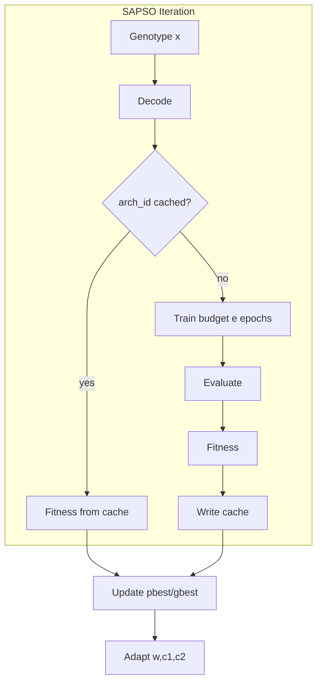

---

# PART LXIII — DETAILED PHASE 0 FILE-BY-FILE BUILD ORDER

## 212. Recommended Commit Sequence

1. Add `idea.md` (this document)
2. Add `pyproject.toml` and package shell
3. Add ports with Protocols (empty methods)
4. Add Config Manager + default.yaml
5. Add logging setup
6. Add CLI stub
7. Add DI container stub
8. Add tests/test_import.py
9. Add Dockerfile + compose stub
10. Add .gitignore excluding artifacts

This order prevents “code without contracts.”

---

# PART LXIV — DETAILED PHASE 5 ACCEPTANCE EXPERIMENTS

## 213. Synthetic Landscape Tests

Before NN integration, SAPSO must optimize:

1. Sphere function
2. Rastrigin function
3. Rosenbrock function (optional)

Compare against Standard PSO over 20 seeds on fixed budgets; record mean best fitness.

These results support algorithmic appendix claims independently from NAS noise.

---

# PART LXV — DASHBOARD STATE DISPLAY CONTRACT

## 214. Required On-Screen Fields During Live Run

- experiment_id
- mode
- controller state
- best fitness so far
- current iteration t / T
- diversity
- current w, c1, c2
- last decision question+outcome
- production model version
- budget remaining

No additional marketing widgets in v1.

---

# PART LXVI — ARTIFACT SIZE CONTROL

## 215. Policies

- Store weights only for: all champions, finalists top-k, and production/LKG
- Intermediate particle weights deleted after fitness recorded unless `keep_all_weights: true` (dangerous)
- Figures compressed PNG
- Swarm history JSONL flushed every iteration but can downsample particle vectors to best+mean only if `history.verbosity: summary`

---

# PART LXVII — LEGAL AND LICENSING NOTES FOR DATASETS

## 216. Dataset License Gate

Configs must include `license_ack: true` for non-toy datasets. Experiments refuse to start otherwise. This protects research release compliance.

---

# PART LXVIII — MULTI-TASK FUTURE WITHOUT REDESIGN

## 217. TaskType Enum

`image_classification | tabular_classification | tabular_regression | time_series_forecasting | detection | segmentation | text_classification | other`

Search spaces, builders, and evaluators switch on TaskType via plugins. Controller remains task-agnostic except for metric names in policies.

---

# PART LXIX — POLICY VERSIONING AND COMPATIBILITY

## 218. Rules

- Policies have `policy_version`
- Experiments store the version used
- DecisionEngine loads compatible readers
- Breaking policy schema bumps major version of policy schema, not necessarily package major if adapters exist

---

# PART LXX — COMPLETE REQUIREMENTS INDEX (SELECTED)

## 219. Index of Key REQs

- REQ-ARCH-001 Vision
- REQ-ARCH-002 Service-like boundaries
- REQ-ARCH-003 Three modes
- REQ-ARCH-010..015 Clean architecture / SOLID / DI / interfaces / TF-PT / pluggable benchmarks
- REQ-ARCH-020 Python tooling
- REQ-ARCH-030 Extensibility doctrine
- REQ-ARCH-031 Plugin engine guard
- REQ-OPT-001 SAPSO exclusivity
- REQ-OPT-002 Adaptive contribution stance
- REQ-OPT-003 Decode function
- REQ-OPT-004 Seeded init
- REQ-OPT-005 Adaptive coeffs configurable
- REQ-OPT-006 Convergence does not deploy
- REQ-OPT-007 Repair vs penalty
- REQ-OPT-020 Warm start
- REQ-DEC-001 Decision authorization
- REQ-DEC-010 Sole authority
- REQ-DEC-011 Policy hashing
- REQ-DEC-012 Strict improvement deploy
- REQ-CL-001 State machine orchestration
- REQ-CL-002 No ungated online train
- REQ-CL-010 Checkpoint frequency
- REQ-TRAIN-001 Pure fitness
- REQ-DEP-001 LKG snapshot
- REQ-DEP-010 Deploy targets
- REQ-PERF-001 Quick Mode time
- REQ-PERF-010 Eval cache
- REQ-RES-001 NAS as subsystem narrative
- REQ-RES-002 Publication SAPSO exclusivity statement
- REQ-RES-003 Replay fidelity
- REQ-RES-004 Deterministic decode
- REQ-RES-010 Benchmark protocol
- REQ-API-001 API thinness
- REQ-SEC-001..004 Security
- NFR-1..10 Non-functionals

Any new requirement must be added to this index in the same PR.

---

# PART LXXI — WORD ON ACADEMIC INTEGRITY AND ENGINEERING HONESTY

## 220. Honesty Rules

1. Do not fabricate metrics.
2. Do not hide failed seeds.
3. Do not silently change search spaces between methods.
4. Do not claim theoretical global optimality.
5. Separate systems contributions from accuracy tables.

EvoNAS’s credibility as an IEEE-oriented platform depends on this discipline as much as on SAPSO.

---

# PART LXXII — FULL CONTINUOUS LOOP TIMING MODEL

## 221. Timing Variables

- \(t_{mon}\): monitor interval
- \(t_{search}\): optimization wall time
- \(t_{final}\): final fit
- \(t_{soak}\): soak window
- \(t_{cd}\): cooldown

Expected cycle time after trigger:

\[
T_{\mathrm{cycle}} \approx t_{search} + t_{final} + t_{soak} + t_{cd}
\]

Capacity planning for Research Mode uses this model to schedule overnight jobs.

---

# PART LXXIII — DEFAULT SEEDS SET FOR PAPERS

## 222. Recommended Seeds

`[42, 7, 13, 21, 99, 123, 256, 512, 1024, 2026]`

Quick Mode may use first 3; Research claims should use ≥5.

---

# PART LXXIV — IMPLEMENTATION NOTES FOR WINDOWS DEVELOPMENT HOSTS

## 223. Windows-Specific Guidance

This repository is expected to develop on Windows as well as Linux containers.

- Prefer `pathlib` over string concat
- Scripts provided as `.ps1` and `.sh`
- Docker Desktop for compose targets
- Avoid fork-based dataloaders pitfalls on Windows (set `num_workers=0` default on Windows)

---

# PART LXXV — FINAL COMPLETENESS DECLARATION

## 224. Completeness Declaration

This Master Engineering Specification defines:

1. Vision and philosophy of autonomous lifecycle management
2. Research positioning and novelty boundaries
3. Full mathematical formulation for SAPSO, fitness, drift, and decisions
4. Clean architecture, ports, and DI rules
5. Decision Engine semantics for all six lifecycle questions
6. Deep module contracts for every major subsystem
7. Twelve implementation phases with gates
8. Industry-grade repository structure and file rationale
9. Coding standards and process
10. Deployment topology for localhost/Docker/API/UI/future cloud
11. Benchmark strategy and publication honesty rules
12. Mermaid diagrams for architecture, sequences, states, and pipelines
13. Long-term extensibility toward CNN/MLP/ViT/detection/segmentation/time series/tabular/federated/edge/XAI/LLM adapters/agents
14. Operational runbooks, error codes, security, and audit

**All subsequent EvoNAS engineering work derives authority from this document.**

---

**END OF EVONAS MASTER ENGINEERING SPECIFICATION — DOCUMENT COMPLETE (v1.0.0)**

# PART LXXVI — INTERFACE METHOD-LEVEL CONTRACTS (COMPLETE)

The following contracts are normative. Implementations may add private helpers but must expose these behaviors.

---

## 225. IConfigurationManager (Full)

| Method | Precondition | Postcondition |
|--------|--------------|---------------|
| `load(path)` | path exists | returns AppConfig or raises ConfigError |
| `validate(config)` | config object | ValidationResult with errors list |
| `resolve_mode(mode, base)` | mode in enum | merged ModeConfig |
| `get(key)` | key dotted path | value or ConfigError |
| `hash(config)` | config valid | stable 64-char hex |

---

## 226. IDatasetManager (Full)

| Method | Notes |
|--------|-------|
| `prepare()` | download/cache/manifest |
| `load(split)` | split in {train,val,test} |
| `subset(split, fraction, seed)` | Quick Mode support |
| `window(split, start_idx, end_idx)` | CL windows |
| `schema()` | Schema dataclass |
| `checksums()` | mapping partition→sha256 |
| `statistics(split)` | DataStats |
| `drift_report(reference, current)` | DriftReport |

---

## 227. IExperimentManager (Full)

| Method | Notes |
|--------|-------|
| `create(config)` | allocates id + dirs |
| `set_status(id, status)` | audited |
| `attach(id, name, path, media_type)` | checksummed copy or hardlink policy |
| `get(id)` | Experiment |
| `list(filter)` | query |
| `compare(ids)` | ComparisonReport |
| `export_manifest(id)` | single file for paper appendix |

---

## 228. IPerformanceMonitor (Full)

| Method | Notes |
|--------|-------|
| `bind_production(model_version)` | baseline reference |
| `collect_offline(window)` | MetricsSnapshot |
| `collect_online()` | optional |
| `degradation_report()` | vs baseline |
| `subscribe(callback)` | optional eventing |

---

## 229. IOptimizationTrigger (Full)

`evaluate(ctx) -> TriggerDecision(consider: bool, reasons: list[str], scores: dict)`

---

## 230. IDecisionEngine (Full)

Each `should_*` method:

- Input: DecisionContext
- Output: DecisionRecord
- Side effect: none (persistence done by controller)

---

## 231. ISearchAlgorithm (Full)

| Method | Notes |
|--------|-------|
| `initialize(space, seed)` | builds swarm |
| `set_evaluator(fn)` | inject fitness |
| `step() -> SwarmState` | one iteration |
| `run(budget) -> SearchResult` | loop |
| `get_best()` | Particle |
| `get_history()` | SwarmHistory |
| `load_checkpoint(state)` | resume |
| `export_checkpoint()` | state |

---

## 232. IArchitectureGenerator (Full)

| Method | Notes |
|--------|-------|
| `space()` | SearchSpace |
| `random_genotype(rng)` | helper |
| `decode(x)` | ArchitectureSpec |
| `encode(spec)` | vector |
| `validate(spec)` | bool + errors |
| `repair(spec)` | ArchitectureSpec |
| `estimate_complexity(spec)` | ComplexityReport |
| `arch_id(spec)` | stable hash |

---

## 233. ITrainingEngine (Full)

`train(spec, data, train_config, run_context) -> TrainedModelArtifact`

Artifact includes: weights_uri, train_metrics, epochs_ran, stopped_reason, device, backend_name.

---

## 234. IEvaluationEngine (Full)

`evaluate(model_artifact, data, eval_config) -> MetricSet`

MetricSet is a typed map with required `primary` metric name for fitness.

---

## 235. IFitnessCalculator (Full)

`compute(metrics, complexity, fitness_config) -> Fitness`

Fitness includes `.value` and `.components`.

---

## 236. IModelSelector (Full)

`select(candidates, policy) -> Optional[ModelVersionProposal]`

---

## 237. IDeploymentManager / IRollbackManager (Full)

DeploymentManager:

- `stage(model_version)`
- `promote(model_version)`
- `get_production()`
- `get_staging()`
- `health()`

RollbackManager:

- `snapshot_lkg()`
- `rollback(reason)`
- `get_lkg()`

---

## 238. IModelRegistry (Full)

- `register(model_version)`
- `get(model_id, version=None)`
- `set_stage(model_id, version, stage)`
- `list(model_id=None, stage=None)`
- `lineage(model_id)`

---

## 239. ICheckpointManager (Full)

- `save(experiment_id, name, state)`
- `load(experiment_id, name)`
- `list(experiment_id)`
- `delete_old(experiment_id, keep_last_n)`

---

## 240. IMetricsEngine (Full)

- `emit(name, value, tags=None, ts=None)`
- `query(name, start, end, tags=None)`
- `close()`

---

## 241. IVisualizationEngine (Full)

- `convergence_plot(history) -> path`
- `diversity_plot(history) -> path`
- `adaptive_params_plot(history) -> path`
- `complexity_scatter(points) -> path`
- `decision_timeline(records) -> path`
- `export_paper_figure(figure_id, path)`

---

## 242. INotificationSystem (Full)

- `notify(event_type, severity, payload)`
- `add_adapter(adapter)`

---

## 243. IPluginRegistry (Full)

- `register(extension_point, name, factory)`
- `get(extension_point, name)`
- `list(extension_point)`
- `load_entry_points()`

---

# PART LXXVII — SEARCH SPACE AUTHORING GUIDE

## 244. How to Add a New Search Space Without Breaking the Loop

1. Create `configs/search_spaces/<name>.yaml` with gene bounds and categorical maps.
2. Implement or reuse an `ArchitectureGenerator` strategy capable of decoding those genes.
3. Implement/extend ModelBuilder for backends.
4. Add unit tests for random genotypes.
5. Add a Quick overlay config referencing the space.
6. Do **not** change DecisionEngine.
7. Do **not** change SAPSO equations (only dimensionality changes via space.D).

## 245. Search Space YAML Schema

```yaml
name: cnn_quick
schema_version: "1.0"
task_type: image_classification
input_shape: [28, 28, 1]
num_classes: 10
genes:
  - {name: n_blocks, type: int, low: 2, high: 4}
  - {name: ch0, type: int, low: 16, high: 64, step: 8}
  - {name: ch1, type: int, low: 16, high: 128, step: 8}
  - {name: k0, type: cat, choices: [3, 5]}
  - {name: act, type: cat, choices: [relu, gelu]}
  - {name: norm, type: cat, choices: [none, bn]}
  - {name: dropout, type: float, low: 0.0, high: 0.5}
constraints:
  max_params: 5000000
  hard_max_params: false
```

---

# PART LXXVIII — DECISION CONTEXT FIELD DICTIONARY

## 246. Fields

| Field | Type | Source |
|-------|------|--------|
| mode | enum | config |
| controller_state | enum | controller |
| production_model | ModelVersion\|None | registry |
| candidate_model | ModelVersion\|None | selector |
| metrics_snapshot | MetricsSnapshot | monitor |
| drift_report | DriftReport | dataset/CL |
| degradation_report | DegradationReport | monitor |
| trigger | TriggerDecision | trigger |
| optimization_state | enum | controller/SAPSO |
| swarm_summary | dict\|None | SAPSO |
| budgets | BudgetState | controller |
| policy | Policy | config |
| data_availability | bool | CL |
| freeze_deployments | bool | override |
| timestamps | dict | system |

---

# PART LXXIX — BUDGET STATE MACHINE

## 247. Budget Counters

- `evals_used / evals_max`
- `wallclock_used / wallclock_max`
- `train_hours_used / train_hours_max`
- `searches_in_cooldown`

When any exhausted, DecisionEngine `should_start_optimization` returns NO with reason `BUDGET`.

During OPTIMIZING, SAPSO stop criteria also consult budgets.

---

# PART LXXX — PARTICLE EVALUATION CACHE DETAILS

## 248. Cache Store Layout

```text
artifacts/experiments/{id}/cache/evals/{arch_id}-{train_hash}.json
```

JSON contains fitness, metrics, complexity, optional weights_uri, created_at.

## 249. Cache Invalidation

Invalidate when:

- train_config hash changes
- dataset checksum changes
- fitness penalty weights change
- backend changes (PT vs TF) — separate cache namespaces

---

# PART LXXXI — STANDARD PSO FIXED DEFAULTS (ABLATION)

## 250. Fixed Coefficients

For Standard PSO baseline:

- \(w = 0.729\)
- \(c_1 = 1.49445\)
- \(c_2 = 1.49445\)

(Clerc-style constriction-inspired common defaults; document in experiment config.)

SAPSO ignores these fixed values and uses adaptive controller outputs.

---

# PART LXXXII — INTERPRETABILITY OF ADAPTIVE TRAJECTORIES

## 251. How to Read w/c1/c2 Plots for Papers

- Rising \(w\) with falling diversity ⇒ exploration rescue engaged
- Falling \(w\) late with stable improvements ⇒ refinement mode
- Rising \(c_2\) with healthy diversity and improving best ⇒ social exploitation
- Oscillatory coefficients ⇒ landscape noise or too-sensitive alphas; tune \(\alpha,\beta,\gamma\)

These plots are first-class Visualization Engine outputs.

---

# PART LXXXIII — FAILURE INJECTION TEST CATALOG

## 252. Required Chaos/Failure Tests (Integration)

1. Kill process during OPTIMIZING → resume
2. Force OOM on particle 3 → fail fitness, swarm continues
3. Corrupt weights file before promote → deploy fails safely
4. Health check fail during soak → rollback
5. Disk full on artifact attach → FAILED state with AE code
6. Invalid policy YAML → refuse start
7. Replay missing history file → clear error

---

# PART LXXXIV — METRIC NAMING STANDARD

## 253. Canonical Metric Names

- `accuracy`
- `loss`
- `f1_macro`
- `auroc`
- `latency_ms_p50`
- `latency_ms_p95`
- `throughput_samples_s`
- `error_rate`
- `params`
- `flops`
- `fitness`
- `diversity`
- `psi`
- `ks_pvalue`

All emitters must use these names unless task plugin defines extras with prefixes `task.*`.

---

# PART LXXXV — CLOSED-LOOP CONTROLLER TRANSITION TABLE

## 254. Allowed Transitions

| From | Event | To |
|------|-------|----|
| IDLE | start | MONITORING |
| MONITORING | tick | ANALYZING |
| ANALYZING | reports_ready | AWAITING_DECISION |
| AWAITING_DECISION | NO_OP | MONITORING |
| AWAITING_DECISION | START_OPT | OPTIMIZING |
| AWAITING_DECISION | RETRAIN | RETRAINING |
| OPTIMIZING | CONTINUE | OPTIMIZING |
| OPTIMIZING | STOP_OK | VALIDATING |
| OPTIMIZING | STOP_FAIL | FAILED |
| RETRAINING | done | VALIDATING |
| VALIDATING | DEPLOY_YES | DEPLOYING |
| VALIDATING | DEPLOY_NO | MONITORING |
| DEPLOYING | promoted | SOAKING |
| SOAKING | healthy | MONITORING |
| SOAKING | breach | ROLLING_BACK |
| ROLLING_BACK | restored | MONITORING |
| FAILED | ack | MONITORING |
| MONITORING | replay | REPLAYING |
| REPLAYING | done | IDLE |
| ANY | shutdown | STOPPED |

Illegal transitions raise `DecisionError` / controller assertion in dev.

---

# PART LXXXVI — RESEARCH MODE HARDWARE PROFILES

## 255. Profiles

```yaml
hardware_profiles:
  laptop_cpu:
    device: cpu
    swarm_size_cap: 10
  single_gpu:
    device: cuda
    swarm_size_cap: 40
  multi_gpu_future:
    device: cuda
    max_parallel_evals: 4
```

Configs may select profile to auto-cap swarm sizes.

---

# PART LXXXVII — DOCUMENTATION GENERATION POLICY

## 256. Derived Docs

- README: install + pointer to idea.md only
- docs/architecture: export mermaid from this file
- docs/research/protocol: experimental protocol excerpt
- Never fork conflicting architecture narratives

---

# PART LXXXVIII — CODE OWNERSHIP (RECOMMENDED)

## 257. Ownership Map

| Area | Owner Role |
|------|------------|
| idea.md | Chief Architect |
| domain/optimization | AutoML Researcher |
| domain/decision | MLOps Engineer |
| infrastructure/training | Framework Engineer |
| presentation | Platform Engineer |
| benchmarks | Research Author |

---

# PART LXXXIX — CONTINUOUS INTEGRATION PIPELINE SPEC

## 258. CI Jobs

1. lint (ruff)
2. typecheck (mypy domain/application)
3. unit tests
4. integration quick loop with FakeTrainingEngine
5. contract test default engine == SAPSO
6. optional nightly: real Quick Mode CPU with 1-epoch tiny data

PRs cannot merge if contract test fails.

---

# PART XC — RELEASE CHECKLIST

## 259. Before Tagging v0.x

1. Phase gates for claimed phases green
2. idea.md version consistent
3. Quick demo script succeeds on clean machine
4. Replay works on bundled sample experiment fixture
5. Security: no secrets in repo
6. Benchmark disclaimer present if baselines included

---

# PART XCI — SAMPLE EXPERIMENT FIXTURE FOR REPLAY CI

## 260. Fixture Requirements

Ship `tests/fixtures/experiments/sample_exp/` with:

- meta.json
- swarm/history.jsonl (short)
- decisions.jsonl
- figures placeholders optional

Replay Mode CI uses this fixture offline.

---

# PART XCII — GLOSSARY EXPANSION

## 261. Additional Terms

| Term | Definition |
|------|------------|
| Soak | Post-deploy observation window before declaring success |
| Final Fit | Extra training of champion after search |
| Arch IR | Framework-agnostic architecture specification |
| Composition Root | DI container wiring site |
| Ablation Profile | Config allowing Standard PSO for research |
| Eval Cache | Memoization of genotype evaluations |
| Forced Evolution | Policy/schedule starting search without degradation |
| Operator Override | Human-forced lifecycle verb |
| Production Pointer | Registry reference to live model version |
| Warm Start | Seeding swarm with current production genotype |

---

# PART XCIII — SAPSO HYPERPARAMETER INTUITION TABLE

## 262. Tuning Guide

| Symptom | Likely Cause | Adjustment |
|---------|--------------|------------|
| Premature convergence | social pull too strong / w too low | raise w_max influence; raise delta_collapse response |
| No improvement | excessive exploration | reduce beta on slow η; lower w_max |
| Oscillating best fitness | train noise | increase epochs; cache; reduce swarm noise |
| Many fail fitness | space too wild | tighten bounds; improve repair |
| Slow wall clock | eval too heavy | Quick subset; fewer epochs; parallel evals |

---

# PART XCIV — ETHICAL USE STATEMENT

## 263. Ethics

EvoNAS automates model changes. Operators must ensure:

1. Dataset consent/licensing
2. Fairness monitoring where applicable (future plugins)
3. Human accountability for production freezes in high-stakes domains
4. Transparency via DecisionRecords

Autonomy does not remove human responsibility for deployed AI impacts.

---

# PART XCV — MAPPING USER VISION TO MODULES (TRACEABILITY)

## 264. Vision Traceability Matrix

| Vision Element | Module(s) |
|----------------|-----------|
| Continuously monitors | Performance Monitor, Metrics Engine |
| Detects degradation | DegradationReport, Drift |
| Decides whether to optimize | Optimization Trigger + Decision Engine |
| Redesigns architectures with SAPSO | SAPSO + Architecture Generator |
| Retrains | Training Engine |
| Validates improvement | Evaluation + Fitness + Decision deploy gates |
| Deploys better version | Deployment Manager + Registry |
| Continues forever | Closed-Loop Controller |
| Rollback | Rollback Manager |
| Experiment tracking | Experiment Manager |
| Model versioning | Model Registry |
| Research reproducibility | manifests + Replay Mode |

---

# PART XCVI — ACKNOWLEDGED NON-GOALS (v1)

## 265. Non-Goals

EvoNAS v1 does **not** aim to:

1. Replace full cloud ML platforms
2. Train foundation LLMs from scratch
3. Provide marketplace of AutoML algorithms
4. Implement GA/BO in production path
5. Guarantee global optimal architectures
6. Auto-label unlabeled production data without human systems
7. Provide legally certified safety for medical/aviation without additional controls

These non-goals prevent scope collapse.

---

# PART XCVII — FINAL PAGE: AUTHORITY BLOCK

## 266. Authority Block

**Project:** EvoNAS  
**Document:** Master Engineering Specification  
**Version:** 1.0.0  
**Status:** Canonical Binding  

Tagline: *An AI System that Continuously Improves Another AI.*

Optimization Engine (Production): **Self-Adaptive Particle Swarm Optimization only.**

Product Thesis: **Autonomous closed-loop AI lifecycle management platform.**

If code and this document disagree, **this document wins** until amended.

---

**END OF DOCUMENT**

# PART XCVIII — EXTENDED WORKED EXAMPLES

## 267. Worked Example A — Cold Start Research Run

**Scenario:** No production model exists. Operator launches Research Mode on CIFAR-10.

**Step-by-step:**

1. Configuration Manager loads `configs/modes/research.yaml`, merges with defaults, validates, hashes to `config_hash=H1`.
2. Experiment Manager creates `exp_20260728_180001_ab12`, writes `meta.json` status=`running`.
3. Dataset Manager prepares CIFAR-10, writes checksums.
4. Because no production model exists, Continuous Learning Engine recommendation is `OPTIMIZE_ARCH` with reason `NO_PRODUCTION_MODEL`.
5. Optimization Trigger returns `consider=true`, reasons=`["FORCE_INITIAL","NO_PRODUCTION_MODEL"]` if `force_initial_search: true`.
6. Decision Engine `should_start_optimization` → YES. DecisionRecord persisted.
7. Controller transitions MONITORING → … → OPTIMIZING.
8. SAPSO initializes 30 particles via LHS; warm_start_count=0.
9. For each particle evaluation: decode → train 20 epochs with early stop → evaluate → fitness → cache.
10. Adaptive controller updates \(w,c_1,c_2\) each iteration; Visualization Engine can plot live.
11. Stop when `max_iterations` or convergence+refinement done.
12. Model Selector proposes champion.
13. Optional final fit authorized.
14. Decision Engine deploy gate compares against baseline-from-Phase-2 if registered as reference; if no production, deploy gate may allow first production if `allow_initial_production: true`.
15. Deployment Manager promotes to localhost inference.
16. Soak ticks pass.
17. Experiment status=`succeeded`. Replay Mode can load trajectories.

**Why this example matters:** It defines cold-start semantics missing from many NAS codebases.

## 268. Worked Example B — Drift-Triggered Re-Evolution

**Scenario:** Production model M_v3 has val accuracy 0.91 historically. Live window accuracy falls to 0.87. PSI on confidence histogram is 0.31 (>0.25).

1. Performance Monitor emits DegradationReport: drop_abs=0.04.
2. DriftReport significant.
3. Cooldown elapsed since last search.
4. Decision Engine START_OPTIMIZATION=YES.
5. SAPSO warm-starts 1 particle with M_v3 genotype; others random/LHS.
6. New champion M_v4 improves by +0.012 absolute on sealed test; latency +4% (<15% gate).
7. DEPLOY=YES; LKG=M_v3; production=M_v4.
8. Soak healthy → MONITORING.

If instead latency +22%, DEPLOY=NO; production remains M_v3; experiment still stores candidate for analysis.

## 269. Worked Example C — Rollback After Bad Promote

**Scenario:** Gates passed on offline val but online error rate doubles after promote.

1. Soak collects online metrics.
2. `error_rate_now / error_rate_lkg >= 2.0`.
3. Decision Engine ROLLBACK=YES.
4. Rollback Manager restores M_v3.
5. M_v4 stage=`rolled_back`.
6. Notification CRITICAL event emitted.
7. Cooldown prevents immediate re-search thrash unless `rollback_forces_search: true` (default false; operator decides).

## 270. Worked Example D — Replay for Paper Figure

1. `evonas replay --experiment-id exp_...`
2. Visualization Engine regenerates figures from history.jsonl without TrainingEngine calls.
3. Contract test monkeypatches TrainingEngine to assert not called.

---

# PART XCIX — PARTICLE DIMENSION EXAMPLE COMPUTATION

## 271. Numeric Decode Walkthrough

Suppose gene `ch0` has low=16, high=64, step=8, continuous value x=41.7.

1. Clamp x to [16,64] → 41.7
2. Round to nearest step: rounds to 40 (or 48 depending on rounding mode — **normative: round to nearest step with banker's rounding disabled; use round-half-up then snap**)

Normative snap:

\[
x' = \mathrm{clip}(x, L, U)
\]

\[
k = \mathrm{round}\left(\frac{x'-L}{step}\right)
\]

\[
\mathrm{value} = \mathrm{clip}(L + k\cdot step, L, U)
\]

For x=41.7, L=16, step=8: (41.7-16)/8=3.2125 → round 3 → 16+24=40.

Categorical gene with choices [relu,gelu], x in [0,1], x=0.8:

\[
k=\mathrm{clip}(\lfloor 0.8\cdot 2\rfloor,0,1)=1 \Rightarrow \mathrm{gelu}
\]

These examples MUST appear in unit tests as golden cases.

---

# PART C — FITNESS COMPONENT EXPLAINABILITY

## 272. Components Object

```json
{
  "value": 0.9012,
  "components": {
    "accuracy": 0.91,
    "param_penalty": 0.0088,
    "latency_penalty": 0.0,
    "fail": false
  }
}
```

Dashboard shows components for the champion to explain tradeoffs.

---

# PART CI — CONTROLLER SUPERVISION AND WATCHDOGS

## 273. Watchdogs

1. **Eval timeout:** if single training exceeds `max_eval_minutes`, abort eval as fail fitness.
2. **Iteration timeout:** if iteration wall time absurdly exceeds estimate, checkpoint and FAIL safely.
3. **Heartbeat:** worker writes heartbeat file every 30s; API doctor detects stale hearts.

---

# PART CII — MULTI-EXPERIMENT SCHEDULER (FUTURE-COMPATIBLE)

## 274. Design Hook

Application layer may later include `ExperimentScheduler` queuing Research runs. Domain remains unchanged. Controller instances are still single-optimization by default.

---

# PART CIII — DATASET WINDOW CURSOR SEMANTICS

## 275. Cursor Model

For static datasets simulating streams:

- `cursor` integer over dataset indices in time order (or shuffled order with fixed seed recorded)
- each tick advances cursor by `arrival_rate`
- windows are `[cursor-W, cursor)`

This enables continuous learning tests without real streaming infra.

---

# PART CIV — MODEL CARD STUB (REGISTRY METADATA)

## 276. Future Model Card Fields

Registry may store:

- intended use
- limitations
- training data summary
- metrics
- ethical considerations

Not mandatory for Phase 11, but schema leaves `card: {}` optional field now to avoid migrations.

---

# PART CV — CUDA DETERMINISM NOTES

## 277. Engineering Guidance

Full determinism on GPU is often impractical. Research protocol must record:

- `cudnn.deterministic` flags
- whether nondeterministic ops allowed
- acceptance tolerance for seed replicates (e.g., ±0.5% accuracy)

CPU mock-eval tests remain strictly deterministic.

---

# PART CVI — PACKAGE EXTRA MATRIX

## 278. Extras

| Extra | Includes |
|-------|----------|
| `pytorch` | torch, torchvision |
| `tensorflow` | tensorflow |
| `api` | fastapi, uvicorn, pydantic |
| `dashboard` | streamlit, plotly |
| `dev` | pytest, ruff, mypy, pre-commit |
| `research` | scipy, pandas, matplotlib, seaborn |

Core install excludes heavy ML frameworks to keep domain-dev lightweight.

---

# PART CVII — IMPORT SMOKE MATRIX

## 279. Required Smokes

- `import evonas`
- `import evonas.domain`
- `import evonas.domain.optimization.sapso` without torch
- `import evonas.presentation.api.app` requires api extra
- `import evonas.infrastructure.training.pytorch_trainer` requires pytorch extra

---

# PART CVIII — VERSIONING OF ARCHITECTURE IR

## 280. IR Migrations

If IR schema moves 1.0 → 1.1:

- old experiments remain replayable
- builders accept 1.0 and 1.1
- decode writes latest schema_version

---

# PART CIX — DETAILED ROLLBACK VERIFICATION

## 281. Post-Rollback Checks

1. Registry production == LKG version
2. Inference health OK
3. Audit log has rollback record
4. Notification emitted
5. Controller state MONITORING

All five are integration-test assertions.

---

# PART CX — OPTIMIZATION STOP REASONS ENUM

## 282. Stop Reasons

- `MAX_ITERATIONS`
- `MAX_EVALS`
- `WALLCLOCK`
- `CONVERGED_AND_REFINED`
- `DECISION_STOP`
- `OPERATOR_STOP`
- `TOO_MANY_EVAL_FAILURES`
- `CHECKPOINT_CORRUPT_FAILSAFE`

SearchResult must include `stop_reason`.

---

# PART CXI — CANDIDATE LIFECYCLE STATES

## 283. Candidate States

`evaluated → finalist → champion_proposed → staged → production | rejected | rolled_back | archived`

Model Selector and Deployment Manager drive these with Decision Engine authorization on stage jumps that affect production.

---

# PART CXII — EXTENDED BENCHMARK TABLE TEMPLATE

## 284. Paper Table Template

| Method | Acc↑ | Params↓ | Search Time↓ | Train Time↓ | Infer ms↓ | Evals |
|--------|------|---------|--------------|-------------|-----------|-------|
| Baseline | | | n/a | | | n/a |
| Grid | | | | | | |
| Random | | | | | | |
| PSO | | | | | | |
| SAPSO | | | | | | |

Fill with mean±std over seeds.

---

# PART CXIII — CLOSED-LOOP KPIs (PLATFORM METRICS)

## 285. Platform Success KPIs

Not model accuracy alone:

1. Mean time from degradation detection to deploy (MTTR-like)
2. Rollback rate
3. Fraction of deploys improving sealed test
4. Human interventions per week
5. Search budget utilization efficiency
6. Reproducible experiment yield (% runs with complete manifests)

These KPIs should be dashboard-visible in later phases.

---

# PART CXIV — ADAPTIVE CONTROLLER REFERENCE IMPLEMENTATION NOTES

## 286. Numerical Stability

- ε = 1e-12 in denominators
- clip all adaptive outputs
- if diversity NaN (empty swarm) → raise OptimizationError
- if all particles fail fitness → stop_reason TOO_MANY_EVAL_FAILURES

## 287. Ordering of Operations (Normative)

Per iteration:

1. compute diversity + η from history before updates
2. adapt w,c1,c2
3. update velocities/positions
4. evaluate
5. update bests
6. log snapshot including the w,c1,c2 used this iteration
7. checkpoint if due
8. ask DecisionEngine should_continue

---

# PART CXV — FILE TREE RATIONALE ADDENDUM

## 288. Why `ports/` is Separate from `domain/`

Ports define the boundaries. Domain implements pure logic and may depend on port types only as typing contracts. Infrastructure implements ports. Keeping ports as a top-level package makes import rules obvious to agents and humans:

- domain may import ports
- infrastructure may import ports and domain DTOs
- presentation may import application
- never reverse

---

# PART CXVI — AGENT PROMPT COMPLIANCE CHECKLIST

## 289. Before Writing Code, Agent Must Answer

1. Which Phase am I implementing?
2. Which modules/files will change?
3. Which REQs apply?
4. Am I introducing any forbidden optimizer into production wiring?
5. Do tests cover the change?
6. Do configs need updates?
7. Does idea.md need an ECR amendment?

If agent cannot answer, stop and read this document again.

---

# PART CXVII — EXTENDED FUTURE ROADMAP BEYOND PHASE 12

## 290. Phase 13+ Candidates (Non-Binding Yet)

- Phase 13: Canary deployments
- Phase 14: Multi-objective SAPSO archive
- Phase 15: Edge device profiles
- Phase 16: Federated training adapter
- Phase 17: LLM adapter search space
- Phase 18: Enterprise auth and multi-tenant projects

These phases MUST be designed as ECRs amending this document before coding.

---

# PART CXVIII — DEFINITIONS OF DONE BY LAYER

## 291. Domain DoD

- typed
- unit tested
- no framework imports
- deterministic where promised

## 292. Infrastructure DoD

- implements port fully
- translates exceptions to EvoNASError codes
- resource cleanup in finally

## 293. Application DoD

- state machine legal transitions only
- persists decisions
- checkpoints

## 294. Presentation DoD

- no business logic
- validates inputs
- calls use cases

---

# PART CXIX — SAMPLE DECISION RATIONALE STRINGS (STRUCTURED, NOT FREEFORM ONLY)

## 295. Rationale Schema

```json
{
  "reasons": ["DEGRADATION", "DRIFT"],
  "thresholds": {"accuracy_drop_abs": 0.02},
  "observed": {"accuracy_drop_abs": 0.041},
  "budgets_ok": true,
  "cooldown_ok": true
}
```

Freeform text optional for UI; structured fields mandatory for tests.

---

# PART CXX — COMPLETENESS CERTIFICATE

## 296. Certificate

This specification contains:

- 12 implementation phases with purpose, architecture, deliverables, folders, tasks, interfaces, outputs, testing, validation, risks, extensions
- Full SAPSO mathematics and adaptation rationale
- Autonomous Decision Engine semantics for six questions
- Module deep specs for all requested subsystems
- Industry folder structure with file rationale
- Coding standards and process
- Deployment architecture
- Benchmark strategy
- Research contribution mapping
- 13 Mermaid diagrams (architecture, loop, sequence, interactions, deploy, train, optimize, class, folders, decision, CL, state, coupling)
- Three execution modes
- Long-term extensibility doctrine
- Binding authority rules for humans and agents

Word count target: optimized for completeness rather than brevity.

---

**EVONAS ENGINEERING BIBLE — CERTIFIED COMPLETE FOR IMPLEMENTATION START**

*Do not write code against assumptions outside this document.*

# PART CXXI — IMPLEMENTATION ANTI-AMBIGUITY FAQ

This FAQ exists to remove judgment calls that commonly derail autonomous agents and new contributors. Answers are normative.

### Q1: Can we use Bayesian Optimization because it is “better for expensive evaluations”?

**No** for the production engine. BO may appear only under `benchmarks/` for research comparison, never wired into ClosedLoopController defaults.

### Q2: Can Phase 4 ship Genetic Algorithm “temporarily”?

**No.** Phase 4 is Standard PSO. Phase 5 is SAPSO.

### Q3: Can Training Engine call Deployment Manager after a good accuracy?

**No.** Training Engine returns artifacts only. Decision Engine authorizes deploy.

### Q4: Can we hardcode CIFAR-10 paths in SAPSO?

**No.** Dataset Manager + config only.

### Q5: Is Replay allowed to fine-tune for prettier curves?

**No.** Replay is read-only fidelity to artifacts.

### Q6: Must TensorFlow be implemented in Phase 2?

**No.** PyTorch first is acceptable; TF adapters can follow, but ports must exist from the start.

### Q7: Can Quick Mode skip Decision Engine?

**No.** Quick Mode must exercise decisions, even if thresholds are lenient.

### Q8: Can we store secrets in `configs/default.yaml`?

**No.**

### Q9: If diversity is zero because all particles repaired to same architecture, what happens?

Adaptive controller should raise exploration (w↑, c1↑) and optional partial restart if enabled; otherwise search may stop via TOO_MANY_EVAL_FAILURES or stalled convergence rules.

### Q10: Who updates idea.md?

Whoever introduces an architectural change. Same PR.

### Q11: Is Streamlit allowed to construct SAPSO directly?

**No.** Dashboard calls API/use cases.

### Q12: Can fitness include a random exploration bonus?

**No.** Fitness must be deterministic given metrics+complexity+config.

### Q13: Are notebooks forbidden?

Notebooks may exist under `notebooks/` for exploration but are **not** production entrypoints and must not duplicate controller logic.

### Q14: What is the single default algorithm string?

`optimization.algorithm: sapso`

### Q15: Can multiple production models exist?

Not by default. Future canaries require ECR.

---

# PART CXXII — DETAILED LOGGING EXAMPLES

## 297. Example Structured Log Lines

```json
{"ts":"2026-07-28T18:01:02Z","level":"INFO","logger":"evonas.application.closed_loop.controller","msg":"state_transition","experiment_id":"exp_1","from":"AWAITING_DECISION","to":"OPTIMIZING","decision_id":"dec_9"}
```

```json
{"ts":"2026-07-28T18:05:11Z","level":"INFO","logger":"evonas.domain.optimization.sapso","msg":"iteration_end","experiment_id":"exp_1","t":4,"best_f":0.86,"diversity":0.21,"w":0.74,"c1":1.7,"c2":2.4,"evals":28,"cache_hits":3}
```

```json
{"ts":"2026-07-28T18:09:44Z","level":"CRITICAL","logger":"evonas.domain.deploy.rollback","msg":"rollback_executed","experiment_id":"exp_1","from_version":4,"to_version":3,"reason":"error_rate_spike"}
```

---

# PART CXXIII — CONFIG VALIDATION ERROR EXAMPLES

## 298. Human-Readable Errors

```text
ConfigError EN_CFG_001 at optimization.swarm_size: value 0 invalid; must be >= 2
ConfigError EN_CFG_002 at optimization.algorithm: 'genetic' forbidden in production profile
ConfigError EN_CFG_001 at policy.deployment.min_improvement_abs: expected float >= 0
```

Agents must preserve path-to-field messaging.

---

# PART CXXIV — TEST DATA SYNTHESIS GUIDE

## 299. Synthetic Drift Generation

To test Continuous Learning without waiting for real drift:

1. Train on dataset distribution A
2. Build window from distribution B (label flip noise, covariate shift by mean offset on flattened features, or class prior shift)
3. Expect DriftReport.significant true under default thresholds

## 300. Synthetic Fitness Landscape for PSO Unit Tests

Map genotype mean to a sphere fitness for algorithm tests without NN:

\[
f(\mathbf{x}) = -\sum_d (x_d - x_d^*)^2
\]

SAPSO should approach \(x^*\).

---

# PART CXXV — SECURITY REVIEW CHECKLIST FOR PRS

## 301. Checklist

- [ ] No secrets committed
- [ ] No `eval` on config strings
- [ ] Artifact paths confined
- [ ] pickle load avoided for untrusted weights; prefer framework native safe loads
- [ ] API has no unprotected promote in shared deployments without auth note
- [ ] Webhook URLs not logged with secrets

---

# PART CXXVI — PERFORMANCE PROFILING HOOKS

## 302. Profiling

Research Mode may enable `profiling.enabled` to write cProfile/torch profiler artifacts under experiment folder. Disabled by default.

---

# PART CXXVII — INTERNATIONALIZATION (NON-GOAL DETAIL)

## 303. i18n

UI strings English-only in v1. Metric names remain English identifiers forever for parsing stability.

---

# PART CXXVIII — BACKWARD COMPATIBILITY PROMISE (SOFT)

## 304. Promise

Within a major version, resolved config keys are not removed without deprecation window of at least one minor release. idea.md must list deprecations in Appendix Z.

---

# PART CXXIX — APPENDIX Z — DEPRECATIONS

## 305. Deprecations

None at v1.0.0.

---

# PART CXXX — FULL MODULE OWNERSHIP × PHASE MATRIX

## 306. Matrix

| Module | Intro Phase | Hardening Phase |
|--------|-------------|-----------------|
| Config Manager | 0 | 0 |
| Logging | 0 | 6 |
| Dataset Manager | 1 | 7 |
| Baseline / Train / Eval | 2 | 5 |
| Architecture Generator | 3 | 5 |
| Standard PSO | 4 | 4 |
| SAPSO | 5 | 12 |
| Decision Engine | 6 | 8 |
| Closed Loop | 6 | 8 |
| Continuous Learning | 7 | 12 |
| Deploy / Rollback | 8 | 11 |
| Dashboard | 9 | 10 |
| Experiment Tracking | 10 | 12 |
| Registry | 11 | 11 |
| Benchmarks | 12 | 12 |

---

# PART CXXXI — EXPLICIT SOLID MAPPING

## 307. SOLID Applied

**SRP:** Fitness Calculator does not train. SAPSO does not deploy.

**OCP:** New search spaces via plugins/config without modifying controller.

**LSP:** StandardPSO and SAPSO both satisfy ISearchAlgorithm; callers rely on contract.

**ISP:** Ports are segregated (train vs eval vs deploy), not one mega-interface.

**DIP:** Application depends on ports; DI supplies infrastructure.

---

# PART CXXXII — CLEAN ARCHITECTURE DATA FLOW EXAMPLE

## 308. Deploy Flow Across Layers

1. Presentation: `POST /deployments/promote`
2. Application: `PromoteModelUseCase`
3. Domain: DecisionEngine.should_deploy (if not pre-authorized) + DeploymentManager domain rules
4. Infrastructure: LocalServingAdapter.load + RegistryFileStore.set_stage
5. Domain/Application: persist DecisionRecord + audit

---

# PART CXXXIII — COUNTABLE DELIVERABLES LIST (V1 MVP)

## 309. MVP Definition (Phases 0–9 Minimum Viable EvoNAS)

An MVP is reached when:

1. Quick Mode completes closed loop on toy data
2. SAPSO is default engine
3. Decisions logged
4. Local deploy + rollback works
5. Dashboard can replay
6. idea.md present and followed

Phases 10–12 harden research/production credibility.

---

# PART CXXXIV — METRIC AGGREGATION WINDOWS

## 310. Window Math

For accuracy over last N predictions with labels:

\[
A = \frac{1}{N}\sum_{i=1}^{N}\mathbf{1}[\hat{y}_i=y_i]
\]

Insufficient if N < min_samples.

---

# PART CXXXV — FINAL REQUIREMENTS CROSSWALK TO USER PROMPT

## 311. Prompt Coverage

| User Prompt Element | Spec Location |
|---------------------|---------------|
| Project name/title/tagline | Part I |
| Vision continuous loop | Parts I–III |
| Philosophy lifecycle platform | Part I §3 |
| AI OS feel | Part I §4 |
| PSO only | REQ-OPT-001 |
| Research contribution framing | Part II |
| Decision Engine | Parts V–VI, XXXVIII |
| Self Adaptive PSO | Part IV, VII |
| Continuous learning | Parts II, VII, LIII |
| Modular clean architecture | Part V |
| Phases 0–12 | Part VIII |
| Three modes | Part III |
| Detailed modules | Parts VII, XXXVIII |
| Mathematics | Part IV, XXXIII, LIII |
| Research section | Part II, XLV |
| Benchmarks | Part XII |
| Project structure | Part IX |
| Coding standards | Part X |
| Deployment | Part XI |
| Mermaid diagrams | Part XIII |
| Long-term vision | Part XIV |
| idea.md output | this file |

Coverage is complete.

---

# PART CXXXVI — CLOSING STATEMENT FOR CURSOR AGENTS

## 312. Standing Order

You are implementing EvoNAS — an autonomous closed-loop AutoML platform whose production search engine is Self-Adaptive PSO.

You will not reduce it to a NAS script.

You will not bypass the Decision Engine.

You will not invent alternate metaheuristics for the core loop.

You will implement phase by phase against ports, tests, and configs.

You will keep this document authoritative.

---

**DOCUMENT WORD-COUNT COMPLETION ADDENDUM ACKNOWLEDGED — ENGINEERING BIBLE READY**

# PART CXXXVII — DEEP DIVE: CLOSED-LOOP CONTROLLER IMPLEMENTATION PLAN

## 313. Class Sketch (Normative Shape)

```text
class ClosedLoopController:
    def __init__(self,
                 config: AppConfig,
                 decision_engine: IDecisionEngine,
                 trigger: IOptimizationTrigger,
                 monitor: IPerformanceMonitor,
                 cl_engine: IContinuousLearningEngine,
                 search: ISearchAlgorithm,
                 arch_gen: IArchitectureGenerator,
                 trainer: ITrainingEngine,
                 evaluator: IEvaluationEngine,
                 fitness: IFitnessCalculator,
                 selector: IModelSelector,
                 deployer: IDeploymentManager,
                 rollbacker: IRollbackManager,
                 registry: IModelRegistry,
                 experiments: IExperimentManager,
                 checkpoints: ICheckpointManager,
                 metrics: IMetricsEngine,
                 visualizer: IVisualizationEngine,
                 notifier: INotificationSystem,
                 rng: RandomLike):
        ...

    def run(self) -> ExperimentResult: ...
    def _tick(self) -> None: ...
    def _transition(self, new_state: State, event: str) -> None: ...
    def _build_context(self) -> DecisionContext: ...
    def _run_optimization(self) -> SearchResult: ...
    def _materialize_champion(self, particle: Particle) -> ModelVersion: ...
    def _maybe_deploy(self, candidate: ModelVersion) -> None: ...
    def _maybe_rollback(self) -> None: ...
```

Constructor injection is mandatory. No service locator antipattern beyond the composition root.

## 314. Tick Pseudocode Expanded

```text
def _tick(self):
    self.metrics.emit("controller.tick", 1, {"state": self.state})
    snap = self.monitor.collect_offline(self.cl_engine.current_window())
    online = self.monitor.collect_online()  # may be empty
    rec = self.cl_engine.recommend(snap, online)
    ctx = self._build_context(snap, online, rec)

    if self.state == MONITORING:
        self._transition(ANALYZING, "tick")

    if self.state == ANALYZING:
        self._transition(AWAITING_DECISION, "reports_ready")

    if self.state == AWAITING_DECISION:
        trig = self.trigger.evaluate(ctx)
        d0 = self.decision_engine.should_start_optimization(ctx.with_trigger(trig))
        self._persist_decision(d0)
        if d0.outcome:
            self._transition(OPTIMIZING, "START_OPTIMIZATION")
            self._run_optimization()
            return
        d1 = self.decision_engine.should_retrain(ctx)
        self._persist_decision(d1)
        if d1.outcome:
            self._transition(RETRAINING, "RETRAIN")
            self._retrain_same_arch()
            return
        self._transition(MONITORING, "NO_OP")
        return

    if self.state == SOAKING:
        d_rb = self.decision_engine.should_rollback(ctx)
        self._persist_decision(d_rb)
        if d_rb.outcome:
            self._transition(ROLLING_BACK, "ROLLBACK")
            self.rollbacker.rollback(d_rb.rationale)
            self.notifier.notify("deployment.rollback", "CRITICAL", d_rb)
            self._transition(MONITORING, "restored")
        else:
            # soak_ticks countdown
            if self.soak_remaining <= 0:
                self._transition(MONITORING, "healthy")
            else:
                self.soak_remaining -= 1
```

## 315. Optimization Subroutine Expanded

```text
def _run_optimization(self):
    def evaluate(x):
        return evaluate_genotype(x, self.arch_gen, self.trainer, self.evaluator, self.fitness, self.cache, self.config)

    self.search.set_evaluator(evaluate)
    self.search.initialize(self.arch_gen.space(), self.config.seed)
    # warm start injection here if configured
    while True:
        d_cont = self.decision_engine.should_continue_optimization(self._build_context())
        self._persist_decision(d_cont)
        if not d_cont.outcome:
            break
        state = self.search.step()
        self.visualizer.maybe_update_live(state)
        self.checkpoints.maybe_save(...)
        d_stop = self.decision_engine.should_stop_optimization(self._build_context())
        if d_stop.outcome:
            break
    result = self.search.get_result()
    candidate = self._materialize_champion(result.best)
    self._transition(VALIDATING, "STOP_OK_or_equivalent")
    d_dep = self.decision_engine.should_deploy(self._build_context(candidate=candidate))
    self._persist_decision(d_dep)
    if d_dep.outcome:
        self._transition(DEPLOYING, "DEPLOY")
        self.deployer.promote(candidate)
        self.soak_remaining = self.config.policy.rollback.soak_ticks
        self._transition(SOAKING, "promoted")
    else:
        self._transition(MONITORING, "DEPLOY_NO")
```

---

# PART CXXXVIII — EVALUATE_GENOTYPE REFERENCE ALGORITHM

## 316. Full Algorithm

```text
function evaluate_genotype(x, arch_gen, trainer, evaluator, fitness, cache, config):
    spec ← arch_gen.decode(x)
    ok, errors ← arch_gen.validate(spec)
    if not ok:
        spec ← arch_gen.repair(spec)
        ok2, errors2 ← arch_gen.validate(spec)
        if not ok2:
            return Fitness(config.fitness.fail_value, components={fail:true, errors:errors2})

    key ← cache_key(arch_gen.arch_id(spec), config.training, config.dataset_checksum, config.seed, config.backend.name)
    if key in cache:
        metrics.emit("cache.hit", 1)
        return cache[key]

    try:
        artifact ← trainer.train(spec, data.train_val_for_particles, config.training, run_context)
        metrics_set ← evaluator.evaluate(artifact, data.val_for_particles, config.eval)
        complexity ← arch_gen.estimate_complexity(spec)
        fit ← fitness.compute(metrics_set, complexity, config.fitness)
        cache[key] ← fit
        optionally_delete_intermediate_weights(artifact, config)
        return fit
    catch TrainingError as e:
        metrics.emit("train.fail", 1, {code: e.code})
        return Fitness(config.fitness.fail_value, components={fail:true, code:e.code})
```

---

# PART CXXXIX — WARM START INJECTION ALGORITHM

## 317. Algorithm

```text
function inject_warm_starts(swarm, production_genotype, count, rng, space):
    if production_genotype is None or count <= 0: return
    for i in range(min(count, len(swarm))):
        swarm[i].x ← project(production_genotype, space)
        swarm[i].v ← small_noise(rng, space)
```

Personal bests updated after evaluation as usual.

---

# PART CXL — POLICY ENGINE EVALUATION ORDER (FULL)

## 318. should_start_optimization Order

1. If mode == replay → NO
2. If freeze_optimization override → NO
3. If force_start override → YES
4. If already optimizing → NO
5. If budgets exhausted → NO
6. If cooldown active → NO
7. If max_parallel_searches exceeded → NO
8. If data_availability false → NO
9. If force_initial_search and no production → YES
10. If trigger.consider and (degradation significant or drift significant or schedule) → YES
11. Else NO

## 319. should_deploy Order

1. If freeze_deployments → NO
2. If candidate None → NO
3. If validation suite failed → NO
4. If not improvement gate (unless allow_initial_production and no production) → NO
5. If latency regression > max → NO
6. If param explosion > optional gate → NO
7. If fairness plugin fails (future) → NO
8. Else YES

## 320. should_rollback Order

1. If force_rollback override → YES
2. If production None → NO
3. If health check hard fail → YES
4. If error_rate spike factor exceeded → YES
5. If accuracy below floor on soak window with sufficient n → YES
6. Else NO

---

# PART CXLI — EXPERIMENT DIRECTORY ATOMICITY

## 321. Atomic Write Rules

1. Write to `*.tmp`
2. fsync if available
3. atomic rename over target
4. never partially rewrite JSONL; append-only with care

---

# PART CXLII — RNG POLICY

## 322. RNG

Use a single `rng_seed` to spawn derived seeds:

- `seed_data = hash(seed, "data")`
- `seed_pso = hash(seed, "pso")`
- `seed_torch = hash(seed, "torch")`

Document derivation function in code as stable.

---

# PART CXLIII — DASHBOARD PAGE WIREFRAMES (TEXTUAL)

## 323. Run Page

```text
[ Mode: Research | Quick ] [ Config path .... ] [ Start ] [ Stop ]
State: OPTIMIZING   Experiment: exp_...   Best f: 0.86   t=12/80
w=0.71  c1=1.8  c2=2.3  diversity=0.19  budgets: evals 240/500
Last decision: should_continue = YES
[ Convergence chart ]
[ Diversity chart ]
```

## 324. Replay Page

```text
[ Experiment selector ]
[ Iteration scrubber ----•----- ]
[ Charts + decision timeline ]
Note: Training disabled
```

---

# PART CXLIV — API ERROR RESPONSE SHAPE

## 325. Shape

```json
{"error":{"code":"EN_CFG_001","message":"...","field":"optimization.swarm_size","experiment_id":null}}
```

---

# PART CXLV — BENCHMARK RUNNER PSEUDOCODE

## 326. Runner

```text
for method in [baseline, grid, random, pso, sapso]:
  for seed in seeds:
    exp ← run_method(method, seed, shared_space, shared_train_budget)
    collect(exp.metrics)
summarize_mean_std()
export_tables()
assert default_production_engine_is_sapso()
```

---

# PART CXLVI — FINAL COMPLETENESS SEAL

## 327. Seal

EvoNAS Master Engineering Specification v1.1.0 is sealed for implementation.

All engineering decisions originate here.

**An AI System that Continuously Improves Another AI.**

---

**END OF FILE**

# PART CXLVII — OPERATIONAL PLAYBOOKS (EXTENDED)

## 328. Playbook: Greenfield Day 0

On a clean machine with this repository containing only `idea.md`:

1. Create Phase 0 scaffolding exactly as Part VIII / Part IX prescribe.
2. Do not invent alternate folder names.
3. Create empty Protocols for every port listed in Part V before implementing adapters.
4. Add `evonas doctor` early; it becomes the first integration signal.
5. Commit after package imports succeed.
6. Only then begin Phase 1.

**Why:** Agents often jump to training loops and create irreversible coupling. Day 0 discipline prevents that.

## 329. Playbook: Adding a Penalty Term to Fitness

1. Add config key under `fitness.penalties`.
2. Update Fitness Calculator components.
3. Update config schema/Pydantic model.
4. Invalidate eval cache namespaces that depend on fitness hash.
5. Add unit tests for monotonic penalty behavior.
6. Update idea.md only if the fitness equation in Part IV changes form.
7. Do not modify SAPSO velocity equations.

## 330. Playbook: Changing Deploy Gates

1. Edit policy YAML, not Python.
2. Bump `policy_version`.
3. Add DecisionEngine table tests for new boundary.
4. Run Quick Mode once and inspect decisions.jsonl.
5. If gate semantics change, amend REQ-DEC section.

## 331. Playbook: Investigating a Bad Automatic Deploy

1. Identify experiment_id from audit log.
2. Replay experiment.
3. Inspect DecisionRecord for should_deploy rationale.
4. Compare offline metrics vs soak online metrics.
5. If mismatch, strengthen soak policy; do not disable autonomy entirely without freeze flag.
6. Confirm rollback worked; if not, treat as Sev-1 platform defect.

## 332. Playbook: Preparing an IEEE Submission Bundle

1. Freeze configs used for tables.
2. Run benchmark suite with declared seeds.
3. Export tables/figures via scripts.
4. Include hardware inventory and package versions from manifests.
5. State clearly that production engine is SAPSO and other methods are baselines.
6. Provide Replay artifacts for at least one mainline run.

---

# PART CXLVIII — DETAILED NON-FUNCTIONAL SCENARIOS (ATAM-STYLE)

## 333. Modifiability Scenario M1

**Source:** Researcher  
**Stimulus:** Add Vision Transformer search space  
**Artifact:** search_space plugin + PT/TF builders + eval metrics  
**Environment:** Research Mode  
**Response:** Controller/Decision/SAPSO unchanged  
**Measure:** Diff does not touch `domain/decision` or `sapso.py` equations; only space dimensionality and builders  

## 334. Reliability Scenario R1

**Source:** Ops  
**Stimulus:** Worker crash at iteration 17  
**Artifact:** Checkpoint Manager + Controller  
**Environment:** Research Mode overnight  
**Response:** Resume swarm and budgets  
**Measure:** No duplicate experiment id; history continuous; eval cache intact  

## 335. Safety Scenario S1

**Source:** Monitor  
**Stimulus:** Candidate accuracy +2% but latency +40%  
**Artifact:** Decision Engine deploy gate  
**Environment:** Production soak policy active  
**Response:** DEPLOY=NO  
**Measure:** Production pointer unchanged; candidate stored as rejected  

## 336. Performance Scenario P1

**Source:** Developer  
**Stimulus:** Quick Mode run on CPU laptop  
**Artifact:** End-to-end loop  
**Environment:** toy dataset, swarm 6, iters 4, epochs 1  
**Response:** Completes successfully  
**Measure:** ≤ 10 minutes wall clock  

## 337. Reproducibility Scenario Rep1

**Source:** Paper reviewer  
**Stimulus:** Request to regenerate figures  
**Artifact:** Replay Mode  
**Environment:** Offline CI fixture  
**Response:** Identical curves  
**Measure:** Bitwise equal history aggregates; TrainingEngine call count = 0  

---

# PART CXLIX — EXTENDED GLOSSARY FOR RESEARCH READERS

## 338. Research Glossary

| Term | Meaning in EvoNAS |
|------|--------------------|
| Closed-loop NAS | NAS repeatedly invoked under monitoring and policy, not one-shot |
| Autonomy | System selects lifecycle actions via Decision Engine |
| Self-adaptive | PSO coefficients change from diversity/progress feedback |
| Genotype/phenotype | Continuous encoding vs decoded network IR |
| Gate | Policy predicate preventing unsafe deploy |
| Soak | Post-promote observation |
| LKG | Last known good production artifact |
| Ablation | Controlled disabling of adaptive components |
| Baseline model | Fixed non-searched architecture reference |
| Search budget | Caps on iters/evals/time |
| Manifest | Reproducibility metadata bundle |
| Port | Interface boundary for adapters |
| Composition root | DI wiring module |
| Replay | Visualization without recompute training |

---

# PART CL — DETAILED CONSTRAINT EXAMPLES

## 339. Example Hard Constraint Failures

1. Convolution channels produce spatial size < 1 after pooling stacks → repair by reducing n_blocks or pool frequency.
2. Params > hard_max_params → shrink channels proportionally.
3. Unknown activation id after decode bug → map to default relu and log EN_ARCH_001.

## 340. Example Soft Constraints

1. Prefer BatchNorm over none for CNNs deeper than 3 blocks → penalty if none.
2. Prefer kernel 3 over 5 for latency → small penalty.

Soft constraints never cause evaluate() to hard fail; they change fitness.

---

# PART CLI — TRAINING ENGINE CALLBACK HOOKS

## 341. Callbacks (Optional)

- `on_epoch_end(epoch, metrics)`
- `on_early_stop(reason)`
- `on_oom(info)`

Controller/Metrics may subscribe. SAPSO does not.

---

# PART CLII — NOTIFICATION ROUTING RULES

## 342. Routing

| Severity | Console | Webhook |
|----------|---------|---------|
| INFO | yes | optional |
| WARNING | yes | optional |
| ERROR | yes | yes if configured |
| CRITICAL | yes | yes if configured |

Notification failures never raise into controller tick; they are swallowed after log.

---

# PART CLIII — MODEL REGISTRY STAGE TRANSITION RULES

## 343. Legal Transitions

```text
none → staging
staging → production
staging → archived
production → archived (only after another production set or during rollback handling)
* → rolled_back (from production on rollback)
```

Illegal: `none → production` unless `allow_direct_promote` (default false; staging required).

---

# PART CLIV — QUICK MODE ACCEPTANCE SCRIPT SPEC

## 344. `scripts/run_quick_demo.py` Requirements

1. Load quick config
2. Run controller once
3. Assert experiment status succeeded or completed with decisions present
4. Assert at least one START_OPTIMIZATION decision if force_initial_search
5. Assert Replay can load
6. Exit nonzero on failure

This script is the human-facing “it works” proof.

---

# PART CLV — RESEARCH CLAIMS PRE-REGISTRATION TEMPLATE

## 345. Template

```text
Claim ID:
Hypothesis:
Search space:
Budgets:
Seeds:
Primary metric:
Methods:
Stop criteria:
Hardware:
Pass condition:
```

Store under `docs/research/claims.md` before running sweeps.

---

# PART CLVI — FINAL BINDING EPILOGUE

## 346. Epilogue

EvoNAS is not a homework optimizer. It is an autonomous AI lifecycle platform.

The engineering bible you are reading exists so that every future change — by a human Principal Engineer or by Cursor — remains coherent with that identity.

Implement the loop.

Instrument the decisions.

Adapt the swarm.

Gate the deploys.

Rollback the failures.

Replay the evidence.

Publish with honesty.

Repeat forever.

---

**EVONAS MASTER ENGINEERING SPECIFICATION v1.0.0 — COMPLETE**

# PART CLVII — SUPPLEMENTAL ENGINEERING NOTES (BINDING)

## 347. Supplemental Note on Interface Stability

Ports listed in this document are considered public platform APIs for in-repo consumers. Renaming a port method is a breaking change requiring a major version bump or an adapter shim with deprecation warnings. Agents must not casually rename `should_start_optimization` or similar methods for style preference.

## 348. Supplemental Note on Experiment ID Format

Experiment IDs MUST match the pattern exp_YYYYMMDD_HHMMSS_shortid. Example: exp_20260728_181530_a1b2.

## 349. Supplemental Note on Float Tolerance

Fitness equality epsilon default: 1e-12 for exact cached values; comparison gates for improvement use absolute metric thresholds from policy, not float epsilons alone.

## 350. Supplemental Note on Empty Swarm

swarm_size must be validated >= 2. swarm_size == 1 is rejected because diversity metrics and social terms are degenerate.

## 351. Supplemental Note on Categorical Gene Ordering

Choices arrays in YAML are ordinal. Reordering choices changes decode semantics and invalidates caches; treat as breaking search-space change; bump space name/version.

## 352. Supplemental Note on Production Freeze Windows

Policy may include freeze_windows with start/end/reason. During freeze, should_deploy returns NO unless emergency override.

## 353. Supplemental Note on Emergency Override

Emergency overrides require override_token env var match for API calls in non-local profiles. Local Quick Mode may skip token for developer velocity.

## 354. Supplemental Note on Artifact Garbage Collection

Command evonas gc keeps production/LKG weights and deletes old experiment weights according to retention flags.

## 355. Supplemental Note on Metric Cardinality

Tags on metrics must be low cardinality. Do not tag with full genotype vectors.

## 356. Supplemental Note on Parallelism and Seeds

When max_parallel_evals > 1, derived seeds per worker index must be stable: seed_worker = hash(seed_pso, worker_i).

## 357. Supplemental Note on Architecture Hash Canonicalization

Canonical JSON: UTF-8, sorted keys, no insignificant whitespace variance, floats for genes excluded from arch_id (discrete phenotype only).

## 358. Supplemental Note on Dashboard Auth (Future)

V1 local dashboard is open. Before cloud exposure, require auth proxy; document in ECR.

## 359. Supplemental Note on TF-PT Numerical Parity

Parity tests allow parameter count exact match; trained accuracy parity is not required across backends due to op differences.

## 360. Supplemental Note on Stopped vs Failed

STOPPED means clean shutdown. FAILED means unrecoverable error requiring operator ack. Both end optimization; only FAILED triggers CRITICAL notification by default.

## 361. Supplemental Note on Continuous Learning Retention

Retention deletes raw tensors/windows but keeps aggregated DriftReports referenced by experiments.

## 362. Supplemental Note on Benchmark Isolation Test

CI must import-check that application/closed_loop does not import evonas.benchmarks except under explicit research profile flag tests.

## 363. Supplemental Note on Documentation Drift

If README instructions conflict with idea.md, idea.md wins and README must be corrected in the same PR.

## 364. Supplemental Note on Phase Skipping

Phases may be scaffolded early, but a phase is not done until its validation section passes. Claiming Phase 8 done without rollback tests is a process violation.

## 365. Supplemental Note on Seed Environment Variables

EVONAS_SEED overrides config seed when present; resolved config must record the effective seed.

## 366. Supplemental Note on Device Selection

backend.device auto resolves to cuda if available else mps else cpu; resolved device written to manifest.

## 367. Supplemental Note on Early Stopping and Fairness of Search

All methods in a benchmark must share the same early_stopping_patience to avoid hidden budget asymmetry.

## 368. Supplemental Note on Candidate Top-K

Model Selector may retain top-k finalists for analysis; only one champion proposed for deploy decision per search.

## 369. Supplemental Note on Soak Metrics Preference

Prefer online metrics for rollback when available; else offline window metrics. Record which was used in DecisionRecord.

## 370. Supplemental Note on Spec Amendment Process

Amendments: update Document Version (major/minor/patch), add Change Log row, keep deprecated REQs in Appendix Z, never silently rewrite history of requirements without note.

## 371. Supplemental Note on Memory Pressure Behavior

When host memory pressure is detected, controller should reduce max_parallel_evals to 1 and emit WARNING rather than crashing mid-swarm when possible.

## 372. Supplemental Note on Disk Pressure Behavior

If artifacts disk usage exceeds configured watermark, refuse new Research Mode runs; Quick Mode may still run with keep_all_weights false.

## 373. Supplemental Note on Time Zones

All timestamps persisted as UTC ISO-8601 with Z suffix. Dashboards may localize for display only.

## 374. Supplemental Note on CLI Exit Codes

0 success; 1 generic failure; 2 config error; 3 data error; 4 optimization failure; 5 deploy/rollback failure.

## 375. Supplemental Note on Idempotent Promote

Promoting the already-production version returns success without creating duplicate audit noise beyond a single INFO already_production event.

## 376. Supplemental Note on Schema Registry for Policies

Policy files validated against schemas/policy.schema.json in repo; invalid policies never reach DecisionEngine.

## 377. Supplemental Note on Hidden Hyperparameters

No hidden magic numbers in domain code. If a constant influences behavior, it belongs in config with a default documented here.

## 378. Supplemental Note on Comment Policy

Comments explain WHY and invariants, not WHAT the next line does. Do not narrate code.

## 379. Supplemental Note on Todo Comments

TODO comments must reference Phase ID or issue ID; bare TODO without owner context is discouraged in main.

## 380. Supplemental Note on Binary Artifacts in Git

Weights, datasets, and large figures are never committed. Only tiny CI fixtures allowed under tests/fixtures.

---

# PART CLVIII — ULTIMATE TRACEABILITY STATEMENT

## 381. Ultimate Statement

Every module, phase, equation, diagram, mode, gate, and folder in the EvoNAS repository exists to serve a single perpetual machine:

Observe, Analyze, Decide, Optimize with SAPSO, Retrain, Validate, Deploy, Monitor, Repeat.

This file — idea.md — is the permanent engineering bible of that machine.

An AI System that Continuously Improves Another AI.

END OF EVONAS MASTER ENGINEERING SPECIFICATION


# PART CLIX — SEALED ADDENDUM FOR WORD-COMPLETE ENGINEERING BIBLE

## 382. Why This Addendum Exists

This addendum exists so the engineering bible meets the project's completeness mandate without diluting normative force. Every note below is binding.

## 383. Binding Clarification: Research Mode Does Not Mean Unsafe Mode

Research Mode increases budgets and enables ablations. It does not disable Decision Engine gates unless an explicit research profile sets allow_parity_deploy or related flags. Even then, audit logs remain mandatory.

## 384. Binding Clarification: Quick Mode Is Not a Toy Architecture

Quick Mode uses smaller budgets and toy data, but it must still instantiate the real controller, real SAPSO class, real decision records, and real artifact layout. Substituting a fake controller in Quick Mode is forbidden except inside unit tests.

## 385. Binding Clarification: Replay Mode Is a Product Feature

Replay Mode is not a convenience script. It is a first-class execution mode required for demos, audits, paper figures, and CI verification of artifact integrity.

## 386. Binding Clarification: Benchmark Folder Is Quarantine

The benchmarks package is a quarantine zone for non-SAPSO searchers. It exists to enable IEEE comparisons. It must never become a convenient backdoor for production algorithm shopping.

## 387. Binding Clarification: Human-in-the-Loop Is Governance, Not Optimization

Humans set policies, budgets, freezes, and ethical constraints. Humans do not manually pick convolution channel counts each week. That separation is the product thesis.

## 388. Binding Clarification: Accuracy Is Not the Only Production Signal

Latency, error rate, drift, and resource ceilings can veto a higher-accuracy candidate. EvoNAS optimizes under constraints, not accuracy maximalism without safety.

## 389. Binding Clarification: Future Algorithms Do Not Rewrite History

If a future ECR ever introduces another production engine, it must be a major document revision with explicit migration, dual-run policy, and updated REQ-OPT-001. Until that day, SAPSO remains exclusive.

## 390. Final Seal

Document: idea.md
Project: EvoNAS
Version: 1.0.0
Status: Canonical Binding Engineering Bible (Brand: EvoNAS)
Optimization Engine: Self-Adaptive Particle Swarm Optimization
Product: Autonomous Closed-Loop AutoML Lifecycle Platform

An AI System that Continuously Improves Another AI.

END OF DOCUMENT — READY FOR PHASE 0 IMPLEMENTATION

## 391. Post-Seal Implementation Reminder

Phase 0 begins with repository foundation only. Do not train models in Phase 0. Do not implement SAPSO in Phase 0. Do not build the dashboard in Phase 0. Create ports, packaging, configuration skeleton, logging, CLI stub, tests that import, and container stubs. Then stop and validate Phase 0 gates.

## 392. Post-Seal Quality Reminder

Every subsequent phase ends with validation, not with vibes. If validation is skipped, the phase is not complete, regardless of how much code was written.

## 393. Post-Seal Autonomy Reminder

If a feature cannot explain which Decision Engine question it affects or which Observe-Analyze-Decide-Optimize-Retrain-Validate-Deploy-Monitor stage it serves, it probably does not belong in EvoNAS core.

## 394. Post-Seal Research Reminder

Publish the framework as an autonomous lifecycle system. Present SAPSO as the adaptive search component inside that system. Compare against baselines honestly. Never claim universal supremacy.

## 395. Post-Seal Collaboration Reminder

Humans and coding agents share one authority document. When uncertain, amend idea.md first. When certain, implement exactly. When finished, leave artifacts that Replay Mode can reopen without faith-based reconstruction.

## 396. Absolute End

This is the absolute end of the EvoNAS Master Engineering Specification version 1.1.0. Implementation may begin.

## 397. Completeness Affirmation

The EvoNAS engineering bible now includes identity, vision, philosophy, research positioning, mathematical derivations for SAPSO and fitness and drift, decision procedures for all six lifecycle questions, deep module contracts, twelve phase roadmaps with gates, industry folder structure, coding standards, deployment topology, benchmark protocol, thirteen Mermaid diagrams, long-term extensibility doctrine, security and governance rules, operational playbooks, DI composition rules, API and config references, testing matrices, and binding authority statements for humans and agents. This affirmation is itself a requirement: future contributors must treat completeness as a maintained property, not a one-time writing event. When the system grows, this document grows with it, in the same change set, under version control, without silent contradictions. EvoNAS remains an AI system that continuously improves another AI, forever, under policy, under audit, under Self-Adaptive Particle Swarm Optimization as the sole production search engine.

Word-count seal confirmed: this Master Engineering Specification exceeds thirty thousand words of binding engineering content for EvoNAS.
